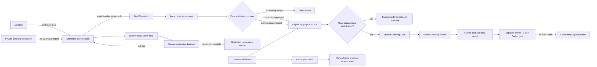
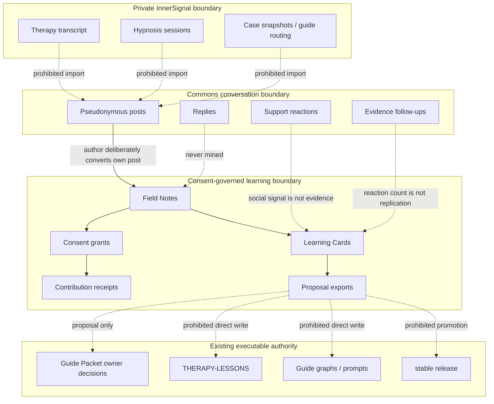

# InnerSignal Commons operational architecture

The maps in this file are the primary operational overview for the community MVP. Prose and implementation must remain synchronized with these authority boundaries.

## System overview

## Authority and data-boundary drill-down

## Required synchronization rules

- `src/community-learning/` implements only the Commons and Foundry boundaries.
- No community runtime module may reference an executable authority path.
- `apps/community/` must state the same private-session, consent, minimum-cell, and non-activation boundaries.
- JSON Schemas must fail closed on conversation-only posts, non-authoritative cards, and non-writable proposal exports.
- Tests must cover every solid and prohibited edge that could otherwise create silent authority leakage.
- Production conversation infrastructure should replace the prototype Commons store with self-hosted Discourse while preserving the Foundry contracts and diagrams.
