# Inner-child therapy living map

Updated: 2026-08-26

## Status and authority

This is the human-readable Mermaid control surface for the inner-child therapy architecture. It is deliberately **not** a replacement for executable or source authority.

Current authority remains:

1. current owner instructions;
2. `guides/inner-child-guide.txt` for the guide body;
3. `guides/owner-amendments.json` for owner-approved amendments already installed there;
4. `guide-graphs/source-maps/inner-child-guide.json` and `guide-graphs/source-maps/owner-amendments.json` for source mapping;
5. `guide-graphs/candidates/inner-child.graph.json` and the compiler-produced `guide-graphs/compiled/inner-child-directed-graph.json` for executable graph state.

The compiled graph on `main` is still `2026-08-09-r5`. This map records owner-approved refinements so they are not lost while guide prose and executable graph state are reconciled. A map node does not by itself make an uncompiled rule executable.

## Main map

```mermaid
flowchart TD
    START["Inner-child problem arrives"] --> SAFETY{"Immediate danger, disorientation,<br/>or unable to stop / return?"}

    subgraph S1["1 · Safety, hook, and enough choice"]
        SAFETY -- "yes" --> EXT["Protector acts outside the dialogue:<br/>orient, get support, leave danger,<br/>eat, sleep, call, lock door, seek care"]
        EXT --> RETURN["Return to inner work only when<br/>present orientation and stopping capacity exist"]
        RETURN --> HOOK
        SAFETY -- "no" --> HOOK{"Is a hook / activation currently<br/>narrowing meaningful choice?"}
        HOOK -- "yes" --> PAUSE["Interrupt before interpretation:<br/>notice body + urge; 1–3 breaths;<br/>widen attention"]
        PAUSE --> NOCASE["Do not decide what the feeling proves<br/>while captured by the hook"]
        NOCASE --> ENTRY
        HOOK -- "no" --> ENTRY["Continue the unresolved therapeutic question"]
    end

    subgraph S2["2 · Witness and borrowed adulthood"]
        ENTRY --> WITNESS{"Enough witness / adult capacity<br/>for the next bounded operation?"}
        WITNESS -- "no" --> NW["Neutral witness:<br/>a younger/distressed state is here,<br/>and something can notice it"]
        WITNESS -- "yes" --> NEED
        NW --> NEED{"Which adult function is actually needed now?"}
        NEED --> NURT["Nurturer · warmth, non-cruelty,<br/>permission to feel"]
        NEED --> PROT["Protector · boundaries, competence,<br/>impulse interruption, follow-through"]
        NEED --> GUIDE["Guide · next sane, value-consistent action<br/>without pretending certainty"]
        NEED --> MIX["Mixed / uncertain · use the smallest<br/>combination that fits"]
        NURT --> CANHOLD
        PROT --> CANHOLD
        GUIDE --> CANHOLD
        MIX --> CANHOLD{"Can the needed function be held directly?"}
        CANHOLD -- "no" --> SOURCE
        CANHOLD -- "yes" --> SELFCHECK{"Is direct self-application still distorted<br/>by shame, resentment, self-attack,<br/>or inability to know what to say?"}
        SELFCHECK -- "no" --> APP["Use it as part of one integrated adult"]
        SELFCHECK -- "yes" --> SOURCE{"What caring proxy is actually available?"}
        SOURCE --> REAL["Real person you love / who cared well,<br/>if authentically available"]
        SOURCE --> IMAG["Imagined or ideal caring adult:<br/>someone who genuinely wants<br/>to take good care of you"]
        SOURCE --> OTHER["Remembered / fictional / spiritual figure,<br/>future self, written value, or safe plan"]
        REAL --> BFTEST
        IMAG --> BFTEST
        OTHER --> BFTEST["Borrow one bounded response;<br/>keep only what is compassionate,<br/>sane, feasible, and reality-compatible"]
        BFTEST --> REJECTTEST["Would the care still be true if the receiver<br/>said 'I hate you', 'big whoop', or did not trust it?"]
        REJECTTEST --> APP
        APP --> AUTH["Helper returns authority:<br/>support may lend capacity;<br/>it does not own memory, conscience,<br/>medicine, relationships, or future"]
    end

    subgraph S3["3 · What is actually happening now?"]
        AUTH --> RESPONSE{"Dominant live process?"}
        RESPONSE --> THOUGHT["Ordinary thought / feeling / grievance:<br/>use the least elaborate useful model;<br/>do not manufacture a part"]
        RESPONSE --> GUARD["Protective response / urge to escape:<br/>ask what it predicts or is trying to prevent"]
        RESPONSE --> CRED{"Love/care is accessible but feels unsafe,<br/>or trust has an adverse track record?"}
        RESPONSE --> ID["Child/self unclear:<br/>identity formation + differentiation"]
        RESPONSE --> DEEPQ["Deeper dialogue / grief / memory / altered-state request"]
        RESPONSE --> MIXED["Mixed / unknown:<br/>preserve alternatives and ask only<br/>what changes the next step"]
        THOUGHT --> NEXT
        GUARD --> NEXT
        ID --> NEXT
        MIXED --> NEXT

        CRED -- "yes" --> LOVE["LOVE INVARIANT:<br/>care does not need the younger position's<br/>trust, gratitude, agreement, or reciprocal love"]
        LOVE --> LOVETEST["Non-retaliation is evidence of love,<br/>not a substitute for love:<br/>anger/distrust may remain while care remains"]
        LOVETEST --> PROXYQ{"Would a caring-proxy perspective help reveal<br/>what the adult would say without self-prosecution?"}
        PROXYQ -- "yes" --> PROXY["Use the borrowed-care source ladder;<br/>borrow one sane caring response;<br/>reality-check it and test it under rejection"]
        PROXYQ -- "no" --> SPLIT
        PROXY --> SPLIT["Differentiate only the positions actually present;<br/>keep speaker identity provisional;<br/>do not force a fixed trio"]
        SPLIT --> TURNS["If one position is prosecuting another while hooked,<br/>give separate turns rather than a cross-examination;<br/>no position is exiled"]
        TURNS --> KERNEL["Hear the concrete complaint;<br/>separate actionable truth from heat,<br/>global condemnation, and uncertain inference"]
        KERNEL --> CAUSE["Causal compassion, not a blame trial:<br/>what did that version know, fear, have access to,<br/>and believe was possible then?"]
        CAUSE --> LEARN["Compassionate default:<br/>past versions acted from the model and capacities<br/>available to them; learn from consequences now<br/>instead of identifying a guilty age"]
        LEARN --> TRUST["TRUST BRANCH:<br/>trust is evidence-sensitive even when love is not;<br/>ask what would count as credible evidence"]
        TRUST --> VOW["Promise only substantially controllable behavior:<br/>truth, protection, repair, noticing sooner,<br/>and no retaliation for distrust"]
        VOW --> EVIDENCE{"What evidence fits the live complaint?"}
        EVIDENCE --> REL["Relational evidence:<br/>listen without retaliation, admit what is true,<br/>retain care, repair after attack"]
        EVIDENCE --> ACT["Ordinary-life evidence:<br/>one small boundary, task, appointment,<br/>basic-care or protection step"]
        REL --> NEXT
        ACT --> NEXT
        CRED -- "no" --> NEXT
    end

    subgraph S4["4 · Depth and epistemic gates"]
        DEEPQ --> DEEP{"Ready for this specific deeper operation?<br/>oriented, can stop, can return,<br/>enough capacity for this step"}
        DEEP -- "no" --> DAILY["Stay present-focused:<br/>witness, borrowed adulthood,<br/>Protector actions, gentle regulation"]
        DEEP -- "yes" --> DIALOGUE["Deeper child dialogue / grief / memory work"]
        DIALOGUE --> MEMORY["Epistemic guard:<br/>direct memory ≠ report ≠ inference ≠<br/>dream / image / altered-state impression"]
        MEMORY --> ALTERED{"Altered / unusually intense state involved?"}
        ALTERED -- "yes" --> POSHOOK["Positive-hook audit:<br/>bliss, revelation, love, or intensity<br/>is not proof of truth, integration,<br/>or completed healing"]
        ALTERED -- "no" --> NEXT
        POSHOOK --> NEXT
        DAILY --> NEXT
    end

    subgraph S5["5 · Continue, close, and return to life"]
        NEXT{"Another bounded operation is clearly useful now?"}
        NEXT -- "yes" --> RESPONSE
        NEXT -- "no / enough for now" --> CLOSE["Close deliberately:<br/>orient · external contact · relax jaw/hands ·<br/>name the next ordinary-life action"]
        CLOSE --> OPTIONAL{"Any optional integration move actually fits?"}
        OPTIONAL --> REVIEW["Review without trial:<br/>notice recognition, repair, and kept promises"]
        OPTIONAL --> COMMON["Common humanity if useful:<br/>other people know versions of this feeling too"]
        OPTIONAL --> TRANS["Transition / ending work only if<br/>an actual ending or role change is present"]
        OPTIONAL --> FORGIVE["Forgiveness only when useful and ready;<br/>accountability, boundaries, consequences,<br/>and no-contact remain available"]
        OPTIONAL --> RELSUP["Relational support / therapy / community:<br/>borrow capacity without surrendering judgment"]
        OPTIONAL --> LIFE["Return to ordinary life"]
        REVIEW --> LIFE
        COMMON --> LIFE
        TRANS --> LIFE
        FORGIVE --> LIFE
        RELSUP --> LIFE
    end
```



## Operating interpretation

The map is a routing architecture, not a linear checklist. **The smallest sufficient branch wins.**

- **Safety can override introspection.** Present danger calls for present-day protection, not a more sophisticated interpretation of childhood material.
- **Hook before story is conditional and re-entrant.** Pause only when activation is narrowing meaningful choice. The pause creates room; it does not decide what the feeling means or suppress a valid grievance. Return to the unresolved question afterward.
- **Use the least elaborate internal model that helps.** A coherent repeating child/protector position may benefit from dialogue. A passing thought, practical problem, or ordinary grievance may not need a new `part` at all.
- **One inner adult, multiple functions.** Nurturing, protecting, and guiding are qualities/functions of one integrated adult, not three independent inner people.
- **Borrowed adulthood is both bootstrap and de-centering.** Use it when a function is missing, but also when the function exists toward others and becomes distorted during self-application by shame, resentment, or self-attack.
- **Borrowed adulthood must not require a fortunate biography.** If no authentically loved or loving person is available as a proxy, use an imagined or ideal caring adult, a remembered/fictional/spiritual figure, future self, value, or safe plan. Never imply that a real loving relationship existed when it did not.
- **Borrowed care gets a reality check.** Keep only what is compassionate, sane, feasible, and compatible with current facts. An idealized proxy is not automatically wise.
- **Love and trust are different variables.** Love/care need not wait until the younger position believes, reciprocates, forgives, or trusts. Trust remains evidence-sensitive and may reasonably stay low after a bad track record.
- **Non-retaliation operationalizes love under rejection; it does not replace love.** Warmth or love can still be explicit when authentic. The key test is whether anger, hatred, sarcasm, distrust, or nonreciprocity causes care to disappear or turn punitive.
- **Do not use love to erase anger.** `I love you` can coexist with `I hate you`; the point is not that one proposition defeats the other.
- **Causal compassion replaces prosecution.** Work from the compassionate default that each past version acted from the model, conditioning, capacities, and perceived options available to it then. Consequences and learning remain real; the therapeutic goal is not to identify the guilty age.
- **Care does not require pretending harmful choices had no consequences.** Learn, repair, protect, and choose differently now without making self-hatred the mechanism of accountability.
- **Criticism gets decomposed, not swallowed or fought.** Take concrete truth seriously; distinguish it from heat, contempt, global condemnation, and uncertain inference. Do not seed accusations stronger than the person supplied.
- **Credibility is relational and practical evidence.** Listening without retaliation, retaining care, truthful acknowledgment, repair, boundaries, and repeated ordinary action can all count. Do not reduce repair to task completion.
- **Promises stay controllable.** Do not promise invulnerability, omniscience, permanent calm, permanent warmth, or success dependent on somebody else’s reaction.
- **Borrowed authority must transfer back.** A therapist, guru, coach, peer, partner, plan, or imagined figure may model one function; healthy borrowing makes the person more capable of disagreement, judgment, protection, and action without surrendering authority.
- **Deeper states require an epistemic gate.** Emotional force, dreams, hypnosis, entheogens, meditation highs, and imagery can be meaningful without proving literal history.
- **Every session ends.** Returning to food, sleep, work, relationships, walking, or another ordinary activity is part of integration rather than a failure to finish processing.

## Response-shaping invariants

These constraints exist because correct graph coverage can still produce a dry, repetitive, or merely paraphrastic therapy answer.

1. **Add insight before procedure.** Do not merely rename what the person already said. Identify at least one consequential relationship among their statements that they may not yet have articulated—for example, two variables being incorrectly tied together, one response changing the meaning of another, or a protective strategy reproducing the problem it is trying to solve.
2. **Do not invent the insight.** It must be supported by the transcript and remain contestable.
3. **Use the person’s language before framework language.** Graph labels are internal aids, not prose obligations.
4. **One central formulation, one useful experiment, one next question.** Do not repeat the same best-friend/borrowed-care exercise twice in different wording. Do not mechanically cover every selected node.
5. **Do not seed stronger accusations or memories.** Invite the person’s strongest existing complaint rather than supplying `you are evil`, `you ruined everything`, or other content they did not report.
6. **Preserve speaker uncertainty throughout.** Do not narrate one voice as turning into another merely because they occur sequentially.
7. **Do not force blame allocation.** If causality or responsibility matters, ask what each version could perceive, control, and access then; use the answer to learn and repair now.
8. **Do not make non-retaliation sound like bureaucratic foster care.** When love or warmth is genuinely accessible, keep it alive in the response. `I will not turn against you` is a behavioral expression of care, not the whole of care.
9. **Do not demand trust as proof that the intervention worked.** Love can remain while trust updates slowly from evidence.
10. **End when the useful move is clear.** Do not continue processing merely because more graph branches exist.

## Borrowed-care source ladder

When self-directed care is inaccessible, unsafe, unbelievable, contaminated, or distorted by self-prosecution, choose the least artificial proxy that is genuinely usable:

1. **Real relationship, if available:** someone the person loves, someone who has cared well for them, or someone they naturally know how to care for.
2. **Known exemplar:** a teacher, therapist, relative, fictional character, spiritual figure, older sibling archetype, or other figure whose relevant function is understood.
3. **Imagined caring adult:** `someone who genuinely wants to take good care of you`, without implying that this person actually existed.
4. **Future self / explicit values / written plan:** a narrow source for guidance or protection when relational imagery is a poor fit.
5. **Minimum non-cruelty:** if warmth itself triggers threat, begin with `I will not attack you` or the smallest believable caring function rather than forcing affection.

For every rung: borrow **one bounded function**, reality-check it, test whether it survives rejection/nonreciprocity, and return authority to the person.

## Credibility route — canonical sequence

For cases where love is accessible but feels unsafe, distrust is explicit, and self-resentment or internal prosecution appears:

```text
notice whether a hook is narrowing choice
→ preserve love/care without requiring belief
→ distinguish love from trust
→ use a caring-proxy perspective if self-application is distorted
→ differentiate only the positions actually present
→ stop cross-examination; give separate turns
→ hear the concrete complaint / kernel of truth
→ understand past behavior causally rather than assign blame
→ identify what can be learned, repaired, or protected now
→ make only a controllable promise
→ provide relational and/or practical evidence
→ let trust update only as far as evidence supports
```

A useful borrowed-care experiment in this route is:

```text
If an authentically loved person is available as a proxy:
    imagine that person saying the same thing to you.
Else:
    imagine someone who genuinely wants to take good care of you
    saying it, or imagine what such a caring adult would say.

What response comes naturally?
Keep only what is compassionate, sane, feasible, and true.
Then test it under rejection:
Would any of it remain true if the receiver said
"I hate you", "big whoop", or "I don't trust you"?
Borrow only that surviving function.
```

Do not require the exact wording above in user-facing responses.

## 2026-08-26 owner-approved overlay versus current executable graph

The current compiled graph already directly represents safety/orientation, neutral witness, borrowed love, the base best-friend prompt, one-function borrowing, adult apprenticeship, guard-first routing, credibility repair, age/responsibility clarification, concrete Protector action, identity formation, differentiation, Guide-later sequencing, photo/memory caution, altered-state gating, deeper-work readiness, and non-bypassing forgiveness.

The refinements below are captured in this living map but are **not yet claimed to be separate compiled runtime nodes**:

| Refinement | Closest current executable support | Runtime reconciliation still needed |
| --- | --- | --- |
| Conditional hook-before-story interrupt | `IC.SAFETY_ORIENTATION`, `IC.MEET_GUARD` | Preserve as a re-entrant process safeguard rather than a mandatory therapy job. |
| Borrowed care as de-centering even when love exists | `IC.BEST_FRIEND_PERSPECTIVE`, `IC.BORROW_ONE_FUNCTION` | Permit proxy use when self-application is distorted, not only when the adult function is absent. |
| Borrowed-care source ladder, including imagined caring adult fallback | `IC.BEST_FRIEND_PERSPECTIVE`, `IC.BORROW_ONE_FUNCTION` | Extend beyond the real-best-friend assumption; do not imply a loving biography. |
| Caring-proxy realism + rejection test | `IC.BEST_FRIEND_PERSPECTIVE` | Reality-check advice and test whether the caring function survives nonreciprocity. |
| Love invariant distinct from evidence-sensitive trust | `IC.CREDIBILITY_REPAIR`, Nurturer semantics | Make love/non-cruel care available under distrust while allowing trust to remain low. |
| Non-retaliation as evidence of love, not substitute for love | `IC.CREDIBILITY_REPAIR` | Preserve warmth/love when authentic; do not reduce care to procedural non-abandonment. |
| Critique decomposition / kernel-of-truth response | `IC.CREDIBILITY_REPAIR`, `IC.MEET_GUARD` | Distinguish actionable complaint from heat/global condemnation/uncertain inference. |
| Causal compassion instead of blame allocation | `IC.AGE_RESPONSIBILITY_CLARIFICATION` | Replace guilty-age framing with age/knowledge/support/control understanding plus present learning. |
| Separate-turn rule for punitive internal cross-examination | `IC.MEET_GUARD`, `IC.CREDIBILITY_REPAIR` | Hear the prosecuting/grieving position without letting it attack a literal child-state. |
| Controllable vow: truth/protection/repair/non-retaliation | `IC.CREDIBILITY_REPAIR`, `IC.PROTECTOR_ACTION` | Reconcile guide/source vow and graph wording. |
| Relational OR practical one-percent evidence | `IC.PROTECTOR_ACTION`, `IC.CREDIBILITY_REPAIR` | Do not make external task completion the only credibility evidence. |
| Insight-before-procedure response invariant | advisory realization | Require a transcript-grounded relational/mechanistic insight without forcing graph prose. |
| One central formulation / no duplicated intervention | advisory realization | Prevent repeated best-friend questions and mechanical node coverage. |
| Not every thought is a part | `IC.MEET_GUARD` already forbids overclassification | Strengthen least-elaborate-model wording if needed. |
| Guru / therapist authority-return boundary | `IC.BORROW_ONE_FUNCTION`, `IC.ADULT_APPRENTICE` | Make anti-dependency rule explicit in realization guidance. |
| Positive hooks | `IC.ALTERED_STATE_GATE` partly covers intensity-as-proof | Add love/bliss/revelation/intensity-not-proof safeguard where needed. |
| Session closure and ordinary-life return | application/session layer | Keep general closure; review/common-humanity/transition/forgiveness/support remain optional branches. |

## Maintenance rule

Update this file whenever a material change alters the inner-child routing topology, a gate, the authority-transfer boundary, the credibility sequence, or the relationship between current guide prose and executable graph behavior. When the executable graph is changed, update the map in the same pull request and reclassify any overlay row that became compiled. Never use the Mermaid map as evidence that generated graph files were rebuilt or tested.
