# Inner-child therapy living map

Updated: 2026-08-25

## Status and authority

This is the human-readable Mermaid control surface for the inner-child therapy architecture. It is deliberately **not** a replacement for executable or source authority.

Current authority remains:

1. current owner instructions;
2. `guides/inner-child-guide.txt` for the guide body;
3. `guides/owner-amendments.json` for owner-approved amendments already installed there;
4. `guide-graphs/source-maps/inner-child-guide.json` and `guide-graphs/source-maps/owner-amendments.json` for source mapping;
5. `guide-graphs/candidates/inner-child.graph.json` and the compiler-produced `guide-graphs/compiled/inner-child-directed-graph.json` for executable graph state.

The compiled graph on `main` is still `2026-08-09-r5`. This map also records the owner's 2026-08-25 refinements so they are not lost while article prose and executable graph state are reconciled. Those refinements are marked in the status table below; a map node does not by itself make an uncompiled rule executable.

## Main map

```mermaid
flowchart TD
    START["Inner-child problem arrives"] --> SAFETY{"Immediate danger, disorientation,<br/>or unable to stop / return?"}

    subgraph S1["1 · Safety and capacity"]
        SAFETY -- "yes" --> EXT["Protector acts outside the dialogue:<br/>orient, get support, leave danger,<br/>eat, sleep, call, lock door, seek care"]
        EXT --> RETURN["Return to inner work only when<br/>present orientation and stopping capacity exist"]
        SAFETY -- "no" --> HOOK["Catch the hook before interpretation:<br/>notice tightening / urge;<br/>pause for 1–3 breaths"]
        HOOK --> NOCASE["Do not decide what the feeling proves<br/>while the activation is running"]
    end

    subgraph S2["2 · Witness and borrowed adulthood"]
        NOCASE --> WITNESS{"Can the person already observe<br/>more than one internal position?"}
        WITNESS -- "no" --> NW["Neutral witness:<br/>a younger/distressed state is here,<br/>and something can notice it"]
        WITNESS -- "yes" --> NEED
        NW --> NEED{"Which adult function is actually missing?"}
        NEED --> NURT["Nurturer · warmth, non-cruelty,<br/>permission to feel"]
        NEED --> PROT["Protector · external boundaries +<br/>interrupt harmful impulsive action"]
        NEED --> GUIDE["Guide · next sane, value-consistent action<br/>without pretending certainty"]
        NEED --> BORROW{"Can that function be held alone yet?"}
        BORROW -- "no" --> BF["Borrow one bounded function:<br/>safe person, plan, value, future self,<br/>or best-friend perspective"]
        BF --> BFTEST["Reality-check the advice;<br/>keep only what is compassionate,<br/>wise, feasible, and still true if rejected"]
        BFTEST --> APP["Adult apprentice:<br/>receive → observe → participate →<br/>initiate 5% → internalize"]
        BORROW -- "yes" --> APP
        APP --> AUTH["Helper returns authority:<br/>support may lend capacity;<br/>it does not own memory, conscience,<br/>medicine, relationships, or future"]
    end

    subgraph S3["3 · Protectors, thoughts, and credibility"]
        AUTH --> RESPONSE{"What shows up next?"}
        RESPONSE --> THOUGHT["Least-elaborate-model check:<br/>sometimes it is simply thinking;<br/>do not manufacture a new part"]
        RESPONSE --> GUARD["Protective response / urge to escape:<br/>ask what it predicts or is trying to prevent"]
        RESPONSE --> CRED{"Love is present but feels unsafe,<br/>or the adult has a bad track record?"}
        THOUGHT --> CRED
        GUARD --> CRED

        CRED -- "yes" --> SPLIT["Separate the positions:<br/>skeptical child · resentful/prosecuting side ·<br/>present adult"]
        SPLIT --> AGE["Assign responsibility by actual age,<br/>knowledge, support, freedom, and capacity"]
        AGE --> ATTACK["Love survives the attack:<br/>do not retaliate because the child<br/>is sarcastic, hostile, or unconvinced"]
        ATTACK --> KERNEL["Find the kernel of truth;<br/>answer serious criticism seriously;<br/>do not fight the bluster"]
        KERNEL --> VOW["Credible promise:<br/>truth, protection, repair,<br/>non-abandonment — not invulnerability"]
        VOW --> EVIDENCE["One small visible Protector action;<br/>no demand for gratitude or immediate trust"]
        CRED -- "no" --> EVIDENCE
    end

    subgraph S4["4 · Identity, differentiation, and direction"]
        EVIDENCE --> SELF{"Is there a coherent child/self<br/>with stable enough preferences to guide?"}
        SELF -- "no / unclear" --> ID["Identity formation:<br/>private preference, play, beginner experiments,<br/>time without external grading"]
        ID --> DIFF["Differentiation:<br/>belong without self-betrayal;<br/>question, disagree, leave when necessary"]
        DIFF --> ADULT["Worth is intrinsic;<br/>adult capacities are developed"]
        SELF -- "yes" --> ADULT
        ADULT --> THREE["Three functions cooperate:<br/>Nurturer + Protector + Guide"]
        THREE --> GUIDELATER["Guide comes later enough that direction<br/>does not become inherited criticism<br/>or spiritual bypass"]
    end

    subgraph S5["5 · Deeper work gates"]
        GUIDELATER --> DEEP{"Ready for deeper dialogue?<br/>oriented, can stop, can return,<br/>not overwhelmed by dissociation"}
        DEEP -- "no" --> DAILY["Stay present-focused:<br/>witness, borrowed adulthood,<br/>Protector actions, gentle regulation"]
        DEEP -- "yes" --> DIALOGUE["Deeper child dialogue / grief / memory work"]
        DIALOGUE --> MEMORY["Epistemic guard:<br/>direct memory ≠ report ≠ inference ≠<br/>dream / image / altered-state impression"]
        MEMORY --> ALTERED{"Altered state involved?"}
        ALTERED -- "yes" --> POSHOOK["Positive-hook audit:<br/>bliss, revelation, love, or intensity<br/>is not proof of truth or completed healing"]
        ALTERED -- "no" --> CLOSE
        POSHOOK --> CLOSE
        DAILY --> CLOSE
    end

    subgraph S6["6 · Close, review, and return to life"]
        CLOSE["Close the session deliberately:<br/>orient · external contact · relax jaw/hands ·<br/>name next ordinary action"] --> REVIEW["Morning intention / evening review:<br/>notice recognition, repair, and kept promises<br/>without turning review into a trial"]
        REVIEW --> COMMON["Optional common-humanity move:<br/>‘Just like me, other people know this feeling.’"]
        COMMON --> TRANS["Transitions / endings:<br/>name what ended, what is unknown,<br/>and how adult + child stay together in the gap"]
        TRANS --> FORGIVE["Forgiveness only when useful and ready;<br/>accountability, boundaries, consequences,<br/>and no-contact remain available"]
        FORGIVE --> REL["Relational support / Hearthwork / therapy:<br/>borrow capacity without surrendering judgment"]
        REL --> LIFE["Return to ordinary life;<br/>trust grows from repeated evidence"]
    end

    NURT -. "available love can be borrowed" .-> BF
    PROT -. "small action creates evidence" .-> EVIDENCE
    GUIDE -. "only after enough warmth/safety" .-> GUIDELATER
    RETURN --> HOOK
```

## Operating interpretation

The map is not a linear requirement to perform every node. It is a routing architecture. The smallest sufficient branch wins.

- **Safety can override introspection.** Present danger calls for present-day protection, not a more sophisticated interpretation of childhood material.
- **Regulation supports the work; it does not settle the case.** Relaxation can reduce charge without repairing credibility, assigning responsibility, or making an unsafe relationship safe.
- **Hook before story.** When activation is high, first create a gap between urge and action. Interpretation can follow after enough capacity returns.
- **Use the least elaborate internal model that helps.** A repeating coherent protector or child position may benefit from dialogue. A passing thought may only need to be noticed and released.
- **Borrowed adulthood must transfer capacity back.** A therapist, guru, coach, peer, partner, plan, or imagined figure may model one function; healthy borrowing makes the person more capable of disagreement, judgment, protection, and action without the helper.
- **Credibility is relational evidence.** When the younger state already sees the adult life as evidence of unreliability, soothing language alone cannot erase that track record. Non-retaliatory listening, accurate responsibility, repair, and repeated Protector action build counterevidence.
- **Love is tested by rejection.** The Nurturer does not withdraw because the child says `I hate you`, distrusts the adult, or refuses to perform gratitude.
- **Worth and capacity are separate.** Worth does not have to be earned. Pausing, protecting, choosing, repairing, and acting consistently may still need to be learned.
- **Identity may need development before deconstruction.** Someone who never had room to discover private preferences may need enough selfhood to stand before no-self or surrender language becomes useful rather than bypassing.
- **Deeper states require an epistemic gate.** Emotional force, dreams, hypnosis, entheogens, meditation highs, and imagery can be meaningful without proving literal history.
- **Every session ends.** Returning to food, sleep, work, relationships, walking, or another ordinary activity is part of integration rather than a failure to finish processing.

## 2026-08-25 owner-approved overlay versus current executable graph

The current compiled graph already directly represents safety/orientation, neutral witness, borrowed love, the base best-friend prompt, one-function borrowing, adult apprenticeship, guard-first routing, credibility repair, age/responsibility clarification, concrete Protector action, identity formation, differentiation, Guide-later sequencing, photo/memory caution, altered-state gating, deeper-work readiness, and non-bypassing forgiveness.

The owner-approved refinements below are captured in this living map but are **not yet claimed to be separate compiled runtime nodes**:

| Refinement | Closest current executable support | Runtime reconciliation still needed |
| --- | --- | --- |
| Catch the hook before interpretation | `IC.SAFETY_ORIENTATION`, `IC.MEET_GUARD` | Add an explicit pre-interpretive pause/refrain route if runtime behavior needs separate enforcement. |
| Best-friend realism + rejection test | `IC.BEST_FRIEND_PERSPECTIVE` | Extend the recommendation beyond the existing base prompt. |
| Love survives hostility / distrust | `IC.CREDIBILITY_REPAIR` | Make non-withdrawal of care under rejection explicit. |
| Kernel-of-truth response | `IC.CREDIBILITY_REPAIR`, `IC.AGE_RESPONSIBILITY_CLARIFICATION` | Distinguish serious critique from heat/bluster without dismissing either. |
| Replace invulnerability vow with truth/protection/repair | `IC.CREDIBILITY_REPAIR`, `IC.PROTECTOR_ACTION` | Reconcile the guide/source vow and graph wording before calling it executable authority. |
| Not every thought is a part | `IC.MEET_GUARD` already forbids overclassification | Add explicit least-elaborate-model wording if needed. |
| Refined Protector includes impulse interruption | `IC.PROTECTOR_ACTION`, safety nodes | Make internal non-harm function explicit alongside external protection. |
| Intrinsic worth vs developed adult capacity | distributed across guide | Add if the distinction materially changes routing or response realization. |
| Guru / therapist authority-return boundary | `IC.BORROW_ONE_FUNCTION`, `IC.ADULT_APPRENTICE` | Make the anti-dependency rule explicit in realization guidance. |
| Positive hooks | `IC.ALTERED_STATE_GATE` partly covers intensity-as-proof | Add attachment-to-bliss/revelation/ideal-state warning. |
| Morning review, `Just Like Me`, session closure, ordinary-life transitions | not separate compiled nodes | Add only if they should become planner-selectable interventions rather than guide/application practices. |

## Maintenance rule

Update this file whenever a material change alters the inner-child routing topology, a gate, the authority-transfer boundary, the credibility sequence, or the relationship between current guide prose and executable graph behavior. When the executable graph is changed, update the map in the same pull request and reclassify any overlay row that became compiled. Never use the Mermaid map as evidence that generated graph files were rebuilt or tested.
