# Inner-child therapy generated audit map

> [!warning] Generated audit view
> Do not edit this file or treat it as executable authority. Regenerate it with `npm run authoring:maps`.
> Projection input: `1f98e966e76da6e426ced6cfc6e014ba9b97033cb71512468963415ca21e4169`
> Compiled bundle: `inner-child-somatic-pilot-2026-08-09-r5`

Compiled graph JSON remains executable development authority. Dashed overlay relationships are owner-approved documentation only and are not planner input.

This is an inner-child-scoped view: all 19 compiled inner-child nodes and all 10 compiled inner-child edges are shown. It is not a whole-bundle view.

The map is not a linear requirement to perform every node. The smallest sufficient branch wins.

```mermaid
flowchart TD
  subgraph M_1aa75d0ca9fdbd6f["Compiled graph behavior"]
    M_cb5d46723686398a["IC.ADULT_APPRENTICE<br/>Move from receiving care to doing five percent"]
    M_ec9679dd8ab603e5["IC.AGE_RESPONSIBILITY_CLARIFICATION<br/>Separate developmental ages and responsibility"]
    M_574d2ac2cc55c239["IC.ALTERED_STATE_GATE<br/>Build sober capacity before using altered states to deepen"]
    M_52c8b8db75284f47["IC.BEST_FRIEND_PERSPECTIVE<br/>Borrow the best-friend standard of care"]
    M_6ecca15c52631c86["IC.BORROW_LOVE<br/>Borrow already-accessible love without flattening its depth"]
    M_b93d40fc7354ac90["IC.BORROW_ONE_FUNCTION<br/>Borrow one bounded adult function"]
    M_c2f772681a2864c0["IC.CARING_COMPANY<br/>Meet the moment with remembered or imagined caring company"]
    M_e7097628f581189a["IC.COMMON_HUMANITY<br/>Recognize shared humanity without minimizing this experience"]
    M_097ac80ea6ef3a75["IC.COMPASSIONATE_STORY<br/>Give a difficult memory compassionate story punctuation"]
    M_38ccc5d4aa4f9900["IC.CREDIBILITY_REPAIR<br/>Repair credibility through non-defensive follow-through"]
    M_790052b599c064aa["IC.CRITICISM_KERNEL<br/>Receive useful content without accepting contempt"]
    M_b5070aeea9a9d2d6["IC.DEEP_CHILD_DIALOGUE<br/>Enter deeper child dialogue only when capacity is adequate"]
    M_6cbe23ec981416d5["IC.DEEP_LOVE_TO_CHILD<br/>Bring already-accessible deep love to the younger self without force"]
    M_7f6d4b17f007275b["IC.DIFFERENTIATION<br/>Untangle belonging from self-betrayal"]
    M_a5042ea0c1f5deb7["IC.DRAFT_EDITOR<br/>Edit the communication without rejecting its author"]
    M_09d305e1df883008["IC.DRAFT_RETURN_TO_CARE<br/>Return to the first draft for understanding and care"]
    M_3433ce138baaa095["IC.EXISTENTIAL_NOURISHMENT<br/>Match the work to existential hunger without making spirituality mandatory"]
    M_41bacc3c2a1b2c86["IC.FORGIVENESS_LATER<br/>Approach forgiveness without bypassing accountability"]
    M_870596bd7b3ac951["IC.GENTLE_SELF_HYPNOSIS<br/>Use gentle present-focused self-hypnosis only as preparation"]
    M_85dd0eb9f6c200ae["IC.GUIDE_LATER<br/>Bring in direction after warmth, safety, and a coherent child exist"]
    M_c4df00343543fe1e["IC.IDENTITY_FORMATION<br/>Build identity through private preference and experimental play"]
    M_61cc47b1d3362606["IC.INTUITION_TRUST_CALIBRATION<br/>Make intuition and analysis correct each other before trust transfers"]
    M_cf2a74e9bd1058af["IC.LOVE_HORIZON_EXPLORATION<br/>Explore a deeper horizon of wellbeing when curiosity is genuine"]
    M_8c3a6fef61d56c26["IC.MEET_GUARD<br/>Meet the protective response before pushing deeper"]
    M_ef53aca50fea10d5["IC.NEUTRAL_WITNESS<br/>Begin with a neutral witness"]
    M_9dca4b5da092b9e3["IC.PAST_COMPETENCE<br/>Retrieve a real occasion of responding well"]
    M_7676d9b9ffb94f9b["IC.PHOTO_EPISTEMIC_CAUTION<br/>Keep photograph and memory sources separate"]
    M_ebcb7c64fcb0eff8["IC.PRECIOUS_HUMAN_OPPORTUNITY<br/>Treat human birth as a precious opportunity before discarding it"]
    M_739de9c1d64e6e87["IC.PROTECTOR_ACTION<br/>Make the Protector visible in ordinary life"]
    M_2fb0351682e14e26["IC.REALIZATION_LOVE_INTEGRATION<br/>Keep realization, doctrine, and community answerable to lived love"]
    M_ce885b7cda58a8c2["IC.SAFETY_ORIENTATION<br/>Outside safety and present orientation first"]
    M_c59ccdcd3369cdcd["IC.SOLAR_PLEXUS_RELAXATION<br/>Relax solar-plexus or abdominal holding before dialogue"]
    M_838d2ffc322b1700["IC.SPIRITUAL_STRUGGLE<br/>Work with spiritual struggle or sacred loss"]
    M_55615d0f18b1dbf9["IC.SUICIDAL_ADULT_SEAT<br/>Bring a second adult or witness seat into the room"]
    M_4a1d59389f630bc5["IC.SUICIDAL_SELF_DEATH_INQUIRY<br/>Examine the self/death assumption before an irreversible act"]
    M_26b08e2ad8df587f["IC.WISER_SELF_PERSPECTIVE<br/>Borrow a wiser perspective without rejecting the present self"]
  end
  M_cb5d46723686398a -- "enables" --> M_739de9c1d64e6e87
  M_ec9679dd8ab603e5 -- "clarifies" --> M_38ccc5d4aa4f9900
  M_574d2ac2cc55c239 -- "gates" --> M_b5070aeea9a9d2d6
  M_52c8b8db75284f47 -- "offers-alternative" --> M_26b08e2ad8df587f
  M_6ecca15c52631c86 -- "offers-alternative" --> M_c2f772681a2864c0
  M_b93d40fc7354ac90 -- "enables" --> M_cb5d46723686398a
  M_b93d40fc7354ac90 -- "offers-alternative" --> M_9dca4b5da092b9e3
  M_e7097628f581189a -- "may-support" --> M_c2f772681a2864c0
  M_097ac80ea6ef3a75 -- "may-use" --> M_b93d40fc7354ac90
  M_38ccc5d4aa4f9900 -- "requires-evidence" --> M_739de9c1d64e6e87
  M_790052b599c064aa -- "may-support" --> M_a5042ea0c1f5deb7
  M_6cbe23ec981416d5 -- "embodies-through" --> M_739de9c1d64e6e87
  M_6cbe23ec981416d5 -- "integrates-relationally" --> M_cb5d46723686398a
  M_6cbe23ec981416d5 -- "routes-block-to" --> M_8c3a6fef61d56c26
  M_7f6d4b17f007275b -- "supports-calibration" --> M_61cc47b1d3362606
  M_a5042ea0c1f5deb7 -- "returns-for-care" --> M_09d305e1df883008
  M_09d305e1df883008 -- "embodies-through" --> M_739de9c1d64e6e87
  M_09d305e1df883008 -- "may-use" --> M_8c3a6fef61d56c26
  M_3433ce138baaa095 -- "opens-when-curious" --> M_cf2a74e9bd1058af
  M_c4df00343543fe1e -- "precedes" --> M_85dd0eb9f6c200ae
  M_61cc47b1d3362606 -- "calibrates" --> M_85dd0eb9f6c200ae
  M_61cc47b1d3362606 -- "slows-high-stakes-transfer" --> M_739de9c1d64e6e87
  M_cf2a74e9bd1058af -- "can-enable" --> M_6cbe23ec981416d5
  M_8c3a6fef61d56c26 -- "precedes" --> M_b5070aeea9a9d2d6
  M_ef53aca50fea10d5 -- "enables" --> M_b93d40fc7354ac90
  M_2fb0351682e14e26 -- "does-not-certify-authority" --> M_61cc47b1d3362606
  M_2fb0351682e14e26 -- "feeds-child-integration" --> M_6cbe23ec981416d5
  M_2fb0351682e14e26 -- "requires-embodiment" --> M_739de9c1d64e6e87
  M_ce885b7cda58a8c2 -- "enables" --> M_ef53aca50fea10d5
  M_c59ccdcd3369cdcd -- "enables" --> M_6ecca15c52631c86
  M_838d2ffc322b1700 -- "may-connect-to" --> M_b93d40fc7354ac90
  M_838d2ffc322b1700 -- "may-connect-to" --> M_7f6d4b17f007275b
  M_838d2ffc322b1700 -- "may-connect-to" --> M_3433ce138baaa095
  M_4a1d59389f630bc5 -- "requires-reality-check" --> M_ebcb7c64fcb0eff8
  M_26b08e2ad8df587f -- "may-support" --> M_a5042ea0c1f5deb7
  M_61b1422fb19471af -- "may-use-as-communication-support" --> M_a5042ea0c1f5deb7
  M_33e0c396b86f7138 -- "clarifies" --> M_790052b599c064aa
  subgraph M_01b1c3aedf3ada55["Owner-approved, not compiled"]
    M_b0cb7ee50f0940c6["OVERLAY.IC.BEST_FRIEND_REALITY_CHECK<br/>OWNER-APPROVED / NOT COMPILED<br/>Reality-check borrowed best-friend advice"]
    M_f0339fbe47bdbfff["OVERLAY.IC.BOUNDED_TRUTHFUL_VOW<br/>OWNER-APPROVED / NOT COMPILED<br/>Make a bounded truthful protection-and-repair promise"]
    M_3f9b66d2b2406328["OVERLAY.IC.COMMON_HUMANITY_MUTUAL_HEALING<br/>OWNER-APPROVED / NOT COMPILED<br/>Connect common humanity with mutual peer healing"]
    M_867b86b265da3f3d["OVERLAY.IC.DYNAMIC_PARTS_MODEL<br/>OWNER-APPROVED / NOT COMPILED<br/>Use parts modeling dynamically and only while useful"]
    M_b86c59ec494fa29e["OVERLAY.IC.FLEXIBLE_DELIBERATE_CLOSURE<br/>OWNER-APPROVED / NOT COMPILED<br/>Close inner work deliberately and flexibly"]
    M_cc14557bdeea8b7f["OVERLAY.IC.IDENTITY_BEFORE_DECONSTRUCTION<br/>OWNER-APPROVED / NOT COMPILED<br/>Develop enough identity before deconstructive practice when needed"]
    M_5a1222fe4722fff3["OVERLAY.IC.NONPUNITIVE_REVIEW<br/>OWNER-APPROVED / NOT COMPILED<br/>Review without holding a trial"]
    M_52ff0b3f131b1980["OVERLAY.IC.PAUSE_ORIENT_BEFORE_INTERPRETATION<br/>OWNER-APPROVED / NOT COMPILED<br/>Pause and orient before interpretation"]
    M_400e8fa3121456c6["OVERLAY.IC.TENTATIVE_CONCLUSIONS_REEVALUATE<br/>OWNER-APPROVED / NOT COMPILED<br/>Re-evaluate tentative activated conclusions when calm"]
    M_faa94f5e35056a54["OVERLAY.IC.TRANSITIONS_AND_ENDINGS<br/>OWNER-APPROVED / NOT COMPILED<br/>Name transitions, endings, and the uncertain gap"]
    M_856accaf7ecba784["OVERLAY.IC.UNSAFE_IMPULSE_PAUSE<br/>OWNER-APPROVED / NOT COMPILED<br/>Pause an immediately unsafe impulse"]
    M_cdfbaa43da9f7124["OVERLAY.IC.WORTH_CAPACITY_DISTINCTION<br/>OWNER-APPROVED / NOT COMPILED<br/>Separate intrinsic worth from developed adult capacity"]
  end
  M_b0cb7ee50f0940c6 -. "extends-reality-check · NOT COMPILED" .-> M_52c8b8db75284f47
  M_b0cb7ee50f0940c6 -. "extends-reality-check · NOT COMPILED" .-> M_b93d40fc7354ac90
  M_f0339fbe47bdbfff -. "qualifies-credibility-vow · NOT COMPILED" .-> M_38ccc5d4aa4f9900
  M_f0339fbe47bdbfff -. "qualifies-credibility-vow · NOT COMPILED" .-> M_739de9c1d64e6e87
  M_3f9b66d2b2406328 -. "adds-common-humanity-guidance · NOT COMPILED" .-> M_b93d40fc7354ac90
  M_3f9b66d2b2406328 -. "adds-common-humanity-guidance · NOT COMPILED" .-> M_cb5d46723686398a
  M_867b86b265da3f3d -. "qualifies-parts-model · NOT COMPILED" .-> M_ef53aca50fea10d5
  M_867b86b265da3f3d -. "qualifies-parts-model · NOT COMPILED" .-> M_8c3a6fef61d56c26
  M_867b86b265da3f3d -. "qualifies-parts-model · NOT COMPILED" .-> M_38ccc5d4aa4f9900
  M_867b86b265da3f3d -. "qualifies-parts-model · NOT COMPILED" .-> M_ec9679dd8ab603e5
  M_b86c59ec494fa29e -. "adds-flexible-closure · NOT COMPILED" .-> M_ce885b7cda58a8c2
  M_b86c59ec494fa29e -. "adds-flexible-closure · NOT COMPILED" .-> M_b5070aeea9a9d2d6
  M_b86c59ec494fa29e -. "adds-flexible-closure · NOT COMPILED" .-> M_574d2ac2cc55c239
  M_cc14557bdeea8b7f -. "qualifies-identity-before-deconstruction · NOT COMPILED" .-> M_c4df00343543fe1e
  M_cc14557bdeea8b7f -. "qualifies-identity-before-deconstruction · NOT COMPILED" .-> M_7f6d4b17f007275b
  M_cc14557bdeea8b7f -. "qualifies-identity-before-deconstruction · NOT COMPILED" .-> M_85dd0eb9f6c200ae
  M_5a1222fe4722fff3 -. "adds-nonpunitive-review · NOT COMPILED" .-> M_cb5d46723686398a
  M_5a1222fe4722fff3 -. "adds-nonpunitive-review · NOT COMPILED" .-> M_38ccc5d4aa4f9900
  M_5a1222fe4722fff3 -. "adds-nonpunitive-review · NOT COMPILED" .-> M_739de9c1d64e6e87
  M_52ff0b3f131b1980 -. "qualifies-before-interpretation · NOT COMPILED" .-> M_ce885b7cda58a8c2
  M_52ff0b3f131b1980 -. "qualifies-before-interpretation · NOT COMPILED" .-> M_8c3a6fef61d56c26
  M_400e8fa3121456c6 -. "qualifies-conclusions-during-activation · NOT COMPILED" .-> M_ce885b7cda58a8c2
  M_400e8fa3121456c6 -. "qualifies-conclusions-during-activation · NOT COMPILED" .-> M_8c3a6fef61d56c26
  M_400e8fa3121456c6 -. "qualifies-conclusions-during-activation · NOT COMPILED" .-> M_7676d9b9ffb94f9b
  M_400e8fa3121456c6 -. "qualifies-conclusions-during-activation · NOT COMPILED" .-> M_574d2ac2cc55c239
  M_faa94f5e35056a54 -. "adds-transition-practice · NOT COMPILED" .-> M_cb5d46723686398a
  M_faa94f5e35056a54 -. "adds-transition-practice · NOT COMPILED" .-> M_c4df00343543fe1e
  M_faa94f5e35056a54 -. "adds-transition-practice · NOT COMPILED" .-> M_7f6d4b17f007275b
  M_faa94f5e35056a54 -. "adds-transition-practice · NOT COMPILED" .-> M_85dd0eb9f6c200ae
  M_856accaf7ecba784 -. "qualifies-protective-response · NOT COMPILED" .-> M_ce885b7cda58a8c2
  M_856accaf7ecba784 -. "qualifies-protective-response · NOT COMPILED" .-> M_8c3a6fef61d56c26
  M_856accaf7ecba784 -. "qualifies-protective-response · NOT COMPILED" .-> M_739de9c1d64e6e87
  M_cdfbaa43da9f7124 -. "distinguishes-worth-from-capacity · NOT COMPILED" .-> M_c4df00343543fe1e
  M_cdfbaa43da9f7124 -. "distinguishes-worth-from-capacity · NOT COMPILED" .-> M_7f6d4b17f007275b
  M_cdfbaa43da9f7124 -. "distinguishes-worth-from-capacity · NOT COMPILED" .-> M_85dd0eb9f6c200ae
  classDef compiled fill:#eef4ff,stroke:#2855a6,stroke-width:2px
  classDef overlay fill:#fff7e6,stroke:#9a6700,stroke-width:2px,stroke-dasharray: 6 4
  class M_cb5d46723686398a,M_ec9679dd8ab603e5,M_574d2ac2cc55c239,M_52c8b8db75284f47,M_6ecca15c52631c86,M_b93d40fc7354ac90,M_c2f772681a2864c0,M_e7097628f581189a,M_097ac80ea6ef3a75,M_38ccc5d4aa4f9900,M_790052b599c064aa,M_b5070aeea9a9d2d6,M_6cbe23ec981416d5,M_7f6d4b17f007275b,M_a5042ea0c1f5deb7,M_09d305e1df883008,M_3433ce138baaa095,M_41bacc3c2a1b2c86,M_870596bd7b3ac951,M_85dd0eb9f6c200ae,M_c4df00343543fe1e,M_61cc47b1d3362606,M_cf2a74e9bd1058af,M_8c3a6fef61d56c26,M_ef53aca50fea10d5,M_9dca4b5da092b9e3,M_7676d9b9ffb94f9b,M_ebcb7c64fcb0eff8,M_739de9c1d64e6e87,M_2fb0351682e14e26,M_ce885b7cda58a8c2,M_c59ccdcd3369cdcd,M_838d2ffc322b1700,M_55615d0f18b1dbf9,M_4a1d59389f630bc5,M_26b08e2ad8df587f compiled
  class M_b0cb7ee50f0940c6,M_f0339fbe47bdbfff,M_3f9b66d2b2406328,M_867b86b265da3f3d,M_b86c59ec494fa29e,M_cc14557bdeea8b7f,M_5a1222fe4722fff3,M_52ff0b3f131b1980,M_400e8fa3121456c6,M_faa94f5e35056a54,M_856accaf7ecba784,M_cdfbaa43da9f7124 overlay
```

## Authority legend

- Solid nodes and arrows: exact compiled graph records.
- Dashed relationships: owner-approved documentation overlays; not compiled and not executable.
- Canvas geometry, Mermaid layout, links, and visual grouping have no runtime meaning.

## Maintenance

Run `npm run authoring:maps:check`. Update graph authority through validated proposals and the existing owner-decision lifecycle, never by editing this map.
