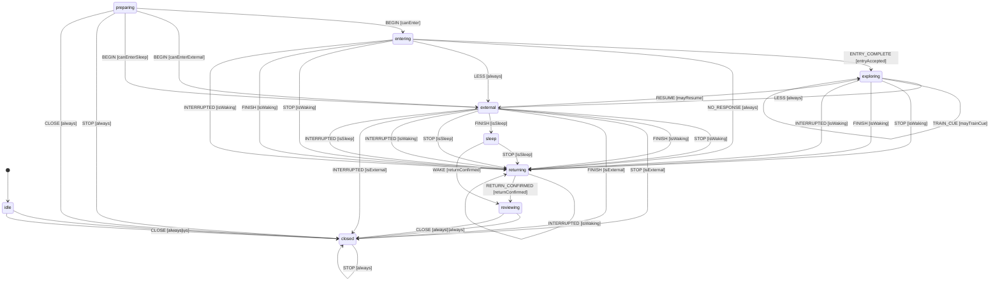

# Inner Signal hypnosis: source, knowledge and session map

> Development candidate, not installed policy or a live voice app. This map is generated from the actual candidate records and transition table. It is not clinical validation.
> Input SHA-256: `19986571c9e0749a74ad4ad9144b5bf52a980e6ae630815206967dd540eef925`
> Article: `u-dont-existDOTcom/joel-articles@90fffafd4864d62b9d987272dab5a8c17a259e9e:articles/inner-signal/master.html`
> Article SHA-256: `842bead8f862873e6b5391cfa06bacb4ddfa3910568876112f45bef8fd3b24ab`
> Controller SHA-256: `0288a30af60f91474a986a5025dd6296e32dd372be95b569dc257985b11747ae`

## What is available

- 148 hypnosis source records from the exact updated guide, with actual text.
- 62 records from the current supplied companion, kept separately attributed.
- 36 outside-guide research topic cards, plus their source ledger and consultation/acceptance protocol. Source account and design application remain distinct.
- 47 functional nodes; 21 executed phase-transition rows; 4 explicit reported-state interrupts.
- Keyword/exact-ID lookup is implemented for these records; NLP extraction, model teaching answers, live audio and installed retrieval integration are not.

## Executed phase transitions

These arrows are the rows the candidate controller actually evaluates. Guard names are defined below. An arrow is not a requirement to visit every phase. Purpose selection, corrections and knowledge requests also use the event handlers listed below.

| Rule | Event | From | To | Guard | Action node |
|---|---|---|---|---|---|
| begin-waking | BEGIN | preparing | entering | canEnter | HYP.INDUCTION |
| begin-no-trance | BEGIN | preparing | external | canEnterExternal | HYP.NO_TRANCE_CONTACT |
| begin-sleep-resource | BEGIN | preparing | external | canEnterSleep | HYP.SLEEP |
| entry-useful | ENTRY_COMPLETE | entering | exploring | entryAccepted | HYP.RESPONSIVE_INVITATION |
| entry-no-response | NO_RESPONSE | entering | returning | always | HYP.ALTERNATIVE_ENTRY |
| less-contact | LESS | entering, exploring | external | always | HYP.CONTACT_DOSE |
| explicit-resume | RESUME | external | exploring | mayResume | HYP.RESPONSIVE_INVITATION |
| cue-learning | TRAIN_CUE | exploring | same | mayTrainCue | HYP.REENTRY_CUE |
| stop-waking | STOP | entering, exploring, external, returning | returning | isWaking | HYP.FULL_RETURN |
| finish-waking | FINISH | entering, exploring, external | returning | isWaking | HYP.FULL_RETURN |
| stop-no-trance | STOP | external | closed | isExternal | HYP.NO_TRANCE_CLOSE |
| finish-no-trance | FINISH | external | closed | isExternal | HYP.NO_TRANCE_CLOSE |
| finish-sleep | FINISH | external | sleep | isSleep | HYP.SLEEP |
| stop-sleep | STOP | external, sleep | returning | isSleep | HYP.FULL_RETURN |
| interrupted-waking | INTERRUPTED | entering, exploring, external, returning | returning | isWaking | HYP.INTERRUPTION_RETURN |
| interrupted-no-trance | INTERRUPTED | external | closed | isExternal | HYP.NO_TRANCE_CLOSE |
| interrupted-sleep | INTERRUPTED | external | returning | isSleep | HYP.INTERRUPTION_RETURN |
| return-report | RETURN_CONFIRMED | returning | reviewing | returnConfirmed | HYP.REVIEW |
| stop-before-or-after | STOP | idle, preparing, reviewing, closed | closed | always | HYP.NO_TRANCE_CLOSE |
| ordinary-close | CLOSE | reviewing, preparing, idle | closed | always | HYP.NO_TRANCE_CLOSE |
| waking-after-sleep | WAKE | sleep | reviewing | returnConfirmed | HYP.REVIEW |

## Reported-state interrupts

These act on structured reports of the current situation, not words inside a question about someone else’s method. No diagnosis keyword, numeric intensity, or mere availability of help triggers them.

| Priority | Reported condition | Result |
|---|---|---|
| 1 | isAcute: Actual report of acute dissociation or lost orientation; preserve source instruction to end deeper practice for the day. | HYP.DISSOCIATION_RESPONSE; end inward work / return as applicable |
| 2 | isUrgent: Actual reported immediate danger, concerning physical symptoms, unsafe surroundings or inability to stop/return. | HYP.SAFETY_ORIENTATION; end inward work / return as applicable |
| 3 | isRefusal: The person has withdrawn willingness; comfort does not make refusal negotiable. | HYP.FULL_RETURN; end inward work / return as applicable |
| 4 | isOverwhelmed: The report says current contact is unworkable, not merely intense. | HYP.CAPACITY_BEFORE_CONTENT; end inward work / return as applicable |

## Event handlers outside the transition table

| Event | Actual handling |
|---|---|
| PLAN | Idle/preparing/closed only; chooses purpose and mode. New scope resets prior consent/readiness; day hold survives. |
| LEARN / CONSULT | Retrieves literal relevant source material without induction, readiness interrogation or a session-phase change. |
| REPORT | Records evidence-linked observations; interrupts only on actual reported constraints. No response is manufactured. |
| SELECT_FOCUS | Explicitly selects a relevant focus; available witness skips witness bootstrap. The source texts govern interpretation. |
| NEXT | Uses current focus and phase, not generic purpose setup. Quiet persists; no new question required for silence/checking-loop closure. |
| QUIET | Stops narration without inferring consent, safety, dissociation or success from silence. |
| REJECT | Stops the refused approach; a new explicit selection is needed to resume it. |
| Unmatched or invalid event | No inferred action; invalid schema throws, unmet guards are reported. |

## Guard definitions

| Guard | Meaning |
|---|---|
| always | No additional eligibility claim; event and source phase still must match. |
| canPlan | No active inward session is silently overwritten; plan only from idle, preparing or closed. |
| canEnter | Chosen waking entry; suitable place, present orientation, workable reported capacity and usable stop/return; no current acute risk, no same-day deeper-work hold; ordinary or resourcing method. |
| canEnterExternal | Chosen no-trance route in suitable surroundings with present orientation and usable stopping; no requirement to learn hypnotic return first. |
| canEnterSleep | Chosen bedtime resource in a suitable place, with reported orientation and stopping; no acute risk or trauma procedure. This selects the sleep resource, not a clinical session. |
| canExplore | Present, willing, able to shift/stop/return, workable current response; same-day deeper-work hold absent. Intensity alone is not a failed guard. |
| entryAccepted | User reports the entry useful or adequate and elects to continue; no dramatic trance sign is required. |
| mayTrainCue | Entry and return already learned; explicit cue-training request during suitable welcome practice, not an unwanted cue or difficult peak. |
| mayResume | Explicit resumption after reducing contact, with current workable reports and no rejection of the selected approach. |
| returnConfirmed | Current explicit report of oriented, alert, voluntary movement; a count or elapsed time alone is insufficient. |
| isWaking | An inward waking session needs its full return. |
| isExternal | No inward session was opened; close ordinary-awareness contact without invented de-induction. |
| isSleep | The separately chosen sleep practice may end in sleep/rest; no acute warning is inferred from silence. |
| isAcute | Actual report of acute dissociation or lost orientation; preserve source instruction to end deeper practice for the day. |
| isUrgent | Actual reported immediate danger, concerning physical symptoms, unsafe surroundings or inability to stop/return. |
| isOverwhelmed | The report says current contact is unworkable, not merely intense. |
| isRefusal | The person has withdrawn willingness; comfort does not make refusal negotiable. |
| needsClinician | The requested live procedure is deliberate trauma regression, unknown-origin trauma bridging, or substantial flashback work. Explanations remain accessible. |

## Conceptual knowledge relationships

The following 45 relationships organize the guide. They are explicitly **not** executable gates or mandatory sequencing. Read the transition table and the actual node/source records to evaluate behavior.

```mermaid
flowchart TD
  subgraph N_1d6f04754f9f8c54["preparation"]
    N_e4d4f49d5dd7a152["HYP.CHOOSE_PURPOSE<br/>Choose a purpose only when a new practice is being planned"]
    N_82c3c9fd941f299b["HYP.PREPARATION<br/>Learn entry and return; establish the missing preparation"]
  end
  subgraph N_f54d2de0a404d4af["safeguard"]
    N_e394101e6e2b39f5["HYP.SAFETY_ORIENTATION<br/>Respond to actual immediate danger or loss of stopping"]
    N_b181a861b2840dd7["HYP.CAPACITY_BEFORE_CONTENT<br/>Reduce contact when the response becomes unworkable"]
    N_4fc9028d626f842b["HYP.DISSOCIATION_RESPONSE<br/>Acute dissociation: end deeper practice for the day"]
    N_1ac96cd06bef0bdc["HYP.BODY_SIGNAL_NOT_VERDICT<br/>Pleasant and unpleasant signals are information, not verdicts"]
    N_69289cb2a641f9ca["HYP.MEMORY_CAUTION<br/>Keep source and interpretation separate"]
    N_c7b51b9cbcbc0790["HYP.SUPPORT_WITH_TRAINED_PERSON<br/>Match support to actual procedure and response"]
    N_7f48a0c3e961c8a5["HYP.ANALYSIS_BALANCE<br/>Keep analysis available without constant supervision"]
    N_1c057816369de000["HYP.ALTERED_STATE_GATE<br/>Stabilization remains available, not deferred"]
  end
  subgraph N_e596899f114b5162["exit"]
    N_c659cda2435e3472["HYP.FULL_RETURN<br/>End the waking session and check actual return"]
    N_176f43cbf66c40d6["HYP.INTERRUPTION_RETURN<br/>A stopped recording does not leave the listener waiting"]
    N_c20eb8e74e3dc6c5["HYP.NO_TRANCE_CLOSE<br/>Close ordinary-awareness contact without invented trance"]
    N_a223eb8a9c40f3ac["HYP.SLEEP<br/>Sleep is a separately chosen destination"]
  end
  subgraph N_ada750e3f8464e9e["practice"]
    N_ab0d07e29204cce0["HYP.NO_TRANCE_CONTACT<br/>Contact in ordinary awareness without a deepener"]
    N_6f5d9266d00abce7["HYP.INDUCTION<br/>A genuine, responsive hypnotic entry"]
    N_81ace4b227079632["HYP.REENTRY_CUE<br/>Deliberate cue learning, selectivity, testing and retirement"]
    N_6ec6dbd0515f8329["HYP.INNER_MEETING<br/>Communion without a compulsory cast of parts"]
    N_868c7f41e163e5b5["HYP.RESPONSIVE_INVITATION<br/>Observe, offer a fitting invitation, and wait"]
    N_cf2ca2a97646afd9["HYP.CONTACT_DOSE<br/>Less contact when requested; not compulsory soothing"]
    N_ab7378170945749d["HYP.WANTED_CARE<br/>Offer the care, distance or silence that is received"]
    N_4031fd1efe62ca18["HYP.POSITIVE_RESOURCE<br/>Love, play and creativity can be the whole purpose"]
    N_9a45789b7f84fd3c["HYP.WITNESS<br/>Use witness bootstrap only when needed"]
    N_f08027272affbb07["HYP.BORROW_ADULT<br/>Borrow the missing function, then carry a part yourself"]
    N_43ba1259a57dbe89["HYP.LOVE_AND_TRUST<br/>Love may remain while trust examines the record"]
    N_70a76f9adbf0f066["HYP.PROTECTOR_STAND_DOWN<br/>Protect proportionately, then stop scanning"]
    N_a02b1cfc465d54bd["HYP.RELATIONAL_REALITY<br/>Look outward without losing one’s own responsibility"]
    N_ac3051b38ff6d72f["HYP.PROCESSING_LOOP<br/>Leave checking without silencing real grief"]
    N_aed69f0a39dd5ad0["HYP.IDENTITY_PLAY<br/>Preference can develop without a clear child image"]
    N_a8230d99a07355e7["HYP.SPIRITUAL_STRUGGLE<br/>Honor spiritual possibility and examine sacred hurt"]
    N_840bdccce5e05996["HYP.DEHYPNOSIS<br/>Assess unwanted steering, not all influence"]
    N_76c0500868322e36["HYP.ANXIETY_BODY_FIRST<br/>Match the amount of contact to the actual anxiety"]
  end
  subgraph N_d3df996dfbad4964["teaching"]
    N_1098853a417613b7["HYP.ALTERNATIVE_ENTRY<br/>When one entry does little, try a different suitable route"]
    N_be027404975be593["HYP.FRACTIONATION<br/>Optional disclosed practice returning and re-entering"]
    N_ae57e786c722fe27["HYP.ADULT_FUNCTIONS<br/>Worth, warmth, protection, direction and enjoyment"]
    N_55b42646e6c0e0df["HYP.PEER_SUPPORT<br/>Borrow capacities reciprocally without giving away the Guide"]
    N_661850ced87e93ee["HYP.FORGIVENESS<br/>Responsibility and release without erased consequences"]
    N_b906c0f7fe4924dc["HYP.APP_BRIDGE<br/>Teach the skill and expose knowledge without covert induction"]
    N_88dfe08c99cb4ddf["HYP.NLP_LANGUAGE<br/>Keep all four NLP layers and actual examples available"]
    N_142d6cbdf1decfb9["HYP.DAILY_PRACTICE<br/>Build fluency, not dependence on recordings"]
    N_402ad8649b04314e["HYP.WEEKLY_DEEPER<br/>More time need not mean more intensity"]
    N_c4ee11ff5f0a4747["HYP.NONORDINARY_RESPONSE_CHECK<br/>Respond without pretending to settle ontology"]
    N_0a8a5306c3bad0aa["HYP.GRANDIOSITY_BYPASS_CHECK<br/>Reality-test an expansive state without erasing its meaning"]
  end
  subgraph N_0fcd568a5cb9bdb4["control"]
    N_0ebd5fa4fa6f57de["HYP.REJECT_WORDING<br/>A no changes the invitation, not its persuasiveness"]
    N_74936f9891a577cf["HYP.SILENCE_CHOICE<br/>Quiet means no words; silence alone supplies no verdict"]
  end
  subgraph N_725949a1f8218e8d["consultation"]
    N_d2e81f22ba571f40["HYP.PRACTITIONER_VETTING<br/>Explain and assess the reported procedure"]
  end
  subgraph N_c97ace4c8fef2cee["review"]
    N_bdd314fee428c094["HYP.REVIEW<br/>Before, tried, happened, uncertain"]
  end
  N_e394101e6e2b39f5 -. "enables" .-> N_e4d4f49d5dd7a152
  N_e4d4f49d5dd7a152 -. "routes-to" .-> N_6f5d9266d00abce7
  N_e4d4f49d5dd7a152 -. "routes-to" .-> N_840bdccce5e05996
  N_e4d4f49d5dd7a152 -. "routes-to" .-> N_76c0500868322e36
  N_e4d4f49d5dd7a152 -. "routes-to" .-> N_1c057816369de000
  N_6f5d9266d00abce7 -. "enables" .-> N_6ec6dbd0515f8329
  N_6f5d9266d00abce7 -. "can-train" .-> N_81ace4b227079632
  N_6f5d9266d00abce7 -. "conditionally-related" .-> N_c659cda2435e3472
  N_88dfe08c99cb4ddf -. "supports" .-> N_6f5d9266d00abce7
  N_88dfe08c99cb4ddf -. "supports" .-> N_868c7f41e163e5b5
  N_6ec6dbd0515f8329 -. "conditionally-related" .-> N_868c7f41e163e5b5
  N_868c7f41e163e5b5 -. "is-qualified-by" .-> N_1ac96cd06bef0bdc
  N_868c7f41e163e5b5 -. "routes-to" .-> N_cf2ca2a97646afd9
  N_868c7f41e163e5b5 -. "routes-to" .-> N_ab7378170945749d
  N_868c7f41e163e5b5 -. "routes-to" .-> N_4031fd1efe62ca18
  N_cf2ca2a97646afd9 -. "supports" .-> N_868c7f41e163e5b5
  N_868c7f41e163e5b5 -. "conditionally-related" .-> N_c659cda2435e3472
  N_c659cda2435e3472 -. "supports-practice" .-> N_142d6cbdf1decfb9
  N_c659cda2435e3472 -. "supports-practice" .-> N_402ad8649b04314e
  N_b181a861b2840dd7 -. "conditionally-related" .-> N_402ad8649b04314e
  N_b181a861b2840dd7 -. "conditionally-related" .-> N_6ec6dbd0515f8329
  N_4fc9028d626f842b -. "routes-to" .-> N_c659cda2435e3472
  N_4fc9028d626f842b -. "routes-to" .-> N_b181a861b2840dd7
  N_7f48a0c3e961c8a5 -. "supports" .-> N_868c7f41e163e5b5
  N_0a8a5306c3bad0aa -. "routes-to" .-> N_1c057816369de000
  N_69289cb2a641f9ca -. "conditionally-related" .-> N_c7b51b9cbcbc0790
  N_1c057816369de000 -. "conditionally-related" .-> N_c4ee11ff5f0a4747
  N_c4ee11ff5f0a4747 -. "supports" .-> N_840bdccce5e05996
  N_76c0500868322e36 -. "can-precede" .-> N_6f5d9266d00abce7
  N_c7b51b9cbcbc0790 -. "includes" .-> N_d2e81f22ba571f40
  N_b906c0f7fe4924dc -. "supports" .-> N_d2e81f22ba571f40
  N_b906c0f7fe4924dc -. "supports-learning" .-> N_142d6cbdf1decfb9
  N_4031fd1efe62ca18 -. "supports" .-> N_142d6cbdf1decfb9
  N_4031fd1efe62ca18 -. "supports" .-> N_402ad8649b04314e
  N_840bdccce5e05996 -. "supports" .-> N_7f48a0c3e961c8a5
  N_f08027272affbb07 -. "supports-when-needed" .-> N_ab7378170945749d
  N_43ba1259a57dbe89 -. "qualifies" .-> N_6ec6dbd0515f8329
  N_a02b1cfc465d54bd -. "context-before-interpretation" .-> N_6ec6dbd0515f8329
  N_ac3051b38ff6d72f -. "may-end-inquiry" .-> N_c20eb8e74e3dc6c5
  N_a8230d99a07355e7 -. "may-change-fit" .-> N_ab7378170945749d
  N_88dfe08c99cb4ddf -. "supplies-examples" .-> N_868c7f41e163e5b5
  N_55b42646e6c0e0df -. "distinct-relational-support" .-> N_f08027272affbb07
  N_9a45789b7f84fd3c -. "only-if-witness-needed" .-> N_f08027272affbb07
  N_0ebd5fa4fa6f57de -. "changes-approach" .-> N_868c7f41e163e5b5
  N_74936f9891a577cf -. "may-pause-words" .-> N_868c7f41e163e5b5
```

## Node/source inspection

Each node retains an inspectable instruction and success criterion. These are source-derived development interpretations, not independent evidence that the whole system is effective.

### HYP.CHOOSE_PURPOSE — Choose a purpose only when a new practice is being planned

Role: preparation.

Choose purpose, scope and mode while awake; no wound is required.

Success: The chosen purpose and reported response determine whether the step helped; no compulsory intensity, insight or action.

Sources:
- `HYP.S.before-you-begin`: Before you begin (hypnosis-guide; text SHA-256 `54f7a9405d42c261153e1e8ef694f8650278f8a7729bbe35525995521f67cf34`).

### HYP.PREPARATION — Learn entry and return; establish the missing preparation

Role: preparation.

Clarify only missing context. Rehearse entry/return without a difficult target when unfamiliar. No endless setup for an already agreed task.

Success: The chosen purpose and reported response determine whether the step helped; no compulsory intensity, insight or action.

Sources:
- `HYP.S.before-you-begin`: Before you begin (hypnosis-guide; text SHA-256 `54f7a9405d42c261153e1e8ef694f8650278f8a7729bbe35525995521f67cf34`).
- `HYP.S.come-all-the-way-back`: Come all the way back (hypnosis-guide; text SHA-256 `c654b7bf50698cc2c1ad460619f960986163471aa740d42b7d4f83728e2ecd19`).

### HYP.SAFETY_ORIENTATION — Respond to actual immediate danger or loss of stopping

Role: safeguard.

End inward work, orient and get appropriate human/medical help for reported danger. Source guidance is not an emergency monitoring capability.

Success: The chosen purpose and reported response determine whether the step helped; no compulsory intensity, insight or action.

Sources:
- `HYP.S.when-this-needs-more-support-than-a-guide-can-provide`: When this needs more support than a guide can provide (hypnosis-guide; text SHA-256 `63d6d490b44f85708b4648f2a4e51d3d6a0a50d615b191d13c543490e8056ba1`).
- `HYP.S.come-all-the-way-back`: Come all the way back (hypnosis-guide; text SHA-256 `c654b7bf50698cc2c1ad460619f960986163471aa740d42b7d4f83728e2ecd19`).

### HYP.CAPACITY_BEFORE_CONTENT — Reduce contact when the response becomes unworkable

Role: safeguard.

Current ability to stay present, choose and shift matters; do not infer incapacity from high intensity, a diagnosis, or available support alone.

Success: The chosen purpose and reported response determine whether the step helped; no compulsory intensity, insight or action.

Sources:
- `HYP.S.capacity-before-content`: Capacity before content (hypnosis-guide; text SHA-256 `f95339c24f91ff6457c819b306ea6f7a8706f7570bff708a9e2c840fe7aabeca`).
- `HYP.S.change-the-amount-of-contact`: Change the amount of contact (hypnosis-guide; text SHA-256 `f9d04457a34ea04806242b3042f4a700e9d86b9bd32def6e252a5f31a0d1749d`).

### HYP.DISSOCIATION_RESPONSE — Acute dissociation: end deeper practice for the day

Role: safeguard.

Open eyes, move, touch texture, name objects, end deeper practice for the day. Separate optional fractionation learning from the acute response.

Success: The chosen purpose and reported response determine whether the step helped; no compulsory intensity, insight or action.

Sources:
- `HYP.S.you-dissociate-or-feel-unreal`: You dissociate or feel unreal (hypnosis-guide; text SHA-256 `fc4ea4922d046ae42539780accb8df3589294def79fe78b2b018f1513253a45f`).
- `HYP.S.come-all-the-way-back`: Come all the way back (hypnosis-guide; text SHA-256 `c654b7bf50698cc2c1ad460619f960986163471aa740d42b7d4f83728e2ecd19`).

### HYP.FULL_RETURN — End the waking session and check actual return

Role: exit.

Reverse entry, restore body ownership, movement and orientation, end today’s deepening instructions. The count alone does not demonstrate return.

Success: The chosen purpose and reported response determine whether the step helped; no compulsory intensity, insight or action.

Sources:
- `HYP.S.come-all-the-way-back`: Come all the way back (hypnosis-guide; text SHA-256 `c654b7bf50698cc2c1ad460619f960986163471aa740d42b7d4f83728e2ecd19`).

### HYP.INTERRUPTION_RETURN — A stopped recording does not leave the listener waiting

Role: exit.

Use the explicit local fallback return when the recording or future service stops. Do not wait for a missing narrator.

Success: The chosen purpose and reported response determine whether the step helped; no compulsory intensity, insight or action.

Sources:
- `HYP.S.come-all-the-way-back`: Come all the way back (hypnosis-guide; text SHA-256 `c654b7bf50698cc2c1ad460619f960986163471aa740d42b7d4f83728e2ecd19`).

### HYP.NO_TRANCE_CONTACT — Contact in ordinary awareness without a deepener

Role: practice.

Read or write one clear question while fully alert; unsure, rest, a different question and stopping remain possible.

Success: The chosen purpose and reported response determine whether the step helped; no compulsory intensity, insight or action.

Sources:
- `HYP.S.9-no-trance-inner-contact`: 9. No-trance inner contact (hypnosis-guide; text SHA-256 `6cfc4aeb3dec9d45ab38d406839d0fc51087cabc3b2b27305384ea9278bc8a47`).

### HYP.NO_TRANCE_CLOSE — Close ordinary-awareness contact without invented trance

Role: exit.

Close the exercise and continue the day. No altered state was deliberately cultivated.

Success: The chosen purpose and reported response determine whether the step helped; no compulsory intensity, insight or action.

Sources:
- `HYP.S.9-no-trance-inner-contact`: 9. No-trance inner contact (hypnosis-guide; text SHA-256 `6cfc4aeb3dec9d45ab38d406839d0fc51087cabc3b2b27305384ea9278bc8a47`).

### HYP.SLEEP — Sleep is a separately chosen destination

Role: exit.

Use the owner’s Nimja sleep playlist resource at bedtime; not a waking session left altered or an opportunity to investigate trauma.

Success: The chosen purpose and reported response determine whether the step helped; no compulsory intensity, insight or action.

Sources:
- `HYP.S.sleep-induction`: Sleep induction (hypnosis-guide; text SHA-256 `f7927c455f32c93a8a6393077ff37a2141ce5cb5b79e153280d4fb3ae8e45da2`).
- `HYP.S.appendix-i-sleep-hypnosis`: Appendix I: Sleep hypnosis (hypnosis-guide; text SHA-256 `43196ce0eb047f5b3e7496613011a6a6093dbcc1679b8d20617de2569a2be92a`).

### HYP.INDUCTION — A genuine, responsive hypnotic entry

Role: practice.

Learn one actual induction; retain rich language, a consistent anchor, pauses and the capacity to correct it.

Success: The chosen purpose and reported response determine whether the step helped; no compulsory intensity, insight or action.

Sources:
- `HYP.S.sober-induction-3-5-minutes`: Sober induction: 3–5 minutes (hypnosis-guide; text SHA-256 `e97e01b81e8e2cce593fa062130008cbe1f4746086876442aacae1e7f3256a22`).
- `HYP.S.please-don-t-put-six-metaphors-in-one-trance`: Please don’t put six metaphors in one trance (hypnosis-guide; text SHA-256 `9705832e6a13cbfc9f84d4f0622e5d4d6a92485349572cf51b6f6f1e238dc8c8`).

### HYP.ALTERNATIVE_ENTRY — When one entry does little, try a different suitable route

Role: teaching.

Differentiate wording, modality, expectation and current state. Offer sound, movement, active-alert or no-trance contact; no change is not hidden success.

Success: The chosen purpose and reported response determine whether the step helped; no compulsory intensity, insight or action.

Sources:
- `HYP.S.nothing-happens`: Nothing happens (hypnosis-guide; text SHA-256 `e1bfa736f9cfac0600be2866eb475e247b85e222e980abcdc6c9f642f55467c2`).
- `HYP.S.stay-awake-when-your-mind-likes-to-escape`: Stay awake when your mind likes to escape (hypnosis-guide; text SHA-256 `4adfb6009dee555bfff01efcf858f38205ac9fae5fb1460ec92d7e4c61dfb19b`).
- `HYP.S.appendix-j-a-practical-induction-library`: Appendix J: A practical induction library (hypnosis-guide; text SHA-256 `9160eac2a6a79720cee23c73d20f053b9056131b6caf2889f52093f9c2b46354`).

### HYP.REENTRY_CUE — Deliberate cue learning, selectivity, testing and retirement

Role: practice.

Learn entry/return first; pair with welcome receptivity rather than peak activation. Never use a trance cue during driving. Keep calming and wake-up cues separate, and retire unwanted associations.

Success: The chosen purpose and reported response determine whether the step helped; no compulsory intensity, insight or action.

Sources:
- `HYP.S.a-shortcut-back-into-hypnosis`: A shortcut back into hypnosis (hypnosis-guide; text SHA-256 `96d90a946afce3bf0826dc024f8288f3e3d8f310dd74ce95680a26eb6c691e20`).
- `HYP.S.anchoring-giving-the-body-a-doorway-back`: Anchoring — giving the body a doorway back (hypnosis-guide; text SHA-256 `bf5217fe1e9cb3b52bff44c31a24415db4fbf1177a1183c2a49ce5439ada18fc`).

### HYP.FRACTIONATION — Optional disclosed practice returning and re-entering

Role: teaching.

Name the technique, retain stopping at either point; no repeated deepening hidden in every answer. Not the default response to acute dissociation.

Success: The chosen purpose and reported response determine whether the step helped; no compulsory intensity, insight or action.

Sources:
- `HYP.S.optional-fractionation-practice-coming-back`: Optional fractionation: practice coming back (hypnosis-guide; text SHA-256 `c2da63efa8f65cb5a1189cc70ee428de8356a77b1514e1e18626c21f0e0c3453`).

### HYP.INNER_MEETING — Communion without a compulsory cast of parts

Role: practice.

Use the whole or parts as helpful; listen without automatic belief. No age, image, hidden cause, or complete cast must appear.

Success: The chosen purpose and reported response determine whether the step helped; no compulsory intensity, insight or action.

Sources:
- `HYP.S.the-actual-inner-meeting`: The actual inner meeting (hypnosis-guide; text SHA-256 `deec5bde336177fb323e8b975896b70b4c8851a660ba1889bae1be37d281ec26`).
- `HYP.S.inner-child-reparenting`: Inner child reparenting (hypnosis-guide; text SHA-256 `52ff9179c8885d9a6d85b95f9e82bf5a215989748a4ad115958a2dd0a6824010`).
- `HYP.S.sometimes-start-with-the-whole`: Sometimes start with the whole (hypnosis-guide; text SHA-256 `80374ea27b045b520ceda12e7574f59759027c7cb99c5d8d7aad42973305a1c1`).

### HYP.RESPONSIVE_INVITATION — Observe, offer a fitting invitation, and wait

Role: practice.

Use the literal current response and chosen directness; permit silence, change and a plain next question. Do not finish the person’s inner story for them.

Success: The chosen purpose and reported response determine whether the step helped; no compulsory intensity, insight or action.

Sources:
- `HYP.S.finding-your-own-words`: Finding your own words (hypnosis-guide; text SHA-256 `7742daa35fc42a467439f4d6bcfcc252cfdb8cbe78a180094677a180c614dd49`).
- `HYP.S.let-the-response-change-the-invitation`: Let the response change the invitation (hypnosis-guide; text SHA-256 `31bde4c870f38595042a94dba2f190a56ff0e12a907feced4788cfd50a1c4bbc`).

### HYP.BODY_SIGNAL_NOT_VERDICT — Pleasant and unpleasant signals are information, not verdicts

Role: safeguard.

Separate noticed sensation from explanation, consent and external truth. Relief, tightening, a twitch and imagery do not prove history or causation.

Success: The chosen purpose and reported response determine whether the step helped; no compulsory intensity, insight or action.

Sources:
- `HYP.S.let-the-response-change-the-invitation`: Let the response change the invitation (hypnosis-guide; text SHA-256 `31bde4c870f38595042a94dba2f190a56ff0e12a907feced4788cfd50a1c4bbc`).
- `HYP.S.finish-without-forcing-a-revelation`: Finish without forcing a revelation (hypnosis-guide; text SHA-256 `592e6ab44ac23719cea85ce5c5efb098dab11c6271381b00589a8ba01fce01c8`).

### HYP.CONTACT_DOSE — Less contact when requested; not compulsory soothing

Role: practice.

Widen to support, titrate or pendulate according to response. Wanted sadness with workable choice can continue. Movement remains small, voluntary or imagined.

Success: The chosen purpose and reported response determine whether the step helped; no compulsory intensity, insight or action.

Sources:
- `HYP.S.change-the-amount-of-contact`: Change the amount of contact (hypnosis-guide; text SHA-256 `f9d04457a34ea04806242b3042f4a700e9d86b9bd32def6e252a5f31a0d1749d`).

### HYP.WANTED_CARE — Offer the care, distance or silence that is received

Role: practice.

Let actual response adjust voice, distance, touch and imagery. Grief following love is not necessarily failure; rejection of one resource is not rejection of all care.

Success: The chosen purpose and reported response determine whether the step helped; no compulsory intensity, insight or action.

Sources:
- `HYP.S.offer-the-care-that-is-actually-wanted`: Offer the care that is actually wanted (hypnosis-guide; text SHA-256 `5598b35ab3dde97358d2ecabf27b289cecb05680bbdcba69e546fca41dcf438e`).

### HYP.POSITIVE_RESOURCE — Love, play and creativity can be the whole purpose

Role: practice.

No required trauma target or productive payoff. Enjoyment, communion and chosen rehearsal are valid purposes.

Success: The chosen purpose and reported response determine whether the step helped; no compulsory intensity, insight or action.

Sources:
- `HYP.S.before-you-begin`: Before you begin (hypnosis-guide; text SHA-256 `54f7a9405d42c261153e1e8ef694f8650278f8a7729bbe35525995521f67cf34`).
- `HYP.S.offer-the-care-that-is-actually-wanted`: Offer the care that is actually wanted (hypnosis-guide; text SHA-256 `5598b35ab3dde97358d2ecabf27b289cecb05680bbdcba69e546fca41dcf438e`).

### HYP.WITNESS — Use witness bootstrap only when needed

Role: practice.

Notice what is present without requiring warmth. If observation and differentiation already exist, skip repeated witness drills.

Success: The chosen purpose and reported response determine whether the step helped; no compulsory intensity, insight or action.

Sources:
- `HYP.S.when-the-adult-role-is-not-available-yet`: When the adult role is not available yet (hypnosis-guide; text SHA-256 `49607354107b4e3f85799145f3c18f17c739b84d1c1ed7f019e0486e67162d6d`).
- `HYP.S.sometimes-start-with-the-whole`: Sometimes start with the whole (hypnosis-guide; text SHA-256 `80374ea27b045b520ceda12e7574f59759027c7cb99c5d8d7aad42973305a1c1`).
- `IC.S.a-witness-is-enough-to-begin`: A Witness Is Enough to Begin (inner-child-companion; text SHA-256 `b94a8fad1285b94bf759f5d2260c6d51fffe0a523a1fc2a2cf7b4a15f485e0b8`).

### HYP.BORROW_ADULT — Borrow the missing function, then carry a part yourself

Role: practice.

Use a real or imagined credible source with the person’s actual constraints. Borrow warmth, protection or direction, including adult capacity to hear distrust without retaliation; try the useful response.

Success: The chosen purpose and reported response determine whether the step helped; no compulsory intensity, insight or action.

Sources:
- `HYP.S.when-the-adult-role-is-not-available-yet`: When the adult role is not available yet (hypnosis-guide; text SHA-256 `49607354107b4e3f85799145f3c18f17c739b84d1c1ed7f019e0486e67162d6d`).
- `HYP.S.it-feels-fake`: It feels fake (hypnosis-guide; text SHA-256 `1b4e00a0ddf3b9537c56e7a892b0f0639532bc85d7dd2a211d25c95f7053c652`).
- `IC.S.borrow-one-function-at-a-time`: Borrow One Function at a Time (inner-child-companion; text SHA-256 `3eaa7664a0b741cd1c9d6c8a13086a62a0a9bc5e941f48e90c098efbcfe2e961`).
- `IC.S.borrow-love-or-borrow-the-perspective-of-care`: Borrow Love—or Borrow the Perspective of Care (inner-child-companion; text SHA-256 `33c850373477aa80c516bbad5131d36fa874e56a9b1334d93d7aface49674a97`).
- `IC.S.become-the-adult-apprentice`: Become the Adult Apprentice (inner-child-companion; text SHA-256 `af95a4c106463faf5159a760644c8f390f1e4bd37b32ab5c916581a20f91f8c1`).

### HYP.LOVE_AND_TRUST — Love may remain while trust examines the record

Role: practice.

Do not require trust to earn love. Take concrete complaints seriously; hear without retaliation, admit/repair failures. Adverse evidence is not an empty record. Do not merge blaming and vow-making positions by age.

Success: The chosen purpose and reported response determine whether the step helped; no compulsory intensity, insight or action.

Sources:
- `HYP.S.love-doesn-t-have-to-wait-for-trust`: Love doesn’t have to wait for trust (hypnosis-guide; text SHA-256 `8914a7882ba14d6c439e3720827472a0169a176f57df275291202eaff11ab58c`).
- `IC.S.love-doesn-t-have-to-wait-for-trust`: Love Doesn’t Have to Wait for Trust (inner-child-companion; text SHA-256 `8ebb8bb703cf7f21e20a2b4951c8e1873ef3f88bf23ba61fea3fec1587d78295`).

### HYP.ADULT_FUNCTIONS — Worth, warmth, protection, direction and enjoyment

Role: teaching.

Worth is not earned by capacity. Protection may begin before warmth; direction avoids both permissiveness and compulsory overcontrol.

Success: The chosen purpose and reported response determine whether the step helped; no compulsory intensity, insight or action.

Sources:
- `HYP.S.the-inner-child-the-guards-and-the-three-inner-adults`: The inner child, the guards, and the three inner adults (hypnosis-guide; text SHA-256 `5b5c12b931804b8138999a151e6af8172c241861490c3f51db141d72613accdd`).
- `HYP.S.the-nurturer`: The Nurturer (hypnosis-guide; text SHA-256 `af8eabb7d7bc6a8300712f4862bd61f52522f28f8693649282dbc87cb6bf0fa9`).
- `HYP.S.the-protector`: The Protector (hypnosis-guide; text SHA-256 `d731be241890442e0c1d396db9ab9c71947c694330d0bdf143c8c5dc0deb386a`).
- `HYP.S.the-leader-guide-or-guru`: The Leader, Guide, or Guru (hypnosis-guide; text SHA-256 `aab4a9333baeb3c1d1d145d78666b6e59c6ed7d7b8a27fc05cb9e927d3802e2d`).
- `IC.S.the-three-adult-functions`: The Three Adult Functions (inner-child-companion; text SHA-256 `eab83f10ea594ff5cc958789ec54d969426c4b4fa9f74a89b0a0c497f55bebd0`).
- `IC.S.the-inner-guide-comes-later`: The Inner Guide Comes Later (inner-child-companion; text SHA-256 `afe68b67f19908c040c81d9ea3bd5b8f80df98e4e7dfba4c15bb95a9e7cfb96d`).

### HYP.PROTECTOR_STAND_DOWN — Protect proportionately, then stop scanning

Role: practice.

Assess real danger and uncertainty; act proportionately, verify enough safety and stand down when scanning no longer helps.

Success: The chosen purpose and reported response determine whether the step helped; no compulsory intensity, insight or action.

Sources:
- `HYP.S.protection-that-knows-when-to-stop-scanning`: Protection that knows when to stop scanning (hypnosis-guide; text SHA-256 `eeabce78db3826b540ced291280d04062ad445b820356bc46234fc80c94547cf`).

### HYP.RELATIONAL_REALITY — Look outward without losing one’s own responsibility

Role: practice.

Assess actual behavior and options before reducing the problem to childhood. Disagreement is not immaturity; guilt proves neither wrongdoing nor manipulation. Preserve valid repair and boundaries.

Success: The chosen purpose and reported response determine whether the step helped; no compulsory intensity, insight or action.

Sources:
- `HYP.S.look-at-the-situation-too`: Look at the situation too (hypnosis-guide; text SHA-256 `736c8445c4fdf605396aeac7ed54380a7b875629974c4265db63bfdc76c1ed04`).
- `IC.S.also-look-outward`: Also Look Outward (inner-child-companion; text SHA-256 `7c323321f55d74b09e9e1ccb16c09b6b5109b1219cae2bf0b8ac7536206b03fc`).

### HYP.PROCESSING_LOOP — Leave checking without silencing real grief

Role: practice.

Real hurt and a checking loop may coexist. Repeated content is not sufficient evidence of a loop. When checking is the process, leave it unanswered and return to chosen life without compulsory resolution.

Success: The chosen purpose and reported response determine whether the step helped; no compulsory intensity, insight or action.

Sources:
- `HYP.S.you-get-stuck-in-endless-processing`: You get stuck in endless processing (hypnosis-guide; text SHA-256 `833bc73b299aaf2ed4efb0e0d34783c5b83772d074367e90b0d2d154f453b268`).
- `IC.S.when-more-processing-becomes-the-hook`: When More Processing Becomes the Hook (inner-child-companion; text SHA-256 `0894151cfb38484f74267d355eeb664976c9f0e1af7c58a6eaf69a69975c7ec0`).

### HYP.IDENTITY_PLAY — Preference can develop without a clear child image

Role: practice.

Support curiosity, private preferences and beginner experiments. Differentiation permits belonging, not only isolation or rebellion.

Success: The chosen purpose and reported response determine whether the step helped; no compulsory intensity, insight or action.

Sources:
- `HYP.S.when-your-voice-is-everybody-else-s-voice`: When “your voice” is everybody else’s voice (hypnosis-guide; text SHA-256 `68da47150a3009bd2a5982cd6ac305dd2cc644977c80e36fe5f19d4cfc0532ab`).
- `HYP.S.the-inner-child-will-not-appear`: The inner child will not appear (hypnosis-guide; text SHA-256 `280524b5995b7a12380adb5ecccc4be1beccee020350ad9f37a1617fcf6a62f2`).
- `IC.S.from-survival-to-experimental-play`: From Survival to Experimental Play (inner-child-companion; text SHA-256 `963257e238b7eee9e0b029139ffc4fca540b38eb499873158eef141772de8d85`).
- `IC.S.let-the-child-be-bad-at-things`: Let the Child Be Bad at Things (inner-child-companion; text SHA-256 `091a61dc0f312c0489fadeb3cade562b18e3a5113973ee8a1ac01e5cf8cc17cd`).

### HYP.SPIRITUAL_STRUGGLE — Honor spiritual possibility and examine sacred hurt

Role: practice.

A genuine opening may coexist with unavailable adult functions. Respect curiosity and spiritual struggle without compulsory spirituality, projection or intensification.

Success: The chosen purpose and reported response determine whether the step helped; no compulsory intensity, insight or action.

Sources:
- `HYP.S.you-get-stuck-in-spiritual-bypass`: You get stuck in spiritual bypass (hypnosis-guide; text SHA-256 `f7f7387d8985478096071912391b936b7fbcd0d1bdd12c359bc6a8a7dfb730a6`).
- `IC.S.when-the-spiritual-relationship-hurts`: When the Spiritual Relationship Hurts (inner-child-companion; text SHA-256 `63c4bf7c2ffc5de50bf6f4c3073beaa0fa55e0ac2b56f6028b83f9d5f4757b9e`).
- `IC.S.how-much-happiness-do-you-know-is-possible`: How Much Happiness Do You Know Is Possible? (inner-child-companion; text SHA-256 `7a5089c133ae4c99bef489789c03ef0e98016578a2645a712137be3bab3ebd18`).

### HYP.PEER_SUPPORT — Borrow capacities reciprocally without giving away the Guide

Role: teaching.

Hearthwork lends warmth and boundaries in equal turns; the peer does not interpret or take final authority.

Success: The chosen purpose and reported response determine whether the step helped; no compulsory intensity, insight or action.

Sources:
- `HYP.S.the-council-internal-first-then-outward`: The council — internal first, then outward (hypnosis-guide; text SHA-256 `33c6dc6bbf7d1c5b0679391947d7267a3b149f89494d2f0fd9dc44b83e04ab2b`).
- `IC.S.borrowed-adulthood-in-relationship`: Borrowed Adulthood in Relationship (inner-child-companion; text SHA-256 `a567484563b346dbe6158aca2ffa13cee20bcc9ea64d6471aa0bfac8d2ad9552`).

### HYP.FORGIVENESS — Responsibility and release without erased consequences

Role: teaching.

Keep the owner’s causal frame attributed; understanding does not erase consequences. Self-forgiveness names responsibility, remorse, rectify and release, not compulsory absolution.

Success: The chosen purpose and reported response determine whether the step helped; no compulsory intensity, insight or action.

Sources:
- `HYP.S.forgiveness-without-bypass`: Forgiveness without bypass (hypnosis-guide; text SHA-256 `b7d7c243fa17824fb8b5087ea6c9c5530f2aace65e4fde027205d55d6b12fb52`).
- `IC.S.how-to-forgive-without-forgetting`: How to Forgive Without Forgetting (inner-child-companion; text SHA-256 `a02bd72ebeac0d10543393c53a31e4d1c678c4ad4e8dd77476a4e80d2dc5849a`).

### HYP.REJECT_WORDING — A no changes the invitation, not its persuasiveness

Role: control.

An explicit refusal is not a protector diagnosis or consent. Change wording, approach or stop; don’t repeat the refused suggestion more forcefully.

Success: The chosen purpose and reported response determine whether the step helped; no compulsory intensity, insight or action.

Sources:
- `HYP.S.let-the-response-change-the-invitation`: Let the response change the invitation (hypnosis-guide; text SHA-256 `31bde4c870f38595042a94dba2f190a56ff0e12a907feced4788cfd50a1c4bbc`).
- `HYP.S.before-you-begin`: Before you begin (hypnosis-guide; text SHA-256 `54f7a9405d42c261153e1e8ef694f8650278f8a7729bbe35525995521f67cf34`).

### HYP.SILENCE_CHOICE — Quiet means no words; silence alone supplies no verdict

Role: control.

Stop narration on request without claiming unconscious consent, safety or success. Keep the explicit stop and return available.

Success: The chosen purpose and reported response determine whether the step helped; no compulsory intensity, insight or action.

Sources:
- `HYP.S.before-you-begin`: Before you begin (hypnosis-guide; text SHA-256 `54f7a9405d42c261153e1e8ef694f8650278f8a7729bbe35525995521f67cf34`).
- `HYP.S.finding-your-own-words`: Finding your own words (hypnosis-guide; text SHA-256 `7742daa35fc42a467439f4d6bcfcc252cfdb8cbe78a180094677a180c614dd49`).

### HYP.MEMORY_CAUTION — Keep source and interpretation separate

Role: safeguard.

Memory, suggestion, image and inference have distinct provenance. Hypnosis cannot prove an event, with or without a clinician. This safeguard is never deferred as though it were memory excavation.

Success: The chosen purpose and reported response determine whether the step helped; no compulsory intensity, insight or action.

Sources:
- `HYP.S.finish-without-forcing-a-revelation`: Finish without forcing a revelation (hypnosis-guide; text SHA-256 `592e6ab44ac23719cea85ce5c5efb098dab11c6271381b00589a8ba01fce01c8`).
- `HYP.S.methods-to-explore-with-a-trained-person-present`: Methods to explore with a trained person present (hypnosis-guide; text SHA-256 `e867f07379506776d0a7c7438d09c6f17b384e8eee77cebd1f0cc08a6e9adf11`).

### HYP.SUPPORT_WITH_TRAINED_PERSON — Match support to actual procedure and response

Role: safeguard.

Deliberate trauma regression, unknown-origin bridging or substantial flashbacks need trained presence; discussion is still available. Help merely being available does not establish need.

Success: The chosen purpose and reported response determine whether the step helped; no compulsory intensity, insight or action.

Sources:
- `HYP.S.methods-to-explore-with-a-trained-person-present`: Methods to explore with a trained person present (hypnosis-guide; text SHA-256 `e867f07379506776d0a7c7438d09c6f17b384e8eee77cebd1f0cc08a6e9adf11`).
- `HYP.S.when-this-needs-more-support-than-a-guide-can-provide`: When this needs more support than a guide can provide (hypnosis-guide; text SHA-256 `63d6d490b44f85708b4648f2a4e51d3d6a0a50d615b191d13c543490e8056ba1`).

### HYP.PRACTITIONER_VETTING — Explain and assess the reported procedure

Role: consultation.

Ask only missing consequential details of purpose, actual words, consent, response and adjustment. Labels and credentials do not settle a specific case.

Success: The chosen purpose and reported response determine whether the step helped; no compulsory intensity, insight or action.

Sources:
- `HYP.S.finding-a-hypnotist-who-can-work-with-you`: Finding a hypnotist who can work with you (hypnosis-guide; text SHA-256 `7c83717005f9dd874298871c54e055650665d2a9f2afd90fd355b51464e19537`).
- `HYP.S.soft-language-can-still-take-away-choice`: Soft language can still take away choice (hypnosis-guide; text SHA-256 `01810bc20037f8bdd3b1afb51b82522f5f6ebd6080a7312c90a3f4c087d8dbba`).

### HYP.APP_BRIDGE — Teach the skill and expose knowledge without covert induction

Role: teaching.

Text teaches and consults; voice must be implemented/tested separately. The app has no direct bodily access or embodied therapist intuition. Self-practice need not graduate to a clinician.

Success: The chosen purpose and reported response determine whether the step helped; no compulsory intensity, insight or action.

Sources:
- `HYP.S.try-it-in-the-inner-signal-app`: Try it in the Inner Signal app (hypnosis-guide; text SHA-256 `63ffd090d0f3a63a23180fab577d16e9a6281de7f4f9fd0c2a66875df6e5d04f`).
- `HYP.S.finding-a-hypnotist-who-can-work-with-you`: Finding a hypnotist who can work with you (hypnosis-guide; text SHA-256 `7c83717005f9dd874298871c54e055650665d2a9f2afd90fd355b51464e19537`).

### HYP.NLP_LANGUAGE — Keep all four NLP layers and actual examples available

Role: teaching.

Access actual wording and sensory/state/strategy tools, not just a list of names. Chosen influence differs from hidden commands or factual certainty.

Success: The chosen purpose and reported response determine whether the step helped; no compulsory intensity, insight or action.

Sources:
- `HYP.S.the-four-nlp-layers`: The four NLP layers (hypnosis-guide; text SHA-256 `53cce0f41e20ca09baaded7fd22cbfccd4632912ae3f31bc55dfbd87c3b1045d`).
- `HYP.S.the-milton-model-minus-the-covert-sales-seminar`: The Milton Model, minus the covert sales seminar (hypnosis-guide; text SHA-256 `c3e0b2e570c75b1ace0068843c7d643a3415a9ce196639a225e25822c776c368`).
- `HYP.S.running-the-whole-nlp-sequence`: Running the whole NLP sequence (hypnosis-guide; text SHA-256 `1249ae4979e0b86242722e68d374e772c78d1201bba34c59ce9daddfd93266d1`).

### HYP.DAILY_PRACTICE — Build fluency, not dependence on recordings

Role: teaching.

Practice entry/listening/response/return, reduce scaffolding when useful. Follow-through when called for; no mandatory task for every pleasant session.

Success: The chosen purpose and reported response determine whether the step helped; no compulsory intensity, insight or action.

Sources:
- `HYP.S.the-15-minute-daily-practice`: The 15-minute daily practice (hypnosis-guide; text SHA-256 `8de5eaa98ef74d46367589b8cabfb1da8f7e1212268efa23b897c28d54095144`).

### HYP.WEEKLY_DEEPER — More time need not mean more intensity

Role: teaching.

Give the same chosen practice more time if useful; preserve full return and conditional action, not a depth score.

Success: The chosen purpose and reported response determine whether the step helped; no compulsory intensity, insight or action.

Sources:
- `HYP.S.the-weekly-deeper-practice`: The weekly deeper practice (hypnosis-guide; text SHA-256 `a87ec7ff7ee61e1155bf081c9958e988eb43a42841527e93243e4e3291d2a94a`).

### HYP.REVIEW — Before, tried, happened, uncertain

Role: review.

Review actual outcomes and uncertainty, including later functioning. No insight, relief, figure or action has to appear.

Success: The chosen purpose and reported response determine whether the step helped; no compulsory intensity, insight or action.

Sources:
- `HYP.S.finish-without-forcing-a-revelation`: Finish without forcing a revelation (hypnosis-guide; text SHA-256 `592e6ab44ac23719cea85ce5c5efb098dab11c6271381b00589a8ba01fce01c8`).
- `HYP.S.the-15-minute-daily-practice`: The 15-minute daily practice (hypnosis-guide; text SHA-256 `8de5eaa98ef74d46367589b8cabfb1da8f7e1212268efa23b897c28d54095144`).

### HYP.ANALYSIS_BALANCE — Keep analysis available without constant supervision

Role: safeguard.

Questions and refusal remain available during hypnosis; extended verification after return. Effortless experience is not incompatible with choice.

Success: The chosen purpose and reported response determine whether the step helped; no compulsory intensity, insight or action.

Sources:
- `HYP.S.finish-without-forcing-a-revelation`: Finish without forcing a revelation (hypnosis-guide; text SHA-256 `592e6ab44ac23719cea85ce5c5efb098dab11c6271381b00589a8ba01fce01c8`).
- `HYP.S.you-become-too-analytical`: You become too analytical (hypnosis-guide; text SHA-256 `82676dfbc644b8a0f5bdac0f0f98a29355621352a32dc2c35186ed035546e57c`).

### HYP.DEHYPNOSIS — Assess unwanted steering, not all influence

Role: practice.

Distinguish welcome music, teachings and care from narrowing choice. Slow consequential decisions; neither compulsory obedience nor automatic rebellion.

Success: The chosen purpose and reported response determine whether the step helped; no compulsory intensity, insight or action.

Sources:
- `HYP.S.de-hypnosis-wake-up-inside-the-influence`: De-hypnosis: wake up inside the influence (hypnosis-guide; text SHA-256 `d581c8e9b3187e81eb5459668736c2a6f33efa4528b1cd713b1dcff73c96f773`).
- `HYP.S.soft-language-can-still-take-away-choice`: Soft language can still take away choice (hypnosis-guide; text SHA-256 `01810bc20037f8bdd3b1afb51b82522f5f6ebd6080a7312c90a3f4c087d8dbba`).

### HYP.ANXIETY_BODY_FIRST — Match the amount of contact to the actual anxiety

Role: practice.

Manageable wanted anxiety is distinct from escalating panic; actual supports are available without a fixed mandatory sequence.

Success: The chosen purpose and reported response determine whether the step helped; no compulsory intensity, insight or action.

Sources:
- `HYP.S.you-get-anxious`: You get anxious (hypnosis-guide; text SHA-256 `63f1e221a64bd254a3a2485742bc0791e9f899d7632866d720d41550cda69b92`).
- `HYP.S.appendix-d-anxiety-body-first`: Appendix D: Anxiety — body first (hypnosis-guide; text SHA-256 `b13202ab4f4aae9be770412c4f7104aaa069dba468659cd2aefc21af52d2c362`).

### HYP.ALTERED_STATE_GATE — Stabilization remains available, not deferred

Role: safeguard.

Attend to reported environment/body/current function before interpretation; no automatic claim of illness or supernatural origin.

Success: The chosen purpose and reported response determine whether the step helped; no compulsory intensity, insight or action.

Sources:
- `HYP.S.already-open-contain-before-you-deepen`: Already open? Contain before you deepen (hypnosis-guide; text SHA-256 `68bd9cd72dcdbc59f0d10a12ca85c5215a1f280a85cd6ac6ae18cd62e3270ed9`).
- `HYP.S.stabilize-before-you-interpret`: Stabilize before you interpret (hypnosis-guide; text SHA-256 `37cd986f9859cebed340832b5a9b45fa051c03854478b29d462fddca1983e229`).

### HYP.NONORDINARY_RESPONSE_CHECK — Respond without pretending to settle ontology

Role: teaching.

A response to warmth or distance does not establish origin; retain love with boundaries and appropriate support.

Success: The chosen purpose and reported response determine whether the step helped; no compulsory intensity, insight or action.

Sources:
- `HYP.S.a-response-check-not-a-verdict-about-what-it-is`: A response check, not a verdict about what it is (hypnosis-guide; text SHA-256 `525b25dd13893d8cf4334baa381a415a8108386e4c212c164e4d62c28b546b08`).
- `HYP.S.a-bodily-boundary-compassion-present-door-closed`: A bodily boundary: compassion present, door closed (hypnosis-guide; text SHA-256 `a387217e4706613ae7ce0dc7618bbd3bad9219b0a93510d3e7774a8518fa31a9`).

### HYP.GRANDIOSITY_BYPASS_CHECK — Reality-test an expansive state without erasing its meaning

Role: teaching.

Do not mistake a powerful experience for historical proof or unquestionable authority; preserve spiritual meaning and ordinary accountability.

Success: The chosen purpose and reported response determine whether the step helped; no compulsory intensity, insight or action.

Sources:
- `HYP.S.you-become-grandiose`: You become grandiose (hypnosis-guide; text SHA-256 `0cdb594ac06c657de04bdbf1e94f8af5cc7e718ba5c7bf1426549545bc1d6e76`).
- `HYP.S.you-become-too-blissful-or-diffuse`: You become too blissful or diffuse (hypnosis-guide; text SHA-256 `bd20eb7ccc6941f44f0251d58b1ae7c12a6cb400acfb37ebb87e73a489315291`).
- `HYP.S.you-get-stuck-in-spiritual-bypass`: You get stuck in spiritual bypass (hypnosis-guide; text SHA-256 `f7f7387d8985478096071912391b936b7fbcd0d1bdd12c359bc6a8a7dfb730a6`).

## Validation and remaining boundaries

- Actual candidate JS selection, phase, correction, return and lookup functions have authored synthetic regressions. These are not a deployed NLP/voice evaluation.
- Every indexed record has usable text and a source/paragraph hash. Build reproducibility against the exact upstream inputs is a separate source gate.
- The owner’s personal/theoretical claims remain attributed reference material, not independently validated facts or authority to conduct a procedure.
- Outside-guide knowledge is available for consultation without becoming the source of the guide’s own words.
- The existing production graph, compiled inner-child/somatic bundle, installed Guide Packets and stable branch are unchanged.
- Independent semantic review, actual voice interruptions and stop controls, live retrieval/model answers, and clinical usefulness remain untested.
