# Inner Signal self-hypnosis generated audit map

> [!warning] Generated audit view
> Do not edit this file or treat it as production graph authority. Regenerate it from the guide-specific candidate graph and source map.
> Projection input: `0ca182867c1d44bc7fd1cc9d3b7b5f54a7990511d2cc286012fe0d6c2f715651`
> Guide master authority: `u-dont-existDOTcom/joel-articles@research/hypnosis-bottom-up-six-books-20260910:articles/inner-signal/master.html` SHA-256 `06987f70e7264a5ac72d132e4b8420cf75cda60f33bbb430c83a0146e612adf9`

`guide-graphs/candidates/inner-signal-hypnosis.graph.json` is a guide-specific development candidate. It does **not** replace `data/graph-v1.0.0.json` or the current compiled inner-child/somatic bundle.

This view shows all 26 candidate nodes and 35 candidate edges. The map is not a requirement to perform every node; the smallest sufficient branch wins.

## Graph surface

```mermaid
flowchart TD
  subgraph M_fcbbe38e0d18268a["Safety and agency"]
    M_e394101e6e2b39f5["HYP.SAFETY_ORIENTATION<br/>Orient and preserve stopping/return capacity first"]
    M_b181a861b2840dd7["HYP.CAPACITY_BEFORE_CONTENT<br/>Capacity before content"]
    M_4fc9028d626f842b["HYP.DISSOCIATION_RESPONSE<br/>When you dissociate or feel unreal, restore contact before interpretation"]
    M_c659cda2435e3472["HYP.FULL_RETURN<br/>Come all the way back and verify reorientation"]
    M_840bdccce5e05996["HYP.DEHYPNOSIS<br/>Restore choice when outside or internal influence is steering"]
  end
  subgraph M_e1283f3f9d2da2b9["Core self-hypnosis path"]
    M_e4d4f49d5dd7a152["HYP.CHOOSE_PURPOSE<br/>Choose the purpose and scope before entering"]
    M_6f5d9266d00abce7["HYP.INDUCTION<br/>Gather attention without disappearing"]
    M_81ace4b227079632["HYP.REENTRY_CUE<br/>Use a deliberate learned cue for easier future entry"]
    M_6ec6dbd0515f8329["HYP.INNER_MEETING<br/>Hold the inner meeting without forcing a cast of characters"]
    M_868c7f41e163e5b5["HYP.RESPONSIVE_INVITATION<br/>Let the next invitation grow from what actually happened"]
    M_1ac96cd06bef0bdc["HYP.BODY_SIGNAL_NOT_VERDICT<br/>Treat bodily response as information, not an explanation of itself"]
    M_cf2ca2a97646afd9["HYP.CONTACT_DOSE<br/>Change the amount of contact instead of forcing through"]
    M_ab7378170945749d["HYP.WANTED_CARE<br/>Offer the care or distance that is actually wanted"]
    M_4031fd1efe62ca18["HYP.POSITIVE_RESOURCE<br/>Use hypnosis for love, play, confidence, creativity, or rehearsal too"]
    M_142d6cbdf1decfb9["HYP.DAILY_PRACTICE<br/>Use a short regular practice to build fluency"]
    M_402ad8649b04314e["HYP.WEEKLY_DEEPER<br/>Use deeper practice only when current capacity supports it"]
  end
  subgraph M_b3f31787b841a9ff["Troubleshooting and epistemics"]
    M_7f48a0c3e961c8a5["HYP.ANALYSIS_BALANCE<br/>Let analysis and intuition correct each other"]
    M_0a8a5306c3bad0aa["HYP.GRANDIOSITY_BYPASS_CHECK<br/>Check grandiosity, bliss, and spiritual bypass against ordinary reality"]
    M_69289cb2a641f9ca["HYP.MEMORY_CAUTION<br/>Keep hypnotic memory vividness separate from historical certainty"]
    M_76c0500868322e36["HYP.ANXIETY_BODY_FIRST<br/>For anxiety, start with body and dose before explanation"]
    M_1c057816369de000["HYP.ALTERED_STATE_GATE<br/>Stabilize before interpreting an altered state"]
    M_c4ee11ff5f0a4747["HYP.NONORDINARY_RESPONSE_CHECK<br/>Use response and boundaries without pretending to settle ontology"]
  end
  subgraph M_612bcbb31f80ac44["Language, support, and app bridge"]
    M_88dfe08c99cb4ddf["HYP.NLP_LANGUAGE<br/>Use indirect language as a responsive tool, not a covert authority trick"]
    M_c7b51b9cbcbc0790["HYP.SUPPORT_WITH_TRAINED_PERSON<br/>Move certain methods to trained, trauma-informed support when needed"]
    M_d2e81f22ba571f40["HYP.PRACTITIONER_VETTING<br/>Vet the practitioner by what they actually do, not the method name alone"]
    M_b906c0f7fe4924dc["HYP.APP_BRIDGE<br/>Use the app as teacher, consultant, and optional voice guide without pretending it has a body"]
  end
  M_e394101e6e2b39f5 -- "enables" --> M_e4d4f49d5dd7a152
  M_e4d4f49d5dd7a152 -- "routes-to" --> M_6f5d9266d00abce7
  M_e4d4f49d5dd7a152 -- "routes-to" --> M_840bdccce5e05996
  M_e4d4f49d5dd7a152 -- "routes-to" --> M_76c0500868322e36
  M_e4d4f49d5dd7a152 -- "routes-to" --> M_1c057816369de000
  M_6f5d9266d00abce7 -- "enables" --> M_6ec6dbd0515f8329
  M_6f5d9266d00abce7 -- "can-train" --> M_81ace4b227079632
  M_6f5d9266d00abce7 -- "must-end-with" --> M_c659cda2435e3472
  M_88dfe08c99cb4ddf -- "supports" --> M_6f5d9266d00abce7
  M_88dfe08c99cb4ddf -- "supports" --> M_868c7f41e163e5b5
  M_6ec6dbd0515f8329 -- "precedes" --> M_868c7f41e163e5b5
  M_868c7f41e163e5b5 -- "is-qualified-by" --> M_1ac96cd06bef0bdc
  M_868c7f41e163e5b5 -- "routes-to" --> M_cf2ca2a97646afd9
  M_868c7f41e163e5b5 -- "routes-to" --> M_ab7378170945749d
  M_868c7f41e163e5b5 -- "routes-to" --> M_4031fd1efe62ca18
  M_cf2ca2a97646afd9 -- "supports" --> M_868c7f41e163e5b5
  M_868c7f41e163e5b5 -- "precedes" --> M_c659cda2435e3472
  M_c659cda2435e3472 -- "supports-practice" --> M_142d6cbdf1decfb9
  M_c659cda2435e3472 -- "supports-practice" --> M_402ad8649b04314e
  M_b181a861b2840dd7 -- "gates" --> M_402ad8649b04314e
  M_b181a861b2840dd7 -- "gates" --> M_6ec6dbd0515f8329
  M_4fc9028d626f842b -- "routes-to" --> M_c659cda2435e3472
  M_4fc9028d626f842b -- "routes-to" --> M_b181a861b2840dd7
  M_7f48a0c3e961c8a5 -- "supports" --> M_868c7f41e163e5b5
  M_0a8a5306c3bad0aa -- "routes-to" --> M_1c057816369de000
  M_69289cb2a641f9ca -- "gates" --> M_c7b51b9cbcbc0790
  M_1c057816369de000 -- "precedes" --> M_c4ee11ff5f0a4747
  M_c4ee11ff5f0a4747 -- "supports" --> M_840bdccce5e05996
  M_76c0500868322e36 -- "can-precede" --> M_6f5d9266d00abce7
  M_c7b51b9cbcbc0790 -- "includes" --> M_d2e81f22ba571f40
  M_b906c0f7fe4924dc -- "supports" --> M_d2e81f22ba571f40
  M_b906c0f7fe4924dc -- "supports-learning" --> M_142d6cbdf1decfb9
  M_4031fd1efe62ca18 -- "supports" --> M_142d6cbdf1decfb9
  M_4031fd1efe62ca18 -- "supports" --> M_402ad8649b04314e
  M_840bdccce5e05996 -- "supports" --> M_7f48a0c3e961c8a5
```

## Primary user journeys

1. Learn self-hypnosis: choose purpose → induction → responsive invitation → full return → daily practice; add the re-entry cue only after entry and return are familiar.
2. Inner-child / communion work: induction → inner meeting → responsive invitation → contact-dose adjustment and/or wanted care → full return.
3. Safety-first route: safety/orientation → capacity before content → dissociation response/full return when needed → trained support when the method or response exceeds self-guided capacity.
4. Influence / epistemic route: de-hypnosis → analysis/intuition balance → memory caution or nonordinary response check when relevant.
5. Practitioner bridge: trained support → practitioner vetting, with the app as teacher/consultant rather than a claim of embodied therapist intuition.

## Source ledger

| Ref | Heading | Reader-text lines | SHA-256 |
| --- | --- | ---: | --- |
| `HYP.ORIENTATION` | Quick start: do this first | 16-20 | `bf3c740e8e8c7b0ae295c698f14e889227293470b5f9fcd1b66082892af849c3` |
| `HYP.HYPNOSIS_MODEL` | What I mean by hypnosis | 21-48 | `f3372d00b58e81dca56bdb5de9f26f2ba3dbe6795c15f5185bb0892b1c619e45` |
| `HYP.SELF_HYPNOSIS` | Why doing it myself worked better for me | 49-57 | `4e9f54bfb61f29598fa559b3d7151a3abcd6923b2c8e4983e1e357b132fc470d` |
| `HYP.MIND_MAP` | A useful map of the mind | 58-75 | `6199c2ed55774e782677e6008c0fa04b2d298ee7f865d70642487c987816dc81` |
| `HYP.INNER_CHILD` | The inner child, the guards, and the three inner adults | 76-144 | `289ded17db1946aa64fb839faaa6e464d37690d1fd6d4c3d9e31e1b19bed070f` |
| `HYP.SOCIAL_VOICE` | When “your voice” is everybody else’s voice | 145-163 | `82ef5f5b108242c346a4d23c57be85f7141456c2cbc1dd9994febc4e8989fedf` |
| `HYP.DEHYPNOSIS` | De-hypnosis: wake up inside the influence | 164-185 | `a3fccab783cc3dd6998c1e73064888535058df0157a9f95541cc163233e4ca0b` |
| `HYP.INDUCTION` | Induction: gathering attention without disappearing | 186-228 | `69052bc90fa57e2d64a74dbcf054e0ff6e26e855e9ee806fbdc7f3f1456d474e` |
| `HYP.REENTRY_CUE` | A shortcut back into hypnosis | 229-236 | `96d90a946afce3bf0826dc024f8288f3e3d8f310dd74ce95680a26eb6c691e20` |
| `HYP.RETURN` | Come all the way back | 237-242 | `d998052c47a2bc82230e0b0fc89f92da6eefcbc77047b852e2a8b1acfb9f26c6` |
| `HYP.INNER_MEETING` | The actual inner meeting | 243-252 | `deec5bde336177fb323e8b975896b70b4c8851a660ba1889bae1be37d281ec26` |
| `HYP.RESPONSIVE` | Let the next response guide you | 253-264 | `08c7935e8cda1e60aabeeed20c5f0c744033941f18db55e1a238e2529541cf74` |
| `HYP.CONTACT_DOSE` | Change the amount of contact | 265-269 | `12e1747c9c52fceaa503352e3986825a2d9a393609da06db0dcf22006399d7fb` |
| `HYP.CARE` | Offer the care that is actually wanted | 270-276 | `9f78b8688714603fe8c8c8edf14a4a06486065cbdfe135cd8fc977c63995bd29` |
| `HYP.FINISH` | Finish without forcing a revelation | 277-280 | `a26ee114f732d411f552f787a165b1381919c44651239f37c85794c793dd5da9` |
| `HYP.DAILY` | The 15-minute daily practice | 281-285 | `8de5eaa98ef74d46367589b8cabfb1da8f7e1212268efa23b897c28d54095144` |
| `HYP.WEEKLY` | The weekly deeper practice | 286-288 | `a87ec7ff7ee61e1155bf081c9958e988eb43a42841527e93243e4e3291d2a94a` |
| `HYP.CAPACITY` | Capacity before content | 289-299 | `c2fec34136bb0ea482b2dc3303513e84416f40bc195d347a4bcb4fdd0202782d` |
| `HYP.TROUBLESHOOT` | Troubleshooting | 300-320 | `fcdce015bf9c6aca6d7b289e89991b39a16a438d384246bd82ec7070a0061578` |
| `HYP.DISSOCIATION` | You dissociate or feel unreal | 321-322 | `fc4ea4922d046ae42539780accb8df3589294def79fe78b2b018f1513253a45f` |
| `HYP.GRANDIOSITY` | You become grandiose | 323-325 | `0cdb594ac06c657de04bdbf1e94f8af5cc7e718ba5c7bf1426549545bc1d6e76` |
| `HYP.ANALYTICAL` | You become too analytical | 326-332 | `c995b7154d6b47c5761e23b214c0a046ddd9ad91bc682991aa05fb786b65bf8d` |
| `HYP.HIDDEN_TRUTH` | You want the hidden truth immediately | 333-345 | `b8b64f0dc00ee4a1f3008c1fe29748f813ea9648e127801d63663ca32366df2a` |
| `HYP.WHAT_NOT` | What not to do | 346-360 | `9a007ac166afd1186831f0bb6b4e100ad1f6adf26d05cf1fe64f69d66ef7c6ea` |
| `HYP.SUPPORT` | When this needs more support than a guide can provide | 361-365 | `63d6d490b44f85708b4648f2a4e51d3d6a0a50d615b191d13c543490e8056ba1` |
| `HYP.TRAINED_METHODS` | Methods to explore with a trained person present | 366-374 | `68a13bfcddd7395303c0ff1daba1408cd8cb11b75a0b70e35bf4e78d7ea5e634` |
| `HYP.APP` | Try it in the Inner Signal app | 375-382 | `b6309409d2eea0a24e0a412760674fa53b92e8f73b107ebaa8f848adea3d93b7` |
| `HYP.QUESTIONS` | Appendix A: How to ask the subconscious a useful question | 383-419 | `f2bac0c750ede4afb114d5f47ab29ece59fe67f9975c4319ed665598466fb95c` |
| `HYP.NLP` | Appendix B: NLP without turning yourself into a sales seminar | 420-529 | `a796161a8baf5dd1729079586e00c9f4bcc0ef7d73b775ce0350fb28f288349b` |
| `HYP.DEHYPNOSIS_CHECKLIST` | Appendix C: The extended de-hypnosis checklist | 530-559 | `2d96b275ab911a82d0c0f12c3c0dc6e454e65a1158ff8ef1893d97c55e58d989` |
| `HYP.ANXIETY_BODY_FIRST` | Appendix D: Anxiety — body first | 560-595 | `27c2c13532a3f3948478dc199a55f49ffc3e65f058d51b1e3bd8cfd69ed5101f` |
| `HYP.OUTSIDE_GUIDANCE` | Appendix F: Self-trust, outside guidance, and oracle-like states | 596-599 | `c0eeb543bb1afefa435ee06496513eab0a0409b5a4bb49afee042c31f5f6c8cd` |
| `HYP.PRACTITIONER` | Finding a hypnotist who can work with you | 600-603 | `7c83717005f9dd874298871c54e055650665d2a9f2afd90fd355b51464e19537` |
| `HYP.ORACLE` | When the subconscious speaks like an oracle | 604-615 | `88af2fc960ec045a5d8c2f6557121eaf62de7175ee52ef82aea6e55d026ff7c8` |
| `HYP.ALTERED_STATES` | Appendix G: Altered states | 616-622 | `c210eefaaec6f12f5bb880f946b74358a06ad333458443ccdd34f1b16cba3e7a` |
| `HYP.STABILIZE_INTERPRET` | Stabilize before you interpret | 623-651 | `65d713eef979e13e8c3560b2cabbeeaaecaecd104394b4222d19aff6d66a81a7` |
| `HYP.NONORDINARY` | Appendix H: Demons, jinn, hostile presences, and “Unattached Burdens” | 652-660 | `959daaa540703367af68708de1f16ac1a5a50f701959fe36e9b8cef5ed0812b8` |
| `HYP.RESPONSE_CHECK` | A response check, not a verdict about what it is | 661-681 | `d805914a1242c8e8e35c8825b7b33685dee09636465205e0898d44095a3051c6` |
| `HYP.SLEEP` | Appendix I: Sleep hypnosis | 682-690 | `a745cc2691b7c925b25eec1cc4d7cca57e3289970caa24132f2dd2afff864a76` |
| `HYP.INDUCTION_LIBRARY` | Appendix K: A practical induction library | 691-711 | `68a7d0b4c3fd3792ca0c16d57e937df804fd594ab9e43b5be224b6fc3e357442` |
| `HYP.SOURCES` | Appendix L: Sources and further reading | 712-723 | `05a14c71396c10d5930a47d20b8ea946985ebd5fac659d8f00e1b664ab84a64d` |

## Source/projection boundary

- The article remains canonical in `joel-articles`; this repository stores a hash-bound reader-text source map rather than a competing full article copy.
- Reader-text line numbers refer to the deterministic extraction described in the source map. Native Substack object markup and the later visual-only infographic swap are outside the semantic routing graph.
- The graph is intentionally selective: it encodes practice routing, safety/return logic, epistemic distinctions, practitioner bridging, and app positioning rather than duplicating every paragraph or appendix heading.
- Documentation generation does not itself promote the candidate into the production graph or stable runtime.
