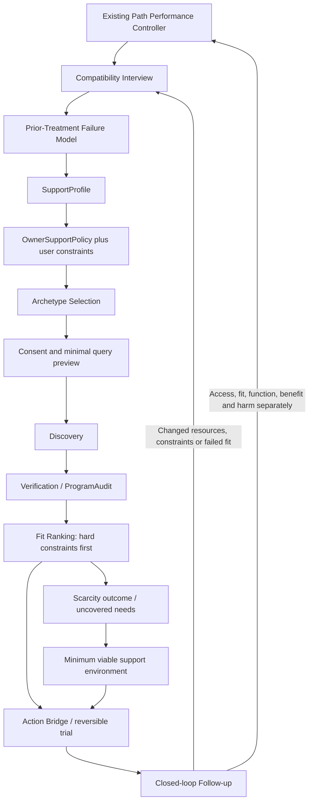

# External support: compatibility, meaningful activity and reversible access

Status: **OWNER-AUTHORIZED CANDIDATE**, 2026-09-07, for draft PR #46. Extends the [existing conception and research note](../../research/2026-09-07-external-support-routing-candidate.md). These A–J design requirements are authorized; runtime wiring, clinical adequacy, storage, provider selection and release are not established by this document. The [task contract](../../../tasks/external-support-20260907/support-contract.mjs) is a pure, task-local prototype. It does not assess a real person, search, contact, refer, buy, persist, or alter the existing controller.

## Preserved pipeline and authority

Support urgency, service intensity and navigation assistance remain separate axes from the original note. Existing emergency, consent and protective routes always take precedence. This pipeline is logical, not a mandatory long questionnaire or a new set of microservices. Official recommendation is **discovery evidence, not fit authority**. A registry can verify a credential within its scope; it cannot establish compatibility, safety or effectiveness. Advertising and reviews likewise supply claims to examine, not authority.

`OwnerSupportPolicy` states version, authorizing source, applicable population/scope, required/avoided features, reasons and review conditions. Owner policy may permit **nature as a hard requirement** and **least-use/shared-decision medication philosophy as a compatibility constraint**. Ask the person whether these are their requirements; do not silently substitute an owner's values for the person's choices or bypass emergency assessment. Compare a service's actual consent, prescribing, review and adverse-event practices rather than accepting a label. Do not assert medication is categorically harmful, promise drug-free outcomes, or advise abrupt discontinuation of prescribed treatment. Any desired treatment change belongs in an informed discussion with an appropriate prescriber.

Every load-bearing item distinguishes: reported experience; externally verified fact (with source/date/scope); hypothesis; owner policy; user choice; and unknown. Prior harm is meaningful individual routing evidence even when population evidence differs. Population evidence does not erase a person's experience; one person's experience does not prove universal harm.

## Compatibility Interview and Prior-Treatment Failure Model

Ask one or a small number of decision-relevant questions at a time; reflect the answer and let the person correct it. Explain why sensitive information would help, offer skip/unknown, and stop once the next safe action is supported. Do not demand diagnoses, exact address, income, trauma narrative or a complete record to offer preliminary navigation.

| Interview area | Example prompt / captured distinction |
| --- | --- |
| Desired daily life and nature | What would a tolerable, useful day look like? How much everyday outdoor access is necessary? Is rural location essential, or could reliable green space meet the need? |
| Prior support | What have you tried, what helped or harmed, and what must not happen again? Distinguish program, method, dose, staff culture, coercion, access failure, environment and external conditions; preserve uncertainty about cause. |
| Current function and supervision | What can you reliably manage yourself, and where do you need another person available? Ask about present self-care, orientation, substance stability, safety, sleep, pain, transport and ability to stop/leave as relevant. History alone is not a current assessment. |
| Meaningful contribution | Which work makes you feel grounded, competent or useful? Which leaves you overwhelmed or in pain? Would a very small trial be welcome? Being unable or unwilling to work must not cost access to needed care. |
| Environment | Any allergy, asthma, mold/damp, animal, sensory, diet, accessibility or privacy constraints? What exposure has actually caused problems, and what is still uncertain? |
| Peers and role burden | Who leaves you steadier, and who relies on you during crises? Are you choosing helpful contribution, feeling responsible for someone's survival, or both? What happens to your own rest and recovery? |
| Money and consent | Would you like to set a maximum total commitment without sharing income? If useful, may we use monthly income/disposable budget to compare this expense with necessities and other support? |
| Philosophy and consent | What treatment approaches, medication decision practices, boundaries or institutional experiences must a service respect? Which are hard requirements versus preferences? |
| Access and trials | What travel/legal/funding constraints matter, who can help make contact, and how could you leave a trial safely? |

The `PriorTreatmentFailureModel` retains intervention/environment, claimed target, benefit/harm and timing, dose/intensity, context, access outcome, person's interpretation, alternative explanations, avoid/retry conditions, evidence source and confidence/unknown. Never encode “failed client”, automatic noncompliance or permanent treatment resistance. A compatible service must address prior failure conditions explicitly; being officially recommended does not reset them. Corrected or withdrawn evidence invalidates dependent fits and shared-query drafts.

## SupportProfile and ProgramAudit

These are candidate contracts, not permission for persistent sensitive records. Minimal outbound discovery payload remains separate from the private profile; consent must name purpose, recipient and fields. Financial data is optional and not included in generic search. Ordinary discovery consent does not authorize contact, disclosure, booking or payment.

| SupportProfile dimension | ProgramAudit counterpart |
| --- | --- |
| Required functions and support/supervision intensity; present function and self-care | Actual staffing, training, scope, continuity, escalation, co-occurring needs and hours of coverage |
| Meaningful activity: desired contribution, strengths, overwhelm/pain limits, capacity, willingness and review | Real activity choices, workload, accommodations, breaks, voluntary opt-out, supervision, progression/reduction and exploitation safeguards |
| Nature requirement and desired amount/type of access | Actual usable daily access, season/weather feasibility, mobility and transport; a scenic photo is insufficient |
| Allergy/asthma/mold/animal constraints, known exposure and uncertainty | Species/animal access to sleeping/living/work areas, ventilation, damp/mold history, cleaning products, smoke, bedding, pollen/dust and ability to separate exposure; independent confirmation where needed |
| Sensory/access/privacy, peer mix and cultural needs | Noise, crowding, hygiene, room/privacy arrangements, staff/peer culture, accommodation and interpersonal climate |
| Treatment philosophy and prior harm/avoid conditions | Consent/coercion practices, shared decisions, least-use approach if required, scope/credentials, complaints and adverse-event handling |
| Budget with optional financial consent; funding, geography, language, visa/legal and transport limits | Total fees plus travel/deposit/insurance/lost benefits or earnings, eligibility, legal access, funding certainty, refund/exit terms and medical access |
| Peer network quality and chosen role | Stable mentors/community, reciprocity, boundaries, safeguarding and staff expectations of residents/volunteers |

Verification attaches to each fact: status (`PASS`/`FAIL`/`UNKNOWN` in the prototype), evidence reference, checked date and currentness. Unverified, expired, conflicted or absent critical facts remain pending. Fit ranking cannot compensate for a failed hard constraint with a high preference score. A qualified human must interpret clinical support needs; this deterministic seam only exercises already-assessed synthetic facts.

## A. Meaningful productive work as a core support function

When the person is capable and wants contribution, meaningful activity is a first-class environment-fit requirement, not an optional amenity. It can supply structure, competence, contribution, routine and community. Include agriculture, gardening, animal care **where tolerated**, maintenance, cooking, crafts, repair, volunteering, supported employment, education and other purposeful activity. Do not equate productive with paid or high-output work, or make usefulness a condition of worth.

Agree a titratable workload based on present function, pain, fatigue and after-effects: for example **1–2 half-days → part-time → more only if tolerated and wanted**. These are discussion examples, not prescribed minimums or validated doses. Record desired start, tolerable ceiling, breaks, recovery time, observable benefit/adverse markers, review date and permission to step down. No automatic increase after attendance alone.

Distinguish therapeutic contribution from exploitation: realistic hours/tasks, informed choice, fair stated exchange/pay where applicable, safe equipment and training, rest, complaints, ability to decline/leave, no coercive debt or loss of needed care/housing as punishment. Work cannot replace required treatment or supervision. The ordinary-placement gate below does not exclude anyone from supported employment/IPS merely because symptoms or substance problems exist; those services deliberately provide support that a host may not.

## B. Ordinary Workaway / WWOOF / farm-stay suitability

Ordinary work exchange is not a supported mental-health environment. **Substantial current instability, active substance or dissociation risk, current repeated hospital use, poor self-care or a need for supervision precludes recommending an ordinary placement as the support plan.** Seek supported alternatives and reassess present needs with a human. A historical diagnosis or remote admission alone is neither a permanent ban nor an automatic residential recommendation.

For mild/moderate depression, mild anxiety, loneliness, burnout, life transition or need for structure/nature, a vetted ordinary exchange may be reasonable **only if current function is sufficiently stable**. Labels alone cannot pass the gate. Before a recommendation assess acuity, self-care, suicidality/violence, substance stability, reality-testing, host-rule capacity, safe exit, finances/transport, conflict tolerance and fallback support. Unknown critical dimensions mean clarification, not approval. Acute danger returns to existing safety handling before travel planning.

Audit host workload, accommodation, hygiene, interpersonal climate, privacy, substance environment, transport/exit, medical access, daily schedule and reviews. Ask whether the host is prepared for the person's **consented, relevant disclosed support needs**; a pleasant listing or all-positive reviews do not establish that capacity. If essential preparedness cannot be established without a disclosure the person declines, keep the result pending or choose a different route. Never forward a private profile to a host automatically.

## C. Staged placement and fit failure

Prefer a low-cost reversible sequence when feasible: **remote interview/video tour → explicit allergen/environment questionnaire → short day visit → 1–3 day trial → 1–2 week trial → longer placement**. For each step record prerequisites, consent, unresolved exposures, support coverage, price/refund, exit transport/funds, contact person, review markers and stop conditions. A remote interview cannot certify mold absence; an absence of symptoms during a short visit cannot guarantee later tolerance.

Do not deliberately challenge a serious suspected allergy/asthma reaction to “test resilience”. Unknown or unsafe exposure requires clarification and relevant clinical advice before exposure. Geography or service restrictions may make a day visit impossible: document the reason and an alternative verification/exit plan; do not silently skip a stage or force an expensive move. Exact durations are owner policy defaults, not evidence-based clinical dosing.

Progression requires a reviewed tolerable stage and ongoing hard-constraint fit; consent can be withdrawn at any point. Avoid large upfront funding, deposits, relocation or time commitments while reversible verification is available. A failed trial due to allergy, mold, animals, sensory load, peer mix, personality/culture, staff behavior, workload, geography or visa/legal access is **fit evidence, not client failure**. Log cause, uncertainty, support impact and refund/exit action; revise the profile/audit and rediscover. Do not reset prior adverse evidence or keep encouraging the same failed placement because money was spent.

## D. Scarcity and a minimum viable support environment

Return zero acceptable options honestly. Preserve distinct outcomes: `NO_GOOD_MATCH`, `TOO_EXPENSIVE`, `ACCESS_BLOCKED`, `WAITLISTED`, `GEOGRAPHIC_MISMATCH`, `PHILOSOPHY_MISMATCH`, `ALLERGY/ENVIRONMENT_MISMATCH`. Multiple reasons may apply. Unknown facts use `VERIFICATION_PENDING`; that is not proof of no available service. Distinguish searched scope, unavailable adapter and actual exhausted candidate set.

When no integrated affordable program fits, **propose** a minimum viable support environment: inexpensive rural housing + structured day work/volunteering + peer mentor/case navigator + local clinician/prescriber as needed + substance-recovery support + scheduled nature exposure + trusted-person check-ins, selecting only relevant modules. Each module must satisfy its own hard constraints and have verified access. A list of modules is not an implemented environment.

Map every required function to a responsible willing person/service, hours, access state, cost, dependency and fallback. Aggregate simultaneous costs, geography, transport/schedule compatibility, supervision gaps and coordination burden. Record tradeoffs and uncovered needs. If continuous supervision is required, housing plus occasional check-ins cannot be called sufficient. Unsafe or unavailable modules remain excluded; inability to assemble adequate coverage remains an honest gap requiring human navigation. Never reduce hard safety/compatibility requirements to fill the screen.

Rediscover when user constraints, capacity, funding, location, availability/waitlist, provider facts or resources change, or a trial fails. Agree who follows up and when; no unsolicited background monitoring is activated here.

## E. Financial fit and high-fee practitioner safeguards

High price alone does not prove poor care. Screen for disproportionate total cost relative to resources, pressure to buy a large package, urgency/scarcity claims, promises of a unique cure, inadequate accessible support around destabilizing practices, and opaque adverse-event handling. Keep observed sales behavior, unanswered questions, alleged misconduct and verified facts distinct. A mismatch may be financial without an exploitation finding.

Offer a user-set maximum all-in commitment without requesting income. Only with explicit consent use monthly income/disposable budget for ratios and opportunity cost: months of income, fraction of annual income and what housing, food, transport or alternative support would be displaced. No moralizing or universal numerical affordability cutoff. Unknown/declined finances remain unknown and do not block free advice; no false zero budget. Withdrawing consent removes financial inputs from any later assessment/export.

Prefer donation/sliding scale, group support, a one-off consultation or a small cancellable package before expensive commitment. Ask for **exact deliverables, session count/duration, cancellation/refund terms, credentials/scope, adverse-event plan, supervision/escalation process, references/outcomes with their limitations, between-session support and lower-cost options**. Independent fit/quality checks and cheaper staged alternatives must precede a disproportionate purchase recommendation. Price or credentials do not certify quality, and references are not causal outcome evidence. No purchase is made by this contract. Do not advise abrupt prescribed-treatment cessation for cost or philosophy reasons.

## F. A useful method can remain a partial tool

Retain a method-level observation vector: self-reported benefit magnitude, duration, dose-response, adverse effects, supervision need/availability, transfer to daily functioning and interaction with pain, substance use, relationships and other problems. Record target, predicted improvement, observation source/time, actual dose/delivery, competing changes and review point. A feeling of relief does not establish mechanism or cure.

Candidate dispositions can coexist: `KEEP_BUT_TITRATE`, `SEEK_SUPERVISION`, `REDUCE_DOSE`, `PAUSE_IF_ADVERSE`, `COMBINE_WITH_OTHER_SUPPORTS`. A reliable anxiety benefit with dose-linked fragmentation calls for preserving that evidence, reducing/limiting exposure, seeking suitable affordable supervision and broader stabilization. **Current adverse fragmentation/dissociation means pause the practice now and use existing de-escalation/support gates**; a future lower-dose option requires reassessment. Never let `KEEP_BUT_TITRATE` override an active protective stop or invent a safe numerical dose.

“Most efficient cure” remains the person's hypothesis: agree broader predicted changes (self-care, steadiness, pain/function, substance stability, relationships), compare actual trajectory over time and consider opportunity cost. If anxiety improves but daily functioning remains flat or deteriorates, retain the anxiety benefit while revising the total-cure hypothesis and support plan. Use the existing path-performance episode/delivery/outcome boundary in a future adapter; this task adds no competing live trajectory controller.

## G. Peer groups and rescuer burden

Ask about reciprocity, emotional aftermath, stability, boundaries, time/money/housing obligations and responsibility during crises. With significant personal struggle and a network dominated by more unstable people, consider caregiver/rescuer overload, boundary erosion, normalization of destabilizing behavior, crisis contagion and reduced recovery capacity **as hypotheses to check**, not labels inferred from friends' diagnoses.

Differentiate supportive friendship from responsibility for someone's treatment, money, housing, crisis management or survival. Help set feasible limits and connect crisis responsibilities to appropriate support. Do not categorically tell people to abandon ill friends. Add more stable peers, mentors and community figures; preserve valued friendships and actual gains. Ask whether helping is meaningful chosen contribution, avoidance of one's recovery, pressure, or a mixture. Do not assume one explanation. Role strain can reduce an otherwise positive work/activity dose.

Relational readiness is already distinct work: PR #46 has the narrow five-signal romance-regulation rule; [PR #47](https://github.com/u-dont-existDOTcom/innerSignalGraph/pull/47) has the broader foreseeable-harm/readiness gate. This peer-burden dimension reuses support-purpose evidence. It does not duplicate romance eligibility, equate friendship with dating, impose full healing, erase partial friendship gains or claim those branches are composed. Existing combined regression requirements remain in the [handoff](../../../tasks/NEXT-CONVERSATION-HANDOFF-2026-09-07.md).

## H. Synthetic regression family

Use a fictional adult receiving a low fixed disability income, with substantial present instability, past dissociative/substance difficulties, chronic pain, repeated hospital use, preference for nature, possible animal/mold constraints and an unstable peer network. A low-cost shaking class yields the clearest self-reported anxiety benefit; more intensive practice sometimes fragments experience. Individual coaching consumes a disproportionate part of a year's resources. No person, country, currency, exact private amount, private quote or identifying teacher/program belongs in fixtures.

Expected candidate outcome: preserve the reported benefit; titrate only after current adverse state is absent, seek suitable supervision if available, combine broader stabilization and apply the cost check. Neither condemn shaking categorically nor endorse it as cure. Ordinary farm exchange fails current support suitability; supported placement still needs allergen/environment verification and reversible trials. With no integrated affordable fit, return the specific scarcity reasons and a modular proposal with uncovered needs. Never call an incomplete modular plan safe, or recommend a financially disproportionate package before independent checks and smaller alternatives.

Use separate counterexamples: stable lower-need person considering an ordinary exchange; remote hospital history with good current function; known severe exposure where no trial should begin; positive low-dose method effects with current adverse episode; affordable transparent practitioner with no sales red flags; helpful friendship without rescue burden; expensive but compatible program versus cheaper incompatible one. Counterexamples protect against categorical bans and false endorsements.

## J. Evidence, validation and implementation boundary

The [bounded scan](../../research/2026-09-07-external-support-owner-delta-scan.md) follows the independently captured owner conception. Compose supported employment, person-centred planning, green-care features, informed consumer choice, support boundaries and harm monitoring. Do not convert sparse care-farming/somatic evidence into strong efficacy claims or infer shaking effects from another intervention.

Task-local schemas and behavioral tests can demonstrate hard-constraint precedence, unknown handling, financial consent, reversible stages, partial-method actions and explicit modular gaps. They cannot verify truthful model extraction, clinical acuity, provider honesty, legal eligibility, allergen safety, treatment efficacy or human outcomes. Before runtime integration, require a separately reviewed adapter to existing controller/consent/storage boundaries and calibrated synthetic multi-turn assessment plus qualified human/domain review. Search vendors, verification freshness policy, retention, regions, follow-up ownership and human escalation thresholds remain implementation decisions to resolve at that boundary; A–I are not re-opened as pending owner approval.
