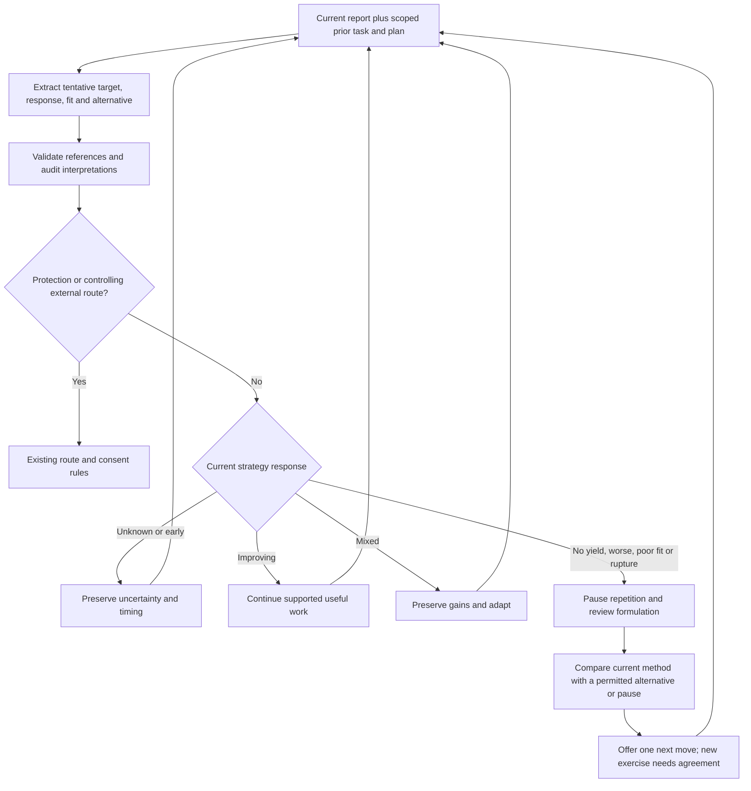

# Current-session strategy performance review

Status: implemented draft candidate for review; not installed or released. The current owner requested inspection and integration of missing dynamic strategy-performance evaluation and switching, while preserving privacy and current authority gates. This authorizes this bounded candidate; it does not approve release, private-history infrastructure, or changes to frozen evaluation evidence.

## Finding and scope

At PR #46 head `aadae353dd383ac95dbe39178ee4645bab7980ec`, dynamic adjustment is partly implemented. `src/case-formulation/turn-task.mjs` retains phase, agreement, marker, response, action outcome and emotional change point. Extraction uses prior snapshot/plan; the audit can correct or invalidate the task. The planner already changes routes for reported inward-attention worsening, external problems and relational assessment. Graph success signals include ordinary-life effects. The companion framework-hypothesis policy remains an offline prototype, unimported by application code.

The missing control is an explicit comparison of the current strategy's expected useful change with reported effects before accepted-task continuity promotes that approach again. Existing guidance can request adaptation but has no structured outcome/fit decision that interrupts repetition.

This change extends the existing current-session task and deterministic planning seam. It adds no memory backend, cross-session ingestion, numerical healing score, model role, paid call, graph node, source-guide rewrite, or automatic global framework promotion. The installed packet path still controls graph selection, and legacy graphs without task policy retain their existing behavior. The new development candidate requires its own behavioral evaluation; PR #46's source pins and prior results are not evidence for this changed candidate.

## Review record and authority

`turn_task.strategy_review` is nullable. New structured outputs include it; validated historical v1 task records may omit it. It carries the current goal's local target, expected change, tentative fit, outcome, whether a meaningful review opportunity has occurred, supporting observation references, and one tentative alternative angle/node. It is private current-session formulation data under the existing conversation boundaries.

The extractor compares the task marker and prior plan success signals with the person's reports even without an explicit complaint. The auditor receives prior task and plan and can correct or invalidate the entire task. A non-null strategy review requires at least Reviewed processing even when Fast is selected; existing deeper safety/intent routing remains intact. All outcome/fit references must occur in the task's observation IDs; the existing scope and audit revocation machinery drops the task when its evidence disappears. A new issue/strategy/target must not inherit old outcome or consent. Structural validation does not prove a label's semantic truth or that the model detected every relevant signal.

No model-generated cumulative trial counts or clinical cutoffs are introduced. `review_due` is a tentative timing judgment checked against the actual opportunity, not a timer or fixed number of chat turns. Silence, brevity, politeness, difficult emotion, persistent symptoms, insight, compliance, or a missed action alone cannot determine success or failure. Noncompletion first requires understanding opportunity and barriers. Delayed effects remain unknown until an appropriate opportunity. Include complicating evidence and partial gains; distinguish reported association from causal explanation.

## Decision and switching behavior

| Evidence state | Next control |
| --- | --- |
| Task closed or refused | Existing closure/refusal semantics; no covert repeat |
| No review, early effect, or unknown outcome | Preserve uncertainty; no manufactured failure or success |
| Supported improvement | Carry the gain forward, with meaningful later review |
| Mixed effects | Preserve the useful part and compare a small adjustment or alternative |
| Due target with no useful yield | Pause automatic exercise repetition and reassess |
| Current worsening or poor fit | Pause and reconsider fit, burden, capacity and alternatives |
| App misunderstanding/rupture | Repair the app's contribution before another exercise |
| Immediate protection or a controlling protective/external route | Existing safety/route precedence governs |

A reassessment removes accepted-task promotion. Where no protective or controlling external route takes precedence, the execution contract uses `review_before_exercise`: graph nodes are eligible options for discussion, and node-coverage enforcement must not force the paused exercise back into the answer. Only an already eligible, unblocked, nondeferred graph node can become a proposed alternative. No eligible alternative means a review/clarification/pause, never an invented route. A declared exercise during review receives one strategy-specific renderer retry; a repeated violation blocks delivery. This checks structured realization claims, not the full meaning of unclaimed prose, which remains a semantic-evaluation obligation.

A different angle can change formulation, practical conditions, care/support, attention, or the decision to do an exercise at all. It must not simply rename the same operation. Offer at most one useful alternative and retain the user's authority. Eligibility is not consent; agreement to the old strategy does not transfer to new imagery, spiritual, somatic or other exercises. A later accepted, newly evidenced task can become the next active route. The controller does not autonomously change treatment, medication, or an installed policy.

## Evidence basis and limits

Independent conception before the external scan: the owner's concern is that the system should notice a poorly performing path and consider another angle without waiting for an explicit complaint. Existing local task state and outcome signals suggest adding a feedback comparison rather than another therapy taxonomy. The required constraints are uncertainty, privacy, source/consent gates, current-task continuity and non-coercion.

Disposition: **COMPOSE / ADAPT**. Searches covered routine outcome monitoring/feedback, not-on-track psychotherapy, and adaptive interventions/decision points. Primary papers were inspected through PubMed abstracts on 2026-09-07:

- [de Jong et al., 2014, randomized trial](https://pubmed.ncbi.nlm.nih.gov/24386975/): feedback benefits varied by treatment duration and recipient; no overall advantage at treatment ending. Reuse the comparison-and-discussion pattern, not a claim that any feedback system improves outcomes.
- [Amble et al., 2016, randomized trial](https://pubmed.ncbi.nlm.nih.gov/26169948/): progress graphs/discussion were considered useful, while a warning signal did not change the subsequent progress slope. Adapt monitoring into an actual response decision; an alert alone is insufficient evidence.
- [Gunlicks-Stoessel et al., pilot SMART](https://pubmed.ncbi.nlm.nih.gov/30577943/): studies decision points and adaptive augmentation in a specific adolescent depression treatment. Reuse explicit decision points; do not import that population's timing, thresholds, algorithms or medication decisions into a general chat system.

External baselines are collaborative routine outcome monitoring and explicit adaptive decision points. The simple local baseline is the unchanged candidate's task continuity with no strategy review. This bounded implementation is compared with that baseline in deterministic planner regressions. No outcome questionnaire or proprietary instrument is copied. No clinical benefit, optimal switching policy, novelty, model detection accuracy or semantic response quality is established by these tests.

Future live evaluation must compare unchanged versus revised candidate across indirect no-yield, partial progress with discomfort, unknown/delayed effects, poor fit, rupture, refusal, safety, valid alternatives and no safe alternative. Assess premature switching and harmful persistence separately. Use independent fictional scenarios and calibrated graders; do not feed the private case or change frozen controls. The existing live-fidelity gate remains outstanding.
