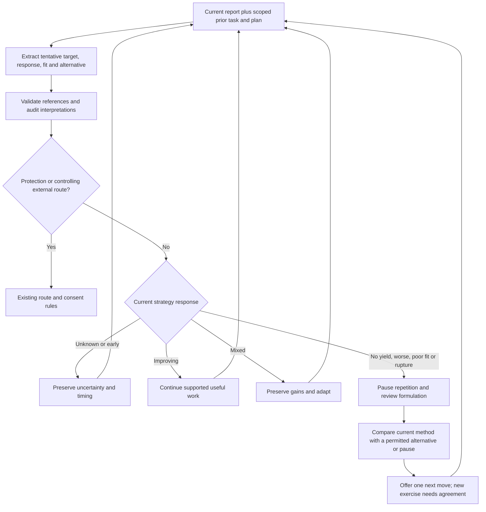

# Current-session strategy performance review

Status: implemented draft candidate for review; not installed or released. The current owner requested inspection and integration of missing dynamic strategy-performance evaluation and switching, while preserving privacy and current authority gates. This authorizes this bounded candidate; it does not approve release, private-history infrastructure, or changes to frozen evaluation evidence.

## Finding and scope

At PR #46 head `aadae353dd383ac95dbe39178ee4645bab7980ec`, dynamic adjustment is partly implemented. `src/case-formulation/turn-task.mjs` retains phase, agreement, marker, response, action outcome and emotional change point. Extraction uses prior snapshot/plan; the audit can correct or invalidate the task. The planner already changes routes for reported inward-attention worsening, external problems and relational assessment. Graph success signals include ordinary-life effects. The companion framework-hypothesis policy remains an offline prototype, unimported by application code.

The missing control is an explicit comparison of the current strategy's expected useful change with reported effects before accepted-task continuity promotes that approach again. Existing guidance can request adaptation but has no structured outcome/fit decision that interrupts repetition.

This change extends the existing current-session task and deterministic planning seam. It adds no memory backend, cross-session ingestion, numerical healing score, model role, paid call, graph node, source-guide rewrite, or automatic global framework promotion. The installed packet path still controls graph selection, and legacy graphs without task policy retain their existing behavior. The new development candidate requires its own behavioral evaluation; PR #46's source pins and prior results are not evidence for this changed candidate.

## Review record and authority

`turn_task.strategy_review` is nullable. New structured outputs include it; validated historical v1 task records may omit it. It carries the current goal's local target, expected change, tentative fit, outcome, whether a meaningful review opportunity has occurred, supporting observation references, and one tentative alternative angle/node. It is private current-session formulation data under the existing conversation boundaries.

The extractor compares the task marker and prior plan success signals with the person's reports even without an explicit complaint. The auditor receives prior task and plan and can correct or invalidate the entire task. A non-null strategy review requires at least Reviewed processing even when Fast is selected; existing deeper safety/intent routing remains intact. All outcome/fit references must occur in the task's observation IDs; the existing scope and audit revocation machinery drops the task when its evidence disappears. A new issue/strategy/target must not inherit old outcome or consent. Structural validation does not prove a label's semantic truth or that the model detected every relevant signal.

No model-generated cumulative trial counts or clinical cutoffs are introduced. `review_due` is a tentative timing judgment checked against the actual opportunity, not a timer or fixed number of chat turns. Silence, brevity, politeness, difficult emotion, persistent symptoms, insight, compliance, or a missed action alone cannot determine success or failure. Noncompletion first requires understanding opportunity and barriers. Delayed effects remain unknown until an appropriate opportunity. Include complicating evidence and partial gains; distinguish reported association from causal explanation.

## Decision and switching behavior

| Evidence state | Next control |
| --- | --- |
| Task closed or refused | Existing closure/refusal semantics; no covert repeat |
| No review, early effect, or unknown outcome | Preserve uncertainty; no manufactured failure or success |
| Supported improvement | Carry the gain forward, with meaningful later review |
| Mixed effects | Preserve the useful part and compare a small adjustment or alternative |
| Due target with no useful yield | Pause automatic exercise repetition and reassess |
| Current worsening or poor fit | Pause and reconsider fit, burden, capacity and alternatives |
| App misunderstanding/rupture | Repair the app's contribution before another exercise |
| Immediate protection or a controlling protective/external route | Existing safety/route precedence governs |

A reassessment removes accepted-task promotion. Where no protective or controlling external route takes precedence, the execution contract uses `review_before_exercise`: graph nodes are eligible options for discussion, and node-coverage enforcement must not force the paused exercise back into the answer. Only an already eligible, unblocked, nondeferred graph node can become a proposed alternative. No eligible alternative means a review/clarification/pause, never an invented route. A declared exercise during review receives one strategy-specific renderer retry; a repeated violation blocks delivery. This checks structured realization claims, not the full meaning of unclaimed prose, which remains a semantic-evaluation obligation.

A different angle can change formulation, practical conditions, care/support, attention, or the decision to do an exercise at all. It must not simply rename the same operation. Offer at most one useful alternative and retain the user's authority. Eligibility is not consent; agreement to the old strategy does not transfer to new imagery, spiritual, somatic or other exercises. A later accepted, newly evidenced task can become the next active route. The controller does not autonomously change treatment, medication, or an installed policy.

## Evidence basis and limits

Independent conception before the external scan: the owner's concern is that the system should notice a poorly performing path and consider another angle without waiting for an explicit complaint. Existing local task state and outcome signals suggest adding a feedback comparison rather than another therapy taxonomy. The required constraints are uncertainty, privacy, source/consent gates, current-task continuity and non-coercion.

Disposition: **COMPOSE / ADAPT**. Searches covered routine outcome monitoring/feedback, not-on-track psychotherapy, and adaptive interventions/decision points. Primary papers were inspected through PubMed abstracts on 2026-09-07:

- [de Jong et al., 2014, randomized trial](https://pubmed.ncbi.nlm.nih.gov/24386975/): feedback benefits varied by treatment duration and recipient; no overall advantage at treatment ending. Reuse the comparison-and-discussion pattern, not a claim that any feedback system improves outcomes.
- [Amble et al., 2016, randomized trial](https://pubmed.ncbi.nlm.nih.gov/26169948/): progress graphs/discussion were considered useful, while a warning signal did not change the subsequent progress slope. Adapt monitoring into an actual response decision; an alert alone is insufficient evidence.
- [Gunlicks-Stoessel et al., pilot SMART](https://pubmed.ncbi.nlm.nih.gov/30577943/): studies decision points and adaptive augmentation in a specific adolescent depression treatment. Reuse explicit decision points; do not import that population's timing, thresholds, algorithms or medication decisions into a general chat system.

External baselines are collaborative routine outcome monitoring and explicit adaptive decision points. The simple local baseline is the unchanged candidate's task continuity with no strategy review. This bounded implementation is compared with that baseline in deterministic planner regressions. No outcome questionnaire or proprietary instrument is copied. No clinical benefit, optimal switching policy, novelty, model detection accuracy or semantic response quality is established by these tests.

Future live evaluation must compare unchanged versus revised candidate across indirect no-yield, partial progress with discomfort, unknown/delayed effects, poor fit, rupture, refusal, safety, valid alternatives and no safe alternative. Assess premature switching and harmful persistence separately. Use independent fictional scenarios and calibrated graders; do not feed the private case or change frozen controls. The existing live-fidelity gate remains outstanding.

## Owner correction: relational readiness and foreseeable harm

This delta is explicitly owner-authorized on PR #47, from fetched head `d6af04da5564564d62fe17e0a096eca2386fe311`. It corrects prior model advice: generic evidence that relationships or social connection can help must not override case-specific foreseeable-harm analysis. The causal/decision error was collapsing **human connection** and **romantic/sexual involvement** into one variable and failing to condition the proposed action on current instability, dependency, load and foreseeable harm. The correction is a candidate policy implementation; it does not claim clinical efficacy or authorize installation/release.

A person need not be fully healed before romance. They do need enough current functional stability that entering a relationship is not foreseeably likely to cause serious harm to themselves, a partner, or dependent/future children where relevant. Severe current instability can contraindicate active romance-seeking. Repeated psychiatric hospitalization, major reality-testing loss, acute suicidality/self-harm, severe substance dependence/relapse risk, violent dyscontrol, extreme dependency, inability to maintain basic self-care and other case-specific risks warrant current assessment. No diagnosis, one phrase, or hospitalization history alone creates an automatic permanent prohibition. Do not invent children or turn possible future harm into a certainty.

Friendship, community, peer support, mentoring and supervised living are distinct actions and can be actively useful while romance-seeking is paused. Do not advise isolation. Depending on local availability, fit and needed support, structured alternatives can include therapeutic community, care-farm/green-care or Soteria-like settings. The gate does not select or prescribe a level of care, change medication, impose a breakup or substitute community living for needed immediate care. Frame readiness through current functioning, foreseeable harm, responsibility, load and reversibility; never moral purity, worthiness or “love yourself first.”

### Structured assessment and decision

Nullable `turn_task.relational_readiness` is independent of `strategy_review`, so an initial dating request can receive an assessment without an existing exercise episode. Historical v1 task records may omit the new nullable field; newly generated records include it. It uses the existing scoped task observations and audit machinery, not a new client history or storage layer.

The record distinguishes romance/pursuit from support-building; current sufficient/insufficient/unknown stability; substantial/not-substantial/unknown foreseeable harm and affected parties; current versus historical risk signals; trajectory; non-romantic versus instrumental/mixed support purpose; evidenced supports/counterevidence; explainable reasons; case-specific readiness markers and when to revisit them. Assertions require task-bound observation IDs. Removed evidence invalidates the task; a changed issue clears inherited assessment while preserving a new current-issue assessment bound to fresh stability/harm observations. A new current assessment may reopen readiness even while historical risk stays recorded.

`relationalReadinessDecision` composes with current safety and strategy review:

| Current assessed evidence | Decision | Romance recommendation | Non-romantic support |
| --- | --- | --- | --- |
| Sufficient stability and no substantial foreseeable harm | `NOT_BLOCKED` | Available, without a guarantee of safety | Available |
| Unknown/insufficient readiness without established substantial harm | `ASSESS_BEFORE_ROMANCE` | Withheld pending assessment; no permanent ban | Available |
| Substantial foreseeable harm, immediate protection/current suicidal intent or worsening relational dependency | `PAUSE_ROMANCE` | Pause active pursuit for now and revisit markers | Available within current safety constraints |

An assessed worsening trajectory with current dependency, relational preoccupation, escalating pursuit or a partner used as primary regulator overrides a positive strategy-outcome proxy. Partner-as-analgesic/reality-anchor/rescuer/proof-of-worth is included in this assessment. A contextual statement such as “keeps me sane” is not itself a diagnosis or a permanent bar; evidence of actual severe dependency/reality-testing risk matters.

Instrumental or mixed socializing does not count wholesale as successful non-romantic support-building. `supportProgress=NOT_EQUIVALENT_TO_NONROMANTIC_SUPPORT` and `REASSESS_SUPPORT_SUBSTITUTION` override an otherwise improving support-building task. Preserve separately evidenced friendship gains, but do not use social attendance or a successful romantic pursuit as the target's success metric. Unknown purpose does not establish progress either: all other states still require observed benefit.

### Trace and enforcement

The evidence-bearing decision and `relationalGuidance` live directly on the execution contract even when a protective/external route controls, the task is closed/refused, or ordinary task guidance does not apply. The existing current-session formulation and intervention contract retain them in the strategy episode. They are private session data, not remote diagnostics, public training data or permission for cross-session ingestion.

Readiness requires at least Reviewed case processing, including when Fast is selected. It can pause automatic accepted-task promotion. A paused/unresolved romance task loses dating action/cue guidance and questions; existing immediate safety routes/questions remain controlling. Unresolved readiness can ask one canonical current-function/support question while respecting explicit refusal, closure and no-question mode. Non-protective strategy review treats selected nodes as discussion options rather than requiring another exercise. No alternative gains consent from the prior task.

When this decision exists, the renderer receives a conditional required `relational_advice` object identifying romance endorsement/discussion/pause and support proposal, partial-friendship-gain or support-goal progress claims, with a verbatim answer quote. The response contract rejects a missing/malformed declaration, ungrounded quote, declared romantic endorsement without readiness, an unsupported readiness ban when `NOT_BLOCKED`, or a support-progress claim that substitutes partner-seeking. One corrective retry can repair the actual advice; a repeated violation blocks delivery. A voluntary user choice not to date is respected and is not a readiness ban.

Limits: these are deterministic controls on audited interpretations and declared response actions. The code does not prove the extractor noticed risk, that reasons/markers are clinically sound, that all evidence is current, or that prose honestly matches its declaration. An omitted assessment, mislabeled action or concealed endorsement remains a semantic-evaluation obligation. Current `taskPolicyVersion=1` candidate graphs use the gate; preserved installed packet graphs retain their legacy behavior. No silent packet-policy installation is authorized. Calibrated fictional multi-turn live tests and human/domain review remain outstanding; prior PR #46 fidelity results do not cover this delta.

### Adversarial regression coverage

`tests/relational-readiness.test.mjs` exercises the five owner-required situations: stable isolation without a dating ban; current major instability with romance paused and support retained; evidenced partner-as-reality-anchor dependency; instrumental/mixed socializing rejected as a support-success proxy; and improved current readiness reopening after a pause. Additional cases cover evidence revocation/correction, changed issue, current-versus-historical risk, unknown readiness, affected-party traceability, Fast audit routing, protective/external route precedence, accepted dating cue suppression, refusal/closure, legacy compatibility, actual planner/prompt seams, and first-call/retry/blocked response delivery. The fixtures are fictional and contain no private case material.
