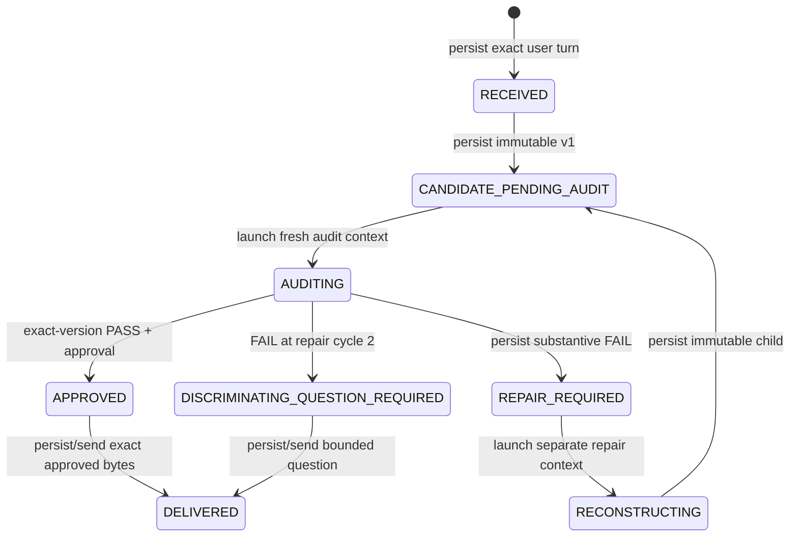

# Automatic private-turn orchestration

**Status:** implementation contract for draft PR #49  
**Scope:** ordinary InnerSignal therapy turns backed by the encrypted private case store  
**Privacy:** architecture and synthetic examples only; no real case content or private-derived digest belongs in Git

## Product boundary

One inbound message is one runtime operation. The server persists the exact user turn before any inference, reconstructs authorized longitudinal context from the private store, and owns every later lifecycle transition. Intermediate candidates and audits never become client-visible responses. The only successful HTTP response is the exact persisted delivery: either an independently approved candidate or, after the second failed repair, the smallest discriminating question permitted by the current episode.

The owner never opens another conversation, moves a handoff identifier, copies an audit, selects the current candidate, or performs a Git operation during an ordinary turn. `InnerSignal Private Continuity` remains a separate read-only surface for authorized inspection and recovery.

Operational invocation or structured-output failures do not advance this semantic graph. They are appended as private failure events, retried at most the configured fixed attempt ceiling, and leave the semantic frontier resumable. Exhaustion returns a concise fail-closed runtime error; it never delivers candidate bytes and never converts an interface error into a substantive audit failure.

## Persisted record

The encrypted case record adds an append-only `runtime_turns` collection. Each runtime turn stores:

- stable runtime, exchange, user-turn, and optional assistant-turn identifiers;
- the current explicit state, repair cycle, and exact current candidate reference;
- an append-only transition/invocation event ledger;
- an immutable discriminator artifact when the terminal uncertainty route is used; and
- the exact delivered response, kind, assistant-turn reference, and exact candidate/audit binding when applicable.

The incoming user text first lands in an immutable encrypted inbox record at `RECEIVED`, before inference. Candidate production determines the episode binding; the candidate commit then atomically promotes those exact unchanged bytes into the canonical transcript together with the state/diff and candidate. Delivered assistant text is likewise a canonical transcript entry. Candidate text and audit prose remain in the same encrypted record under the existing immutable version and audit-history controls.

Every nonfinal persisted state has one controller-owned next action. Restart creates a new controller instance, loads the runtime turn, reconciles it with the immutable candidate lifecycle, and resumes from that state. If a crash occurs after a candidate/audit/approval mutation but before the corresponding transition event, reconciliation records the already durable result instead of re-producing or weakening it.

## Session and information separation

Every model invocation receives a pre-persisted opaque `context_id`. Providers used by this controller must explicitly declare per-request isolation:

- OpenAI API calls use independent Responses requests with `store: false`;
- Anthropic API calls use independent Messages requests;
- Codex CLI calls use ephemeral, isolated invocations;
- Claude CLI calls use no session persistence and one turn; and
- synthetic providers declare and expose the same contract for tests.

The controller rejects a provider that cannot promise isolated per-call context. It also rejects equal producer/auditor context IDs. A candidate records the context that produced or modified its exact bytes. An auditor receives only a sealed audit packet containing the exact candidate and the minimum authorized case/evaluation context. The packet excludes pipeline traces, draft alternatives, provider metadata, prior repair rationale, and any producer hidden reasoning. The audit result is derived and persisted against candidate ID, version, and SHA-256 of the exact text.

A repair invocation receives the exact failed candidate, its frozen audit findings, and authorized current context. It runs under a new producer context. Its child candidate has different bytes, explicit parent/root lineage, incremented repair cycle, no inherited audit, and a closed delivery gate. The subsequent auditor runs under another new context and must cover the complete repair-induced-error checklist.

## Runtime components

The controller depends on narrow injected capabilities:

1. a private case store/access service for exact persistence;
2. a candidate producer that may use the existing tiered therapy pipeline;
3. a blind candidate auditor using a stateless provider invocation;
4. a repair producer using a separate stateless invocation;
5. a discriminator producer constrained to one bounded question; and
6. an opaque ID/clock source for deterministic tests and non-colliding production records.

The production server composes those capabilities internally. Tests can inject deterministic synthetic implementations, but no public route accepts candidate text, audit findings, context IDs, or lifecycle transitions from the owner.

## Exact delivery

Candidate delivery is one private-store mutation. It verifies that:

- the runtime turn is `APPROVED`;
- the named candidate is the exact current active version;
- its status is `approved_for_delivery`;
- its approval audit is an independent PASS bound to the same ID, version, and text digest; and
- the assistant transcript bytes equal the immutable candidate bytes.

That mutation appends the assistant transcript entry, marks the candidate `sent`, records the exact delivery, and advances the runtime turn to `DELIVERED`. A replay returns the persisted delivery; it cannot create a different assistant response.

For final unresolved uncertainty, no repair-cycle-3 candidate exists. A separate discriminator context creates one nonempty bounded question. Deterministic admission rejects multiple questions, advice disguised as a question, or text that is not a question. The store freezes it and atomically appends it as the delivered assistant turn.

## Production and private boundary

The runtime uses the existing case-scoped authorization/key-provider boundary. A server request supplies transport authentication, not private material in tool arguments. All runtime records are encrypted at rest beneath the configured private root outside the checkout. The controller imports no Git or GitHub module and ordinary-turn tests install a trap that fails if any GitHub mutation capability is invoked.

Reasoning ledgers remain separate diagnostics and are not runtime persistence. Production composition must use redacted/off ledgers for private traffic unless the owner explicitly selects another private diagnostic policy.

## Acceptance gates

Synthetic end-to-end tests must prove:

- one inbound message reaches exact approved delivery without lifecycle intervention;
- a substantive failure automatically creates an immutable child and a fresh audit;
- producer, repair producer, and applicable auditors have distinct context identities;
- self-certification and stale/exact-version approval fail mechanically;
- repair cycle 2 is the maximum and a further failure delivers a discriminator, not v4;
- invocation failure retries are bounded and exhausted failures disclose no candidate;
- an encrypted record reopened by a fresh store/controller preserves intake, state, candidates, audits, and delivery;
- production audit packets omit hidden reasoning and producer traces;
- real/private markers cannot appear in the repository, CI-facing fixtures, or ordinary logs; and
- no ordinary therapy turn invokes GitHub or creates a commit.

The complete package gate and publication audit must pass before the branch updates PR #49. The PR remains draft, open, and unmerged.
