# InnerSignal learning groundwork

This directory now covers both the original offline foundation and a live private local-loopback
learning lifecycle. The main app can preview and contribute strict generalized evidence to a
durable queue on the same device. It does not transmit learning data off-device, connect
learning evidence to the therapy runtime, or grant authority to a candidate.

The architecture keeps four surfaces separate:

1. Session adaptation is a future conversational concern and is not implemented here.
2. Per-user personalization is represented only by a strict schema and a pure precedence resolver. Nothing persists or consumes it at runtime.
3. Community lesson candidates remain offline groundwork; main-app response-feedback evidence
   uses a separate strict live-local contract and durable private queue.
4. Global therapy policy remains behind a fail-closed, pure promotion predicate that requires an external owner-decision reference and regression evidence. The predicate performs no write or activation.

The governing epistemic rule is: a feedback signal is not a lesson; a lesson is not a user memory; a user memory is not global therapy policy. Recurrence is occurrence metadata, not scientific confidence, causal evidence, or policy authority. Participant outcome reports retain the boundary `participant-report-only-no-causal-inference`, and contradictory directions remain visible.

Every candidate has runtime, therapy-policy, and external-transmission authority fixed to
`none`. The exact authorized consumer is the existing loopback app/server. Learning modules
have no external-network-capable dependency.

## Live local loopback flow

```text
category-only correction signal
→ user-edited generalized evidence
→ mandatory exact preview and identifiability warning
→ free refusal or explicit default-continuation action
→ durable private local queue and ISL-LOCAL receipt
→ local maintainer disposition
→ user revocation/deletion
```

Preview nonces are in-memory, cryptographically random, single-use, and expire within ten
minutes. The queue stores only the strict derived candidate, hashes of random occurrence and
revocation tokens, fixed audit action codes, and timestamps. Raw user/assistant messages,
transcripts, therapy state, identifiers, embeddings, source hashes, and model-generated
summaries are not eligible fields. Final-occurrence revocation deletes the candidate and its
review metadata from this queue.

## Offline flow

```mermaid
flowchart LR
  A[Synthetic structured feedback] --> B[Strict validation]
  B --> C[Deterministic privacy pre-screen]
  C --> D[Strict revalidation]
  D --> E[Deterministic privacy post-screen]
  E --> F[Canonical fingerprint]
  F --> G[In-memory mock queue]
  G --> H[Synthetic review card]
  H --> I[Pure owner-decision promotion predicate]
  I -. no write or activation .-> J[Eligible result only]
```



No raw conversation object is accepted. Canonicalization/generalization is represented only by fabricated fixtures in this slice. Passing the offline structural screen never means data is safe or authorized to transmit.

## Completion boundary

The live local lifecycle is operational only on the existing loopback app. Scientific adequacy
is not assessed and release, off-device transmission, cross-user aggregation, billing, provider
integration, and public deployment are not authorized. No therapy ledger, guide, graph, prompt,
safety gate, evidence policy, or therapy behavior is changed.
