# InnerSignal learning groundwork

This directory defines an offline-only foundation for learning from user feedback. It does not connect to the therapy runtime, transmit data, create a real review queue, or grant authority to a candidate.

The architecture keeps four surfaces separate:

1. Session adaptation is a future conversational concern and is not implemented here.
2. Per-user personalization is represented only by a strict schema and a pure precedence resolver. Nothing persists or consumes it at runtime.
3. Community lesson candidates are generalized structured records processed by deterministic privacy checks and a purely in-memory mock queue.
4. Global therapy policy remains behind a fail-closed, pure promotion predicate that requires an external owner-decision reference and regression evidence. The predicate performs no write or activation.

The governing epistemic rule is: a feedback signal is not a lesson; a lesson is not a user memory; a user memory is not global therapy policy. Recurrence is occurrence metadata, not scientific confidence, causal evidence, or policy authority. Participant outcome reports retain the boundary `participant-report-only-no-causal-inference`, and contradictory directions remain visible.

Every candidate has `runtimeAuthority`, `therapyPolicyAuthority`, and `transmissionAuthority` fixed to `none`. The modules under `src/learning` have no runtime consumer and no network-capable dependency.

## Offline flow

```mermaid
flowchart LR
  A[Synthetic structured feedback] --> B[Strict validation]
  B --> C[Deterministic privacy pre-screen]
  C --> D[Strict revalidation]
  D --> E[Deterministic privacy post-screen]
  E --> F[Canonical fingerprint]
  F --> G[In-memory mock queue]
  G --> H[Synthetic review card]
  H --> I[Pure owner-decision promotion predicate]
  I -. no write or activation .-> J[Eligible result only]
```

No raw conversation object is accepted. Canonicalization/generalization is represented only by fabricated fixtures in this slice. Passing the offline structural screen never means data is safe or authorized to transmit.

## Completion boundary

This is subtask enablement only. Scientific adequacy is not assessed, release is not authorized, and current consent policy remains local-only. No therapy ledger, guide, graph, prompt, safety gate, evidence policy, or therapy behavior is changed.
