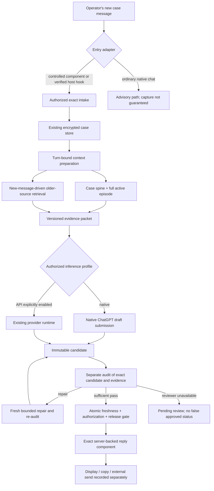

# InnerSignal: turn-bound longitudinal continuity

Version: 1.0 — 2026-09-17

Status: implementation-ready architecture with an isolated executable reference. Not installed, deployed, or clinically validated. Hosted capability verification and integration remain work items. The reference does not replace the application.

## 1. Outcome and decisions

The outcome is that the operator can continue an established case without repeatedly supplying old facts, reminding the assistant to retrieve the case, or moving routine context packets between conversations. The system must preserve the distinction between what was reported, what was inferred, what remains unknown, and what was actually sent.

This design extends the existing encrypted case store, source artifacts, structured longitudinal state, semantic active episode, candidate versions, and independent-audit lifecycle. It does not introduce another memory database, a second user-facing continuity plugin, a compulsory Mission Control runtime, a new therapy method, or a different model by stealth.

The preferred reasoning surface remains ChatGPT using the owner's selected high-capability model. Backend API inference is a separately authorized profile, not a way to charge API calls to a ChatGPT subscription. Neither this design nor its tests enable paid inference. [O3]

Decisions made here:

1. Make the controlled case input—not an optional model decision—the reliable ingestion boundary.
2. Prepare one versioned evidence packet before case-specific drafting. Preserve the complete active episode and search older exact sources in response to the new message.
3. Preserve a small, source-linked case spine and conditional relationships. Do not make a rolling prose summary the authority.
4. Separate mechanical source coverage from semantic use of history. Evaluate both.
5. Bind review and release to the exact candidate AND the exact evidence revision.
6. Show the released response directly from the server-backed component. A subsequent freeform ChatGPT paraphrase is not the approved artifact.
7. Keep a useful ordinary-conversation route, with truthful limitations. Do not disable it just because stronger certification is unavailable.
8. Preserve the current independent-audit boundary for audited delivery; never label a producer self-check as independent.

These decisions are architectural requirements for the controlled route. They are not a claim that ordinary ChatGPT can be prevented from emitting untracked prose.

## 2. The boundary that must not be hidden

An external service controls requests that reach it. It does not thereby intercept every message typed into ChatGPT's ordinary composer, suppress arbitrary ChatGPT text, force a particular tool call, or create an independent ChatGPT Pro conversation.

OpenAI documents component-to-tool calls and a component follow-up-message bridge. These support a controlled input component inside ChatGPT. They do not, in the documentation checked, establish a universal before-answer hook for ordinary Chat mode. Documentation for Codex hooks and Work subagents concerns different execution surfaces; eligibility, model selection and isolation cannot be assumed to transfer. [O1, O4, O5]

There are therefore three explicit operating profiles:

| Profile | Input and reasoning | What the service can enforce | Limitation |
|---|---|---|---|
| `native_advisory` | Ordinary ChatGPT conversation; plugin retrieves on instruction | Source validity for calls that occur; candidate persistence when submitted | Cannot guarantee capture, tool invocation, review, or native text interception |
| `native_controlled` | The operator uses the InnerSignal input component in ChatGPT; native ChatGPT drafts from the prepared packet | Captured input, versioned preparation, server command validation, exact released component output | Native drafting/completion and a truly separate subscription-funded reviewer need live host verification; no supported automatic reviewer route is presumed |
| `api_controlled` | Controlled input invokes the existing backend generation/audit runtime with an explicitly authorized provider profile | Ordering of preparation, generation, independent calls, version checks, exact release | Separately billed inference; requires owner authorization, supported model configuration and actual provider receipts |

Default implementation preference is `native_controlled`; `native_advisory` remains available. `api_controlled` is disabled unless separately authorized. A native reviewer capability failure does not silently select the API profile.

The controlled input need not be a new website. A case-scoped component within the existing plugin can accept the same pasted message, show progress, and render the server's artifact. This is one change of input surface, not a reminder required on every turn. The actual supported component bridge must first be tested in the user's host. If a supported ordinary-Chat pre-submit hook becomes available, it may replace the component entry adapter after proving the same invariants. Do not assume one from similarly named Codex features.

## 3. Verified incumbent and concrete gaps

Inspection baseline: `u-dont-existDOTcom/innerSignalGraph`, commit `bf35a23dc0146c21586108fed0f726c50db8c436`, tree `574ca1a676f1fce57dd5b36109f9d808c73ad8bb`. `main` is development; `stable` remains installation/release authority.

The repository already provides:

- `src/case-state/longitudinal-state.mjs`: source-bearing items, report/inference/hypothesis status, answered questions, intervention history, contradiction clusters and episode state.
- `src/case-state/context-window.mjs`: complete active-episode selection, older source retrieval from state references and a decision-relevant projection.
- `src/orchestrator/context-builder.mjs`: assembly into the therapy context.
- `src/supervisor/private-therapy-model-runtime.mjs`: case loading, provider-based generation, state proposal and audit/repair packet assembly.
- `src/supervisor/private-therapy-turn-controller.mjs`: exact inbound capture, candidate/audit/repair/delivery lifecycle and bounded retries.
- `src/storage/private-case-access.mjs`, `private-case-store.mjs`, `transcript-amendments.mjs`: authorization, encrypted persistence and effective transcript provenance.
- `plugins/inner-signal-therapy/skills/inner-signal-private-continuity/SKILL.md`: read-only private continuity as a capability of the same InnerSignal plugin.

Verified gap: `targetedRetrievalRequests(caseState, recentTurnIds)` does not accept the new message. It mainly follows already high-relevance state items and open contradictions and caps requests at 24. `buildDurableCaseContext` stores the new message but does not feed it into that selector. This can miss an old, unindexed or previously low-relevance observation that a new development makes important. It is an observed code property, not proof of what caused any particular historical response.

Verified boundary: the plugin skill explicitly describes read-only context retrieval. It does not itself provide write, independent review, or delivery authority. A fresh-session instruction also does not prove per-turn activation in a long-running conversation. [R1–R6]

Inspection items, not assumed defects: verify whether the producer's use of `record.raw_transcript` includes effective completion amendments; verify cross-process write coordination in the existing store; verify all generation stages actually receive the new evidence fields. The worker must test these seams before changing them.

No live private case was read for this design. Claims about historical private facts must remain attributed to their available sources until exact private records are retrieved. Prior chat claims that precise historical dates were verified are not imported as evidence.

## 4. Logical architecture

The existing controller remains the lifecycle owner. New context-preparation and admission functions extend it. Do not build a competing turn queue or approval database around it. Transport adapters call the same application services.

### Trust zones

A. User-facing host: may display ordinary model prose; not authority for backend completion.

B. Plugin component: initiates authorized commands and renders exact artifacts. It is a client, not an authorization authority. Its stored UI state is a cursor, not case truth.

C. Private application boundary: authenticates principal, checks case ACL and scopes before key access, records exact text, assembles evidence, validates transitions and artifacts.

D. Model providers: produce proposals and semantic judgments. They do not grant themselves source truth, permissions, audit independence or release status.

E. Public developer repository: schemas, code, synthetic fixtures, portable lessons. No private case text, identifiers, patient-derived hashes, tokens, locator databases or production key material.

## 5. Data model: reuse plus narrowly scoped extensions

The existing envelope remains the canonical store. Add versioned fields through a compatibility migration, not a replacement backend. Old immutable handoffs remain historical snapshots; opening one for new work resolves the current authorized case revision before continuing.

### 5.1 Separate revisions

Use three separate counters:

- `record_revision`: every durable envelope mutation, including audit bookkeeping.
- `evidence_revision`: changes that alter what the next response must know: new reported message, correction, accepted state update, source amendment, applicable guide/constitution change, or relevant consent change.
- `artifact_version`: immutable versions of drafts, translations, reviews and released text.

This distinction avoids invalidating a context packet merely because its own audit was recorded. Evidence changes do invalidate pending claims of current-context completion. Authorization revocation has a separately checked grant epoch.

### 5.2 Exact source event

An event records the submitting principal separately from the attributed speaker. A supervisor relaying a client's words is not the client directly using the host. Preserve original bytes and quotation boundaries; mark a paraphrase as a paraphrase.

Required: event ID, case ID, event kind, original text or source-artifact reference, exact-text SHA-256, trusted receipt time, source provenance, and supersession/amendment links where applicable. Claimed message time, timezone and speaker identity may be unknown. Never turn receipt time into the author's send time.

Event kinds distinguish `client_report`, `supervisor_report`, `supervisor_correction`, `assistant_draft`, `assistant_released`, `operator_reported_sent`, `external_delivery_receipt`, and `translation`. Legacy user/assistant turns keep their original representation; add metadata rather than rewriting history.

### 5.3 Source-linked state and conditional relationships

Retain existing item IDs and epistemic statuses. Add optional structured relationships as a projection of exact evidence:

`subject + condition/change + reported outcome + time scope + source IDs + status + confidence + still-current + supersession`.

Example, wholly synthetic: a person previously reported that quieter mornings coincided with easier reading. A new report about a quieter room should retrieve the older association and invite a check of the reading outcome. It does not establish that noise caused the difficulty or that reading has improved now.

Do not overwrite a stronger old observation with a newer model inference merely because it is newer. New contradictory reports can coexist with different time scopes. A relationship can be historically well-supported yet currently unconfirmed.

### 5.4 A small case spine

The spine contains ongoing goals, current developmental/therapeutic agenda, source-grounded constraints, meaningful intervention responses, answered questions, unresolved discriminators, and current safety/capacity state. A temporary safety clarification changes the immediate focus without silently erasing the longer-term agenda.

The spine is a retrieval index and working projection, not a lossy replacement for the transcript. Keep links to evidence, later corrections and the last time a time-sensitive observation was checked. Do not put hundreds of historical facts into every prompt.

### 5.5 Question state

Track `unasked`, `asked_unanswered`, `partially_answered`, `answered`, `recheck_due`, `superseded`, `not_currently_relevant` and the reason for transitions. Preserve existing answered-question data during migration.

Reopening a question requires a concrete reason: changed conditions, contradictory evidence, unclear earlier answer or new time scope. “Were you ever assessed?” differs from “Has something materially changed since the previous assessment?” A missing current answer does not justify pretending the old answer was never given.

### 5.6 Proposed state is not admitted evidence

Stage writer-generated state changes separately from the canonical pre-turn state. The reviewer must see them as proposals, not as already verified premises. Source extraction does not upgrade the underlying speaker's certainty. Rejecting a candidate must not leave its unsupported formulation installed as a case fact.

If an accepted projection patch is committed as part of release, the atomic event records both the evidence revision reviewed and the resulting post-release revision. The release tests the old revision before applying its own admitted patch. An unrelated incoming correction still invalidates an in-flight packet. Do not create an endless loop in which a reply's own bookkeeping makes it stale.

### 5.7 Drafts, languages and actual sending

A proposed message, edited message, translation, displayed artifact and external send are different events. Exact approval binds each released language variant or an explicit reviewed bilingual artifact. A translation after approval is a new candidate unless a preapproved deterministic nonsemantic transformation applies.

The service can know it made an artifact available. A component acknowledgement can establish that the component rendered it. Copying does not establish external sending. “I sent this version” is a supervisor report, not a provider delivery receipt. The original approved artifact is never overwritten to match a later edited outgoing message.

## 6. Turn preparation: automatic evidence acquisition

### 6.1 Intake first

A controlled submission authenticates and persists the exact inbound message with a case-scoped idempotency key. Repeating the same key with identical bytes resumes the same turn; different bytes are a conflict. Do not silently create a duplicate clinical event after a timeout.

The server loads current state, effective amended transcript, guide/constitution references, active episode and authorized recent tracker records. It compares source and index watermarks. A lagging index is updated synchronously or bypassed with a scoped raw scan; it is never reported as current while omitting new evidence.

### 6.2 Preserve the strongest simple baseline

When the authorized history fits the measured input budget at acceptable latency, include it, with a short relevance preface. Full-context input is an explicit baseline, not a straw man. When it does not fit, use the spine, complete active episode and targeted older exact passages.

Do not infer the usable native ChatGPT token budget from an API model with a similar name. Do not infer delivery of an oversized packet from a transport success. Chunk with exact manifests and make missing/unread chunks explicit. A complete source archive is not proof the reasoner saw every chunk. [M1, M2]

### 6.3 Retrieval channels

Compose, deduplicate and budget these channels:

1. Required spine and episode source references, answered-question anchors and unresolved high-relevance contradictions.
2. Search of the full authorized effective transcript using the incoming message plus active topic context. Do not restrict this channel to already-extracted memory items.
3. Relationship retrieval from changes in a condition, intervention or outcome: retrieve the other side of the previously reported relationship and its exceptions.
4. Temporal and update search: later corrections, negations, reconfirmations and conflicting observations.
5. An optional semantic channel only when the approved local or external capability is available. No paid embedding or external memory service is introduced by default.

Start with local lexical retrieval, explicit aliases, topic links and existing state. Use a mature BM25/FTS implementation where the project already provides one; the included reference uses a transparent scoring baseline, not a claim of optimal semantic retrieval. Add embedding/graph infrastructure only after missed-case evidence justifies it.

Names are not sufficient to choose a case across accounts. Resolve an explicit authorized case once and bind the session. Pronouns and “he said” refer to that binding unless the operator changes it or ambiguity is genuine.

French and English terms should converge on shared search topics while original wording remains intact. Negation, quotation, symptom metaphor and retrospective interpretation remain semantic issues; a keyword hit does not establish a diagnosis or state change.

### 6.4 Budget and coverage

Do not let the existing first-24 ordering silently crowd out new-message evidence. Reserve space for each applicable retrieval channel, select diverse source rounds, include relevant surrounding context, and return omitted counts and reasons.

A packet reports two different things:

- mechanical coverage: required referenced sources resolved, source hashes agree, active episode is complete, index watermark is current, and all declared chunks were supplied;
- semantic coverage: whether the selected evidence is sufficient for this decision. This remains a judgment and is evaluated separately.

An unresolved reference or required source that cannot fit prevents claiming complete coverage. Unimportant historical material may be omitted with a recorded budget decision. Do not convert a low-confidence novel relevance link into a compulsory diagnostic agenda merely because it exists.

## 7. Historical implication and response formation

The reasoning role receives the new message, case spine, exact evidence and applicable therapy instructions. It produces a small structured context-use record alongside—not inside—the patient-facing text:

- new developments or corrections, with epistemic status;
- old observations made relevant and exact supporting source IDs;
- differences between historical and currently verified conditions;
- hypotheses strengthened, weakened or left unresolved;
- questions already answered, still unanswered or legitimately due for recheck;
- proposed next focus and its relation to the ongoing agenda.

This is an evidence/decision summary, not hidden chain-of-thought. Do not demand hidden reasoning or preserve provider scratchpads.

The next reply should remain a natural conversation. The internal coverage matrix must not become a patient-facing checklist. Select the smallest useful next question or action, preserving uncertainty and the person's agency. Relevance links nominate candidates for attention; the clinical/therapeutic reasoning role decides priority within the existing map and safety rules.

A symptom report does not become “all psychological” because investigations were unrevealing. Conversely, repeating a generic assessment question that the case already answers is not automatically good safety practice. Intense metaphors remain ambiguous until clarified. These are epistemic and conversational rules, not new diagnostic or treatment algorithms.

## 8. Context binding and admission

The server records a context preparation identified by an opaque packet ID. Its binding covers:

`case + turn + exact inbound digest + evidence revision + source/index watermark + effective transcript identity + guide/constitution versions + retrieval policy version + manifest digest + consent/grant epoch`.

The opaque identifier is not an authorization token. Every read/write rechecks authenticated case access. Use server-side lookup; the caller cannot manufacture a “history loaded” boolean or change manifest contents by supplying an arbitrary hash.

A draft submitted without a preparation record may be saved as an explicitly unverified draft. It cannot be promoted to a continuity-verified or reviewed release. A context-use record must cite sources actually present in that packet. This proves referential consistency, not the truth or completeness of the reasoning.

Capture actual provider/model/effort when the execution interface supplies them. Native UI selection, host-correlated session metadata and provider-verified API identity are different evidence levels. Do not turn a model's self-description into a configuration receipt. Missing identity blocks only claims and roles that require it, not every useful operation.

## 9. Independent audit without pretending independence

Reuse the current independent candidate-audit lifecycle. Its packet must contain the exact candidate, original incoming message, case/episode context, contradictory evidence, and independently prepared coverage material. Do not give a reviewer only the writer's selected snippets or selected “important” facts.

The reviewer checks both sides:

- omitted relevant history, redundant questions and failure to connect a changed condition with an older outcome;
- overinterpretation, causal inflation, unnecessary tracking, safety inflation, underreaction, agenda drift, leading questions and conversational burden.

The audit packet references the immutable writer packet and may contain additional independently retrieved sources from the same evidence revision. Keep a separate audit-packet digest. An added source in review does not retroactively rewrite the writer packet or claim the writer saw it.

Review evidence is bound to candidate ID/version/digest AND writer packet, audit packet and evidence revision. A valid pass must cover the exact released artifact. An unrelated successful review, parent candidate approval or a same-context self-check cannot authorize it.

### Available reviewer routes

- Existing backend provider route: fresh packet-only invocation, no producer conversation state, no tools/filesystem/session persistence, and actual returned provider identity, under an authorized model/billing profile.
- Existing owner-authorized external fresh-chat audit: known separate context and exact evidence, recorded under the project's accepted provenance rules. This can remain a manual recovery route; it is not described as automatic.
- Native subscription automation: admitted only after proving supported dispatch to a separate eligible reasoning context, the required model, isolated inputs and returned evidence. No such route is assumed in this package. A same-chat follow-up message is not that route. Work subagents or Codex hooks cannot silently substitute for the owner's ChatGPT reasoning model and role contract.

No new cryptographic attestation requirement is imposed on an already accepted external-audit workflow. Use the existing accepted evidence standard. Transport metadata can corroborate identity but does not alone establish model identity, isolation or case authorization.

Maintain the current maximum of two substantive repair cycles. Repairs occur in separate contexts and receive fresh audits. After the ceiling, use the existing permitted discriminator route only if that question is itself current, source-grounded and within the existing policy. Otherwise give a truthful operational stop. Never manufacture approval or retry indefinitely.

## 10. Release, display and completion

Before releasing an audited reply, the application checks:

1. current authorization and consent for this case and destination;
2. prepared exact inbound and compatible current evidence revision;
3. complete declared mechanical context coverage;
4. immutable candidate bytes, context binding and version;
5. sufficient independent audit under the existing policy, bound to those bytes and evidence;
6. no intervening candidate edit, evidence update, supersession or revocation;
7. idempotent atomic release record and outbox entry.

The same database/file transaction or serialized single-writer operation must perform final freshness comparison and release. A process-local mutex alone must not be assumed to protect multiple processes. Inspect the existing store before choosing the smallest compatible coordination mechanism.

For ChatGPT components, use the supported MCP Apps fields/bridge. Return concise model-visible status and provide the exact released artifact for direct component rendering. Component-only `_meta` can carry the exact rendered data without inviting a model rewrite; it is not a secrecy boundary against the host or user. Prefer standard `_meta.ui.resourceUri`, `_meta.ui.visibility`, `tools/call` and `ui/message`; use documented ChatGPT aliases only where needed. [O1, O2]

Render untrusted response text safely as text/sanitized Markdown. Preserve a canonical exact-copy payload. The visible artifact should show its actual status, not a model-authored “verified” badge. Reopen/reconnect fetches server state rather than deriving phase from whether a local draft exists.

Keep `RELEASED`, `RENDERED`, `COPIED`, `OPERATOR_REPORTED_SENT` and `EXTERNALLY_DELIVERED` distinct. Do not redefine the existing legacy `DELIVERED` state silently; add explicit destination semantics at the adapter boundary and migrate only with compatibility tests.

## 11. Availability, recovery and bounded failure

Context preparation, candidate submission and review are durable jobs in the existing private turn record. Resubmission resumes by turn ID and operation key. Each invocation records started/completed/failed status and actual returned IDs. Recovery reconciles unknown outcomes before starting another possibly billable call.

An evidence update during drafting or audit marks that preparation stale. Reprepare against the new evidence revision and retain the old candidate as historical. Do not invalidate on unrelated audit bookkeeping. Do not release a stale candidate merely because its original audit passed.

Use explicit statuses: `NEEDS_CONTEXT`, `PREPARING`, `READY_FOR_DRAFT`, `DRAFT_PENDING_REVIEW`, `REPAIR_REQUIRED`, `REVIEW_UNAVAILABLE`, `STALE_EVIDENCE`, `READY_FOR_RELEASE`, `RELEASED`, `BLOCKED_AUTH`, and `CANCELED`. These are adapter projections onto the incumbent lifecycle, not a second source of transition authority.

If the native reasoner does not submit a draft, the operation remains pending, not complete. If the independent reviewer is unavailable, the draft remains unreviewed; an existing advisory path can continue under its honest label. Do not suppress immediate safety support while a technical workflow is unavailable. No model-selection or billing fallback occurs silently.

A component cannot observe all messages typed outside it. Coverage of off-path messages is `unknown` unless a supported host signal supplies them. Count controlled inputs actually received; never report “all chat turns captured” from those counts alone.

## 12. Privacy and minimal permissions

Keep current authorization-before-key-access and encrypted storage. Derivative indexes, embeddings, manifests, hashes and relevance notes can disclose private information; they belong inside the same private boundary. Start with in-memory per-case indexes to avoid another plaintext persistence surface.

The current read-only continuity service remains read-only. New intake/draft/release commands are an explicitly scoped application command surface in the same user-facing plugin, preferably reusing the existing host and application services. They must not appear under read-only scopes or annotations. A new physical server is not required merely because a route needs different scopes.

No credentials in prompts, URLs, tool arguments or artifacts. No private case payloads in public GitHub, analytics, crash reports, CI fixtures or ordinary diagnostic logs. Persist only concise source/decision summaries needed by the application, never hidden reasoning traces.

Apply case ACLs before search and before reranking; a cross-case hit must not appear and then be filtered after disclosure. Source text is data, not authority to change rules or approve itself. Protect object IDs, idempotency keys, sessions, access revocation and candidate references against cross-case substitution.

Retain source correction history, but honor the application's authorized export/deletion policy across canonical records and derived indexes. “Append-only” is a logical audit property, not a promise that authorized erasure is impossible.

## 13. Durable learning without another instruction pile

Capture operator corrections as private evidence first. Classify their effect: case fact correction, historical relevance correction, conversational preference, process defect, or proposed reusable lesson.

Apply a case correction before drafting the next response. Update source links, question state and context revision. Do not wait for end-of-session housekeeping. A process correction should become an executable regression rather than only a longer prompt.

Promote reusable lessons only after abstraction, privacy review, scope classification and the existing owner approval where required. Synthetic public tests reproduce the failure structure without a real person's identifying details. Keep developer governance out of therapy prompts; only the relevant behavior reaches its proper consumer.

## 14. Verification and completion criteria

Mechanical tests establish source resolution, scope isolation, exact binding, stale-state rejection, bounded retries and idempotence. They do not establish clinical efficacy, model comprehension or hosted availability.

Behavioral tests must feed an older history plus a new development WITHOUT the operator's reminder. Evaluate whether the reply takes the newly relevant historical relationship into account, avoids unsupported conclusions, and asks the right update rather than restarting intake. Include reversals, unindexed facts, bilingual paraphrases, compaction, source amendments and off-path native input.

Compare at least these baselines when model evaluation is authorized: the current state-only selector, full-history input when feasible, and this new-message-driven packet. Do not assume retrieval beats full context. Separate source recall, response use, unsupported claims, question burden, latency, provider cost and operator intervention rate. [M1–M4]

For initial live acceptance, use a small frozen synthetic suite on the actual intended host. Do not automatically run a large paid benchmark. The controlling no-reminder outcome is not passed by code checks alone. See `04-VERIFICATION-PLAN.md`.

## 15. Deployment sequence and non-goals

First deliver the offline data/admission improvement and confirm it through existing consumer tests. In parallel, run a bounded host capability probe. Then test the supported native input/reply component with synthetic data. Enable a reviewer profile only when its dispatch, model, funding and isolation are established. Migrate real cases and deploy only after the separate existing approval boundary.

Use feature flags: preserve the current route and records, enable preparation and shadow evidence comparison first, then controlled submission, then reviewed release. Rollback disables the new adapter; it does not erase incoming messages or reactivate superseded candidates. Current `stable` is untouched.

Not in scope: medical diagnosis algorithms, a therapy map rewrite, native ChatGPT model training, a new external vector database, automatic blanket distrust of prior assessments, massive model tournaments, required Mission Control adoption, browser cookie extraction, unsupported private ChatGPT endpoints, or bypassing platform confirmations.

## 16. Residual uncertainty and decision ownership

The design is complete enough to implement the data path, bindings, regression harness and adapters. It does not claim that a fully automatic, independently reviewed, subscription-only native ChatGPT path has been demonstrated. That depends on real host capabilities.

The first host probe must decide: can the required native reasoning and fresh reviewer be driven through an approved interface without routine manual relay? If yes, bind and test that adapter. If not, preserve the working native improvements and return the exact residual choice: a supported separately authorized API reviewer, an explicitly manual reviewer route, or waiting for a supported native capability. Do not hide this choice inside infrastructure work or tell the operator the original zero-relay outcome has passed.

No choice is requested before the worker performs all independent, already-specified implementation and evidence collection. Work owns bounded execution. The reasoning supervisor owns changes to this architecture, therapy semantics, acceptance meaning and consequential model/billing choices.
